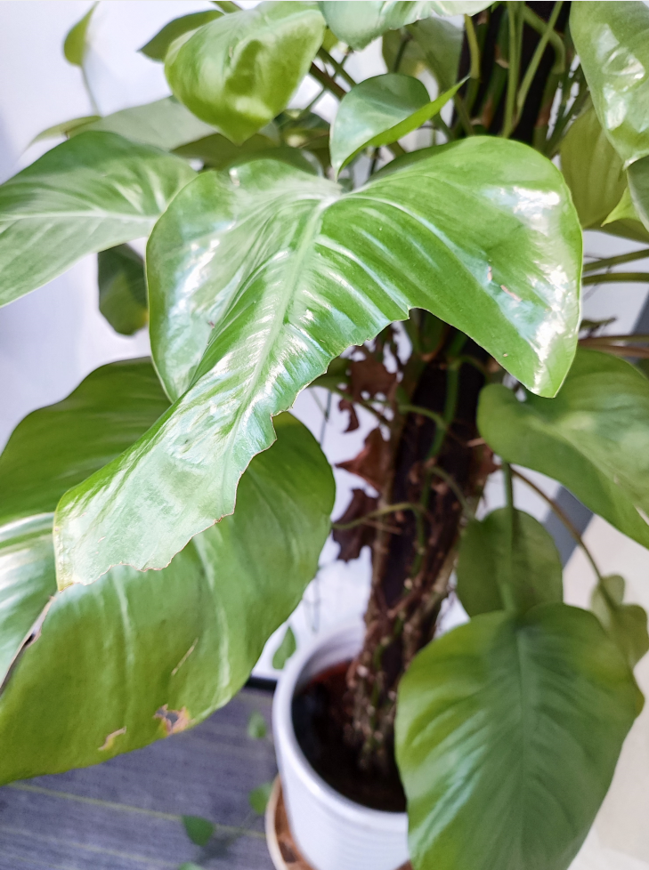

# 被摘掉的叶子-第十四期




会议室的绿植，叶子被人摘了，我不太理解为什么好好的植物，有人就要去弄坏它，就像不理解为啥女孩收到鲜花就会开心一样。

## 技术类

#### Web终极拦截技巧
[https://hughfenghen.github.io/posts/2023/12/23/web-spy/](tab:https://hughfenghen.github.io/posts/2023/12/23/web-spy/)

里面有很多有意思的拦截，可以看看，特别是页面一直刷新，如何调试代码，感觉又新增了我的调试技巧。

#### 字体预加载

[https://mp.weixin.qq.com/s/bs30YrYwOX0XMM_mHFbGNg](tab:https://mp.weixin.qq.com/s/bs30YrYwOX0XMM_mHFbGNg)

```javascript
<link rel="preload" href="cors.com/font.woff" as="font" type="font/woff" crossorigin />

```

因为字体也有跨域问题，所以 preload 的时候，如果资源是跨域的，需要加上 corssorigin 属性做跨域标识，这样才能成功命中 preload 缓存，到这里，其实都是符合预期的：但是吊诡的是，如果字体资源不跨域，你也得加 corssorigin 属性，否则缓存还是命中不了 😅


#### nodejs在2023年的一些变化和特性
[https://blog.rafaelgss.dev/nodejs-2023-year-in-review](tab:https://blog.rafaelgss.dev/nodejs-2023-year-in-review)

Node.js历史悠久，写这篇文章的是维护和开发Node.js的工作人员，他讲述了Node在2023年的新特性和变化，目前Node.js的吉祥物绿乌龟已经推出。而且Node的官方网站也正在陆续改进中，Node专注于安全方面，听说在20版本，开发了权限模型。


#### 如何线上使用sourceMap

[https://zhuanlan.zhihu.com/p/674981525](tab:https://zhuanlan.zhihu.com/p/674981525)

生产环境的代码都进行了编译和压缩，直接看内容，是无法看出这段逻辑是什么样子的，只有在调试的时候，我们能够很方便的看到原始代码，这样的

#### keep screen on

[https://www.keepscreenon.com/](tab:https://www.keepscreenon.com/)

打开这个网页，就可以让电脑屏幕保持常亮，对 PC、Mac、Android、iOS 均有效。这是什么原理呢？在GitHub上找到了这个
[https://github.com/Mars-Interactive/NoSleep.js](tab:https://github.com/Mars-Interactive/NoSleep.js)

原理是使用了一个我不常认识的浏览器API，wakeLock，这里有个兼容性问题，火狐浏览器不支持。
[https://developer.mozilla.org/zh-CN/docs/Web/API/WakeLock](tab:https://developer.mozilla.org/zh-CN/docs/Web/API/WakeLock)


### 非技术类


#### Leiapix

[https://convert.leiapix.com/](tab:https://convert.leiapix.com/)

上传图片生成运镜视频 试了一下Leiapix 这个可以提取图片深度信息，然后生成运镜视频的产品。效果还挺好的，自定义选项也很丰富，一些简单的场景运镜视频不用视频生成工具用这个也挺好。直接上传图片然后再右侧调整选项就行。


#### 腾讯22年前的神级PPT

[https://mp.weixin.qq.com/s/1mqXiAV-XUyM34QwJdNg8Q](tab:https://mp.weixin.qq.com/s/1mqXiAV-XUyM34QwJdNg8Q)

该PPT成功推动了腾讯早期最成功的商业产品QQ秀的立项和上线。这份PPT展示了如何制作一份优秀的立项汇报PPT，包括结构完整、逻辑严谨、数据详实、论证充分等要点。通过介绍Avatar业务的背景信息、市场分析、竞争对手分析、产品方案、人力方案和财务方案等方面，许良成功地说服了腾讯高层投入资源并推动了QQ秀的上线。这份PPT对于职场人特别是互联网从业者具有很高的学习和研究价值。


#### B道选手
[https://holly.witteman.ca/the-b-lane-swimmer/](tab:https://holly.witteman.ca/the-b-lane-swimmer/)

很神奇的是处于顶层的人很慷概乐于助人，处于第二层的人往往承受最大压力，在第三层和第四层的人就都躺平的心态那种。其实人往往都是承受越多，得到越多，想要在底层走上顶层，那必然是要经历风雨，承受压力的。没有人能全靠运气活着，如果你还无压力，那生活久了，生活会教会你要承受压力和恶意。


