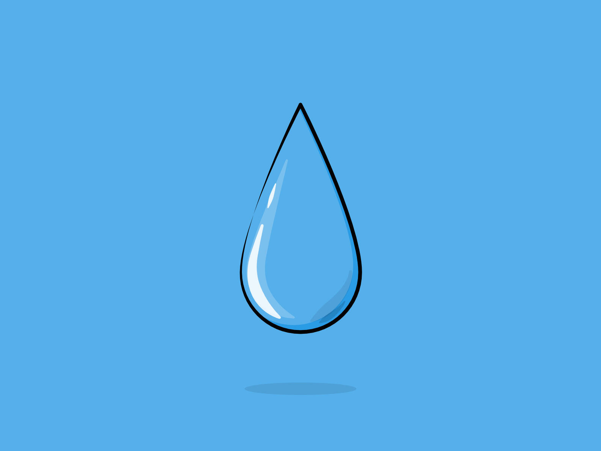

# 清明时节雨纷纷-第十九期




清明放假三天，连着下了三天雨，就只有第一天早上出去晨跑了一会，但是中途下雨，就开始往回跑，跑了一会雨又停了，就在公园里散步了几圈，然后就又开始下小雨，后面就只能回去了。

## 技术类分享

#### <!DOCTYPE aigc>你的网页何必是HTML
[https://unbug.github.io/Chrome-Your-next-web-page-is-not-HTML/](https://unbug.github.io/Chrome-Your-next-web-page-is-not-HTML/)

有了这个功能，页面具体展示什么内容，就不再是可知的了，而是随机的，不过这样的功能，好像除了好玩，用处也不大。

#### 

#### 内容安全策略CSP

[https://www.writesoftwarewell.com/content-security-policy/](tab:https://www.writesoftwarewell.com/content-security-policy/)

这周面试刚好遇到的面试题，面对XSS攻击，如何预防和解决，我这周面试也是自己准备不足，没有怎么背面试题导致的。所以感觉自己没有答好，正好看到这篇文章，CSP就是content security policy（内容安全策略），添加HTTP请求头。

```javascript
Content-Security-Policy: script-src 'self' https://safe-external-site.com; style-src 'self'
```

术语 script-src 和 style-src 是分别指定 JavaScript 和样式表有效源的指令，告诉浏览器不要执行任何内联 JavaScript 或样式表。
除了使用 HTTP 标头之外，您还可以在 <meta> 位于 <head> 元素下的标记中提供策略。

```javascript
<meta http-equiv="Content-Security-Policy" content="script-src 'self' https://safe-external-site.com">
```

想要了解详细的内容，还是看文章吧~


#### 十年前微信消息收发架构

[https://mp.weixin.qq.com/s/dD-aPhnynOqSC3MUYLjeAA](tab:https://mp.weixin.qq.com/s/dD-aPhnynOqSC3MUYLjeAA)

微信应该是国内用户访问量最大的app之一了，在十年前就解决消息实时送达和不丢消息的需求，能看到用户访问量越高的app，复杂度也就越高，这就要求解决问题需要考虑的情况越多。

#### Web文件系统（OPFS及工具）介绍

[https://hughfenghen.github.io/posts/2024/03/14/web-storage-and-opfs/](tab:https://hughfenghen.github.io/posts/2024/03/14/web-storage-and-opfs/)

第一次听到OPFS这个名字，文件系统会让我想到new File在Web端实现操作文件，原来还有源私有文件系统。不过使用这个API需要考虑兼容性，Chrome86+才支持，在Web worker中操作，可以不阻塞主线程，而且处理速度还更快。

## 非技术类分享

#### 软件工程师的日常

[https://unbug.github.io/Today-Was-a-Good-Day-The-Daily-Life-of-Software-Developers/](tab:https://unbug.github.io/Today-Was-a-Good-Day-The-Daily-Life-of-Software-Developers/)

可以看出大多数人还是被会议影响了开发时间，程序员的一天，总会被各种各样的意外打扰，比如接到用户反馈，线上有bug，需要开发介入排查；比如提测之后的需求，有测试来找你提bug；比如开发中，产品突然有需求变动，最可怕的是，突然被告知这个需求不用开发了·····这种意外无疑不可预测，但是程序员却需要时间解决，来看看如何更加合理的安排自己工作的一天吧~


#### 摆脱困境的最佳方式

[https://www.ggnotes.com/the-best-way-to-get-unstuck/](tab:https://www.ggnotes.com/the-best-way-to-get-unstuck/)

被困的感觉会放大焦虑并加速失去动力，当我们出现没有选择时就会卡住，治疗方法是：做点什么。我觉得这应该是分散注意力，将自己强行从某个困境中拉出来，去到另一个场景。

