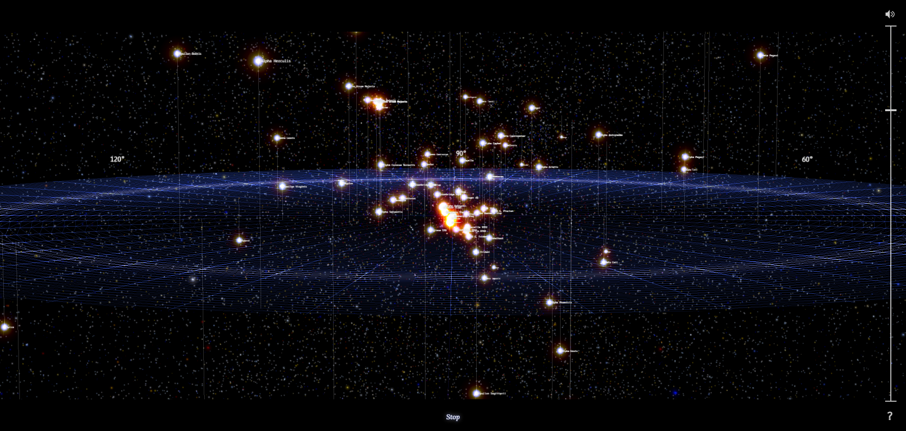
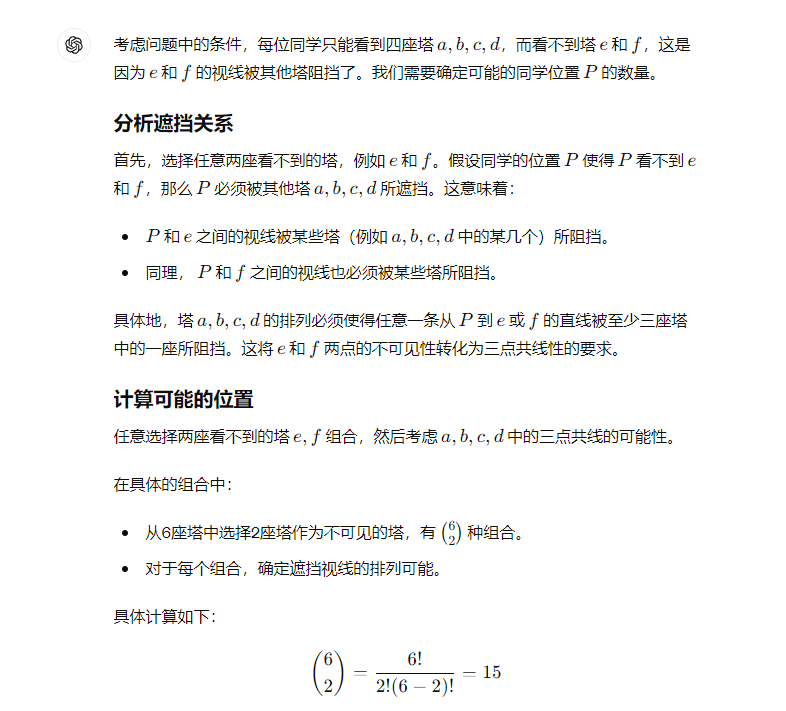

# Stars of the universe-第二十五期

看到这张宇宙恒星动画时，既惊叹于宇宙的广袤无垠，又感叹于人类的渺小，如沧海一粟。

## 技术分享

#### 服务端实时更新获取技术方案

[https://rxdb.info/articles/websockets-sse-polling-webrtc-webtransport.html](tab:https://rxdb.info/articles/websockets-sse-polling-webrtc-webtransport.html)

WebSocket、SSE、长轮询、WebRTC这些我都了解过，新出了一个WebTransport的API，有点意思，WebTransport 是一个现代 API，旨在使用 HTTP/3 QUIC 协议进行高效、低延迟的通信，支持多个流以及可靠和不可靠的数据传输。然而，截至目前，WebTransport 仍然是一个工作草案，缺乏广泛的支持，并且与浏览器和服务器框架（如 Node.js）的兼容性有限。

#### 如何记录JavaScript包
[https://deno.com/blog/document-javascript-package](tab:https://deno.com/blog/document-javascript-package)

JSDoc 将代码中的注释转换为文档对象，该对象可以以各种格式呈现和显示，文章中介绍了JSDoc的好处，以及代码更改，文档也发生变化，可以更好的维护项目。遵循最佳做法，为包创建全面文档，帮助用户更快的启动和运行。

#### 深入研究Promise.withResolvers()提案

[https://2ality.com/2024/05/proposal-promise-with-resolvers.html](tab:https://2ality.com/2024/05/proposal-promise-with-resolvers.html)

很高兴在一年之后再次看到Axel博士的博客。他深入研究了提议的Promise.withResolvers()。withResolvers特性(现在处于第4阶段)以及为什么你可能更喜欢使用它以更优雅的方式创建Promise。

## 非技术分享
#### 2024阿里巴巴全球数学竞赛预选赛

[https://www.longluo.me/blog/2024/04/16/2024-alibaba-global-mathematics-competition-qualifying-round/](tab:https://www.longluo.me/blog/2024/04/16/2024-alibaba-global-mathematics-competition-qualifying-round/)

不愧是全球数学竞赛，里面的题目难度还是很难的，我使用最新的chatGPT-4o模型做了一下第一题，GPT返回的是错误答案

#### ai-music-videos

[https://mashable.com/article/ai-music-videos](tab:https://mashable.com/article/ai-music-videos)

这是Sora发布的最长音乐视频，视频长达4分钟，画面和音乐都由AI生成。

#### Hacker News 每日AI摘要

[https://www.supertechfans.com/cn/](tab:https://www.supertechfans.com/cn/)

这个项目对 Hacker News 每天的热点文章，生成中文的 AI 摘要，除了官网，还会发到[飞书](tab:https://lw9eez9cc6.feishu.cn/wiki/Z408wHLlRi8MdCk6QfacpW6bnB0)上面。这跟我之前收集的一个Hacker News网站内容不太一致，应该是热度不一样。

#### VCs arent yours friends

[https://openvc.app/blog/vcs-arent-your-friends](tab:https://openvc.app/blog/vcs-arent-your-friends)

这篇文章讨论了风险投资者（VCs）与创始人之间的关系。文章指出，尽管 VCs 声称与创始人关系友好，但他们实际上是投资专业人士。很多初创创始人对这种微妙之处一无所知，当他们开始筹集资金时，may会遇到不愉快的惊喜。文章举例说明了一位著名 VC 因为一家初创公司的演示文稿日期过旧而abandon投资，这引发了社交媒体上的热议。

#### 宇宙中的恒星演示图

[https://stars.chromeexperiments.com/](tab:https://stars.chromeexperiments.com/)

宇宙是充满神秘的，因为它广阔无垠，因为它包容万物，产生万物，很多未解之谜。
仅在我们的银河系中就有2000到4000亿颗恒星，这真是令人震惊。更令人叹为观止的是，我们的银河系只是可观测宇宙中≥1000亿个星系之一。
