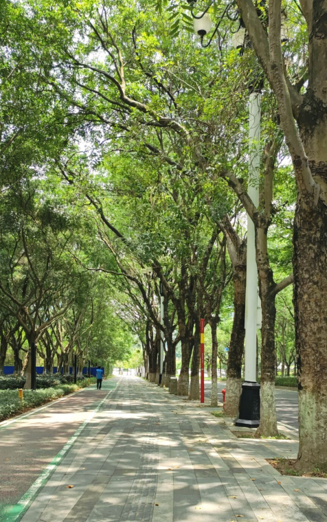

# 端午节和高考一起高“粽”吧-第二十八期

端午节，我终于在下午出去走了走，但是风景不如林间小道，想念公司附近的小路，散步走起来很舒服。端午节和高考一起放假，高考前三天后三天，再加上高考三天，弟弟的高中放9天假期，这样的假期全家一起去旅游才好。

## 技术类分享

#### tldraw

[https://github.com/tldraw/tldraw](https://github.com/tldraw/tldraw)

React组件实现网页画板，速度很快，体验感和ui设计都很不错，不愧是stars数量高的仓库。

#### 函数式编程

[https://github.com/Nealyang/PersonalBlog/blob/master/2018/%E5%87%BD%E6%95%B0%E5%BC%8F%E7%BC%96%E7%A8%8B%E4%BA%86%E8%A7%A3%E4%B8%80%E4%B8%8B%EF%BC%88%E4%B8%8A%EF%BC%89.md](https://github.com/Nealyang/PersonalBlog/blob/master/2018/%E5%87%BD%E6%95%B0%E5%BC%8F%E7%BC%96%E7%A8%8B%E4%BA%86%E8%A7%A3%E4%B8%80%E4%B8%8B%EF%BC%88%E4%B8%8A%EF%BC%89.md)

听说这是一位阿里的员工写的，确实很有深度，函数柯里化当初我就觉得好玩，但是工作中真的没有怎么见到过这样的应用，但是这篇文章却解释了为什么要用，以及如何用好函数化。

## 非技术类分享

#### W.I.N事业工作法

[https://win.iamkasong.com/](https://win.iamkasong.com/)

卡颂老师最近提出的面向专业人士不内卷、高稳定、有前景的职业发展路径。

#### 欺骗大脑做困难的事

[https://medium.com/soulsync/how-i-tricked-my-brain-to-like-doing-hard-things-dopamine-detox-d21d5e0e3edc](https://medium.com/soulsync/how-i-tricked-my-brain-to-like-doing-hard-things-dopamine-detox-d21d5e0e3edc)

这似乎就是奖励与惩罚机制，如果自己做了一件困难的事情，就该受到奖励，如果自己犯错了，就要接受惩罚，为了让自己下次再犯错产生影响，主要原因还是我们生活的太过舒适，就会一直在舒适圈中，不愿意出来，这有点考验人性的弱点。

#### 我如何赢得新加坡 GPT-4 即时工程竞赛

[https://towardsdatascience.com/how-i-won-singapores-gpt-4-prompt-engineering-competition-34c195a93d41](https://towardsdatascience.com/how-i-won-singapores-gpt-4-prompt-engineering-competition-34c195a93d41)

文章中作者讲述了竞赛的心得，LLMs 执行精确数学计算的能力有限，这使得它们不适合需要对数据集进行精确定量分析的任务。LLMs 擅长识别模式和趋势。这种能力源于他们对多样化和大量数据的广泛训练，使他们能够辨别可能不会立即显现的复杂模式。这使得它们非常适合基于数据集中模式查找的任务。

#### 如何开启谷歌

[https://www.paulgraham.com/google.html](https://www.paulgraham.com/google.html)

保罗·格拉汉姆（Paul Graham）是美国著名的"创业导师"，《黑客与画家》的作者，目前正在读的好书，可以推荐给大家，这篇文章是给 14 岁和 15 岁的孩子的演讲，如果他们以后想创业，现在该怎么做。

#### hachyderm
[https://hachyderm.io/explore](https://hachyderm.io/explore)

发现一个比推特还好的社交媒体平台，能够看到全世界的科技专业人士的发言。
Hachyderm 是一个安全的空间，LGBTQIA+ 和 BLM，主要由世界各地的科技行业专业人士组成。请注意，许多非用户帐户类型都有限制.

#### 如何释放你的个人优势

[https://www.dave-bailey.com/blog/personal-advantage](https://www.dave-bailey.com/blog/personal-advantage)

超能力，这篇文章告诉我们应该去寻找自己的超能力，当你发现自己的超能力时，你就能开始发现别人的超能力，这样的你建立超级英雄团队，走向光明。

