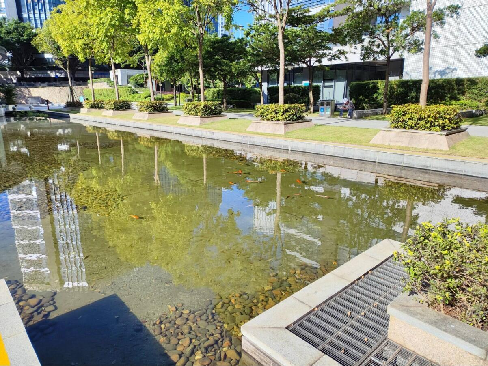

# 池塘的鱼(第一期)

2023-11-18

周末天气良好，空气清新，鱼塘里鱼儿正欢快的捉迷藏，捕捉到这欢快的一幕。

## 技术学习
怎么理解 React Server Component 和 Next.js 的关系  
[https://mp.weixin.qq.com/s/ecfTqFVIQEZPTxUHqC6qlA](tab:https://mp.weixin.qq.com/s/ecfTqFVIQEZPTxUHqC6qlA)  

#### 重写个人网站  
[https://juejin.cn/post/7242127432203173948?share_token=cecb7e09-7e63-44bc-b5a4-aaaa74ce11df](tab:https://juejin.cn/post/7242127432203173948?share_token=cecb7e09-7e63-44bc-b5a4-aaaa74ce11df)  

平常闲暇，我就会阅读别人的周刊，所以现在自己也想记录，希望能够坚持下来。  

#### 性能优化指标介绍  
[https://mp.weixin.qq.com/s/ou1lroTiTj9wVWzjSBos2g](tab:https://mp.weixin.qq.com/s/ou1lroTiTj9wVWzjSBos2g)
一次前端性能优化——性能得分从56到96  

#### http算法进化  
[https://mp.weixin.qq.com/s/6-sonliepZ8hVh4vS2iN2w](tab:https://mp.weixin.qq.com/s/6-sonliepZ8hVh4vS2iN2w)

#### 浏览器与图形引擎渲染对比  
[https://mp.weixin.qq.com/s/Ptxs-3d_cSb4SrC4bhO2Ig](tab:https://mp.weixin.qq.com/s/Ptxs-3d_cSb4SrC4bhO2Ig)

#### 协同文档的实现-简单介绍
[https://mp.weixin.qq.com/s/rYo63APPTXEE53ha9rIVkQ](tab:https://mp.weixin.qq.com/s/rYo63APPTXEE53ha9rIVkQ)  
  
协同文档，国内已经很多了，比如飞书，语雀，但是这还是第一次了解实现的原理。  

#### 优雅控制网络请求优先级  
[https://mp.weixin.qq.com/s/L2am1_sIy7soptJmGOTAYQ](tab:https://mp.weixin.qq.com/s/L2am1_sIy7soptJmGOTAYQ)

#### next路由为什么如此奇怪  
[https://mp.weixin.qq.com/s/YNnliv3RGc6NRXE5UtyhRQ](tab:https://mp.weixin.qq.com/s/YNnliv3RGc6NRXE5UtyhRQ)

#### 编程原则  
[https://mp.weixin.qq.com/s/8niY3Y9RNQZ4lKmG9pLrgA](tab:https://mp.weixin.qq.com/s/8niY3Y9RNQZ4lKmG9pLrgA)

#### 原神地图的实现  
[https://mp.weixin.qq.com/s/RvYmHh7WH0XfOOJ9kTIizg](tab:https://mp.weixin.qq.com/s/RvYmHh7WH0XfOOJ9kTIizg)

#### 前端版本过低引导弹窗方案分享  
[https://mp.weixin.qq.com/s/PT0PZ3S1Cvh2nltcIKwa3g](tab:https://mp.weixin.qq.com/s/PT0PZ3S1Cvh2nltcIKwa3g)

#### 实现处理多张二维码的场景时  
[https://mp.weixin.qq.com/s/waZckM46ydQnw5W5RTAFqw](tab:https://mp.weixin.qq.com/s/waZckM46ydQnw5W5RTAFqw)

 #### 关于“语雀故障” 的思考：可监控！可灰度！可回滚！    
[https://mp.weixin.qq.com/s/XpxK0-amqraM31B6BfamOg](tab:https://mp.weixin.qq.com/s/XpxK0-amqraM31B6BfamOg)  

我经常使用语雀，出现这么久的线上事故，导致我不能翻找笔记，对于强依赖的我来说，真的比较难受。  

#### 不满意网上的Token无感知刷新方案，自己琢磨了个解决方案~  
[https://mp.weixin.qq.com/s/AU_Qu_naIO46H_qTp_iSBw](tab:https://mp.weixin.qq.com/s/AU_Qu_naIO46H_qTp_iSBw)

#### 线上紧急Bug：80%前端可能会遇到的数据精度问题  
[https://mp.weixin.qq.com/s/Jj1RJ6qL8br9WQN6eGZAwQ](tab:https://mp.weixin.qq.com/s/Jj1RJ6qL8br9WQN6eGZAwQ)

#### JavaScript 正在泄漏内存而你却不知道  
[https://mp.weixin.qq.com/s/7CL-e5JoySWg2oQTJGAOJQ](tab:https://mp.weixin.qq.com/s/7CL-e5JoySWg2oQTJGAOJQ)

#### 从0到1实现一个前端监控系统（附源码）  
[https://mp.weixin.qq.com/s/GRP6GBfaNDIJLkuaRXr8ig](tab:https://mp.weixin.qq.com/s/GRP6GBfaNDIJLkuaRXr8ig)

#### 腾讯 13 年，我所总结的Code Review终极大法  
[https://mp.weixin.qq.com/s/HoFSNCd1U3eoUqYaQiEgwQ](tab:https://mp.weixin.qq.com/s/HoFSNCd1U3eoUqYaQiEgwQ)  

code Review很重要，上线前每次都要给leader code Review是为了避免很明显的问题，导致线上出现Bug，但其实每次提交代码之前，我们自己都应该code Review一下，仔细一点可以增加工作效率。

#### 一篇文章告诉你商品团队在做哪些有意思的事？  
[https://mp.weixin.qq.com/s/t1R5wQDfnAoAwNFDKZ2tVA](tab:https://mp.weixin.qq.com/s/t1R5wQDfnAoAwNFDKZ2tVA)

## 非技术分享

#### 经典的职业规划问题   
[https://mp.weixin.qq.com/s/i8Pc9lNMBdp5c0ZLuPlG0g](tab:https://mp.weixin.qq.com/s/i8Pc9lNMBdp5c0ZLuPlG0g)  

看到鱼皮给其他人的建议，跨方向，鱼皮的回复是稳定发展，这样也很不错，不过我觉得自己的想法很重要，在自己感兴趣的事情上面发展，可能会出现意想不到的效果；不过这需要很大胆，对于刚进社会的人来说，稳定确实是首要选择。 

#### 玉伯离职-语雀创始人  
[https://juejin.cn/post/7299035378589040667?share_token=edce6511-0120-4b22-aeb5-016b63d671ae](tab:https://juejin.cn/post/7299035378589040667?share_token=edce6511-0120-4b22-aeb5-016b63d671ae)  

离职，其实是自己有了新的目标，而这个目标在目前的情况下无法达到，所以才做出的选择；其实自己心里一旦有了这个想法，那就遵从这个想法，而其他人只需要尊重别人的选择就好。最近我的leader也离职了，很多人找我聊这话题，其实能够让我产生离职的想法，肯定是目前我已经不满足于现状了，不一定是钱，也可以是其他的东西，比如人、工作等等。当然也有人会出现从众心理，毕竟是自己的leader，但是大多数人还是会考虑后果，别人的离开，影响自己的决定，我这里还是不够的，毕竟人的一生，没有不散的宴席。  

#### 随笔：聊聊职业规划  
[https://mp.weixin.qq.com/s/P4eKfii7PSCcqGE7_k1Hng](tab:https://mp.weixin.qq.com/s/P4eKfii7PSCcqGE7_k1Hng)  

似乎很多技术人都有一个产品梦，自己的职业规划都是想自己打造一个成功的产品，从而实现人生价值，获得尊重和荣誉。说起我自己，目前只是想深究技术，至于以后想法会有什么改变，我不能保证，不过能打造成功的产品，应该是每个技术人都渴望的事情。

#### 技术人对抗焦虑的加减法  
[https://mp.weixin.qq.com/s/7sruMfQDMzmej2DFTP6Fiw](tab:https://mp.weixin.qq.com/s/7sruMfQDMzmej2DFTP6Fiw)

#### 关于我博士毕业的这件小事  
[https://zhuanlan.zhihu.com/p/661406115?utm_psn=1699721650696773632](tab:https://zhuanlan.zhihu.com/p/661406115?utm_psn=1699721650696773632)  

这是一篇很成功的博士经历记录，思想得到升华，现在我的一位大学室友也还在读研期间，希望她也能在研究生期间，思想得到升华，技术傍身，得到质变。  

