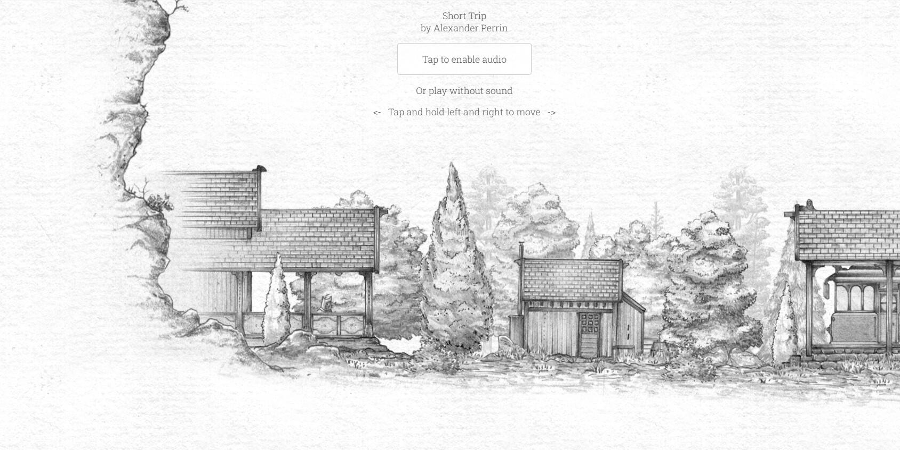

# 有趣的游戏-第九期

这周看了一些有趣的游戏网站，虽然都比较简单，我最喜欢的是弹跳球游戏，翻转盒子也比较有难度，有机会要想学习一下3d游戏，觉得还挺好玩的。

## 技术分享

#### 构建应用的四种方法

[https://tomhummel.com/posts/four-web-apps/](tab:https://tomhummel.com/posts/four-web-apps/)

本文总结了目前架设网站的四种方法：静态网站、云函数、服务器、容器。并根据各种方法提供了对应的产品以及价格，如果你想要构建一个网站或者应用程序，可以看看这篇文章。

#### 2024前端预测

[https://buttondown.email/whatever_jamie/archive/frontend-predictions-for-2024/](tab:https://buttondown.email/whatever_jamie/archive/frontend-predictions-for-2024/)

文章总结了2023这一年中前端领域发生的热门话题，细分了很多领域例如AI，SSR，Build System，Engines等等。

#### 使用Node.js构建简单的cli工具

[https://evertpot.com/node-changelog-cli-tool/](tab:https://evertpot.com/node-changelog-cli-tool/)

作者通过高版本的node，一步一步把cli工具搭建出来，还包含了测试，对使用的工具更加深入的了解，其实我们就该保持这样的热情吧。

#### 贪吃蛇

[https://github.com/Platane/snk](tab:https://github.com/Platane/snk)

拉取 github 用户的贡献图。让它成为一个蛇游戏，生成一条蛇道，细胞被有序地吃掉。感觉这个很有趣，所以把自己的GitHub公共墙加上了这个功能。

## 非技术分享

#### 最漂亮的网站游戏

[https://news.ycombinator.com/item?id=37931804](tab:https://news.ycombinator.com/item?id=37931804)

通常是使用·2D或者3D绘制的游戏，这里有大家的讨论，我选出了下面几款，准备自己试试，看看效果。

#### 弹跳球

[https://squigglegolf.com/game/](tab:https://squigglegolf.com/game/)

类似于弹跳球的游戏，有难度等级，考验对称性，力度控制，没有背景音乐。

#### 翻转盒子

[https://luduxia.com/whichwayround/](tab:https://luduxia.com/whichwayround/)

盒子里有一个物体。盒子会旋转，你需要选择另外三个物体中哪个与盒子中的物体方向相同。有背景音乐，有三次犯错机会，有难度等级。

#### 移动棋子

[https://luduxia.com/reversi/](tab:https://luduxia.com/reversi/)

一个移动友好的自定义渲染器，具有 FXAA、景深、次表面散射等功能。有背景音乐，可选择主题。

#### 短途旅行

[https://alexanderperrin.com.au/paper/shorttrip/](tab:https://alexanderperrin.com.au/paper/shorttrip/)

可选择背景音乐是否关闭，一只猫的旅行，可以一直按左键，左移动。

短途旅行来自于网站

[https://2pt.com.au/](tab:https://2pt.com.au/)

#### 一个越南程序员的阿里之旅

[https://corecursive.com/software-world-tour-with-son-luong-ngoc/](tab:https://corecursive.com/software-world-tour-with-son-luong-ngoc/)

作者是一个越南程序员，原来在 Lazada 工作。后来，Lazada 被阿里收购，他就来到阿里，在杭州西溪园区呆过一段时间。
现在，他已经跳槽到 Booking.com，本文是他讲述自己的故事，以及对阿里的感受。

#### 田同学的2023总结

[https://juejin.cn/post/7321049411852288050](tab:https://juejin.cn/post/7321049411852288050)

最近自己也需要写年终总结，每一年我都有想写的人，但是今年却难以下笔，所以最近自己想多看看别人是怎么写年终总结的，让自己多学习学习。这篇年终总结就很到位，面面俱到。

#### 中美程序员对比

知乎链接：

[https://www.zhihu.com/question/497793332/answer/2216734220](tab:https://www.zhihu.com/question/497793332/answer/2216734220)

沉默王二看法：

[https://mp.weixin.qq.com/s/15zRRFgBo3ty5AksOnvyHg](tab:https://mp.weixin.qq.com/s/15zRRFgBo3ty5AksOnvyHg)

都是说国内工作氛围不好，虽然现在我的经验不多，但是就目前来看，确实是这样，年底和年中的时候，都会进行裁员，很多岗位都是写着招聘，但是hr都是不读消息的。

有时候会想，为什么这么多人有钱之后都想要出国，国内的技术氛围真的这么糟糕吗？但是现实似乎就是这样，年龄大的人都不愿意在国内继续工作，因为身体受不了国内的工作氛围，国内的领导都是官威很大，特别是涉及利益的事件，倒霉的似乎都是普通的开发者，国内的开发者想要做一些技术贡献的时间都没有，庞大而繁杂的业务都忙的不可开交。

