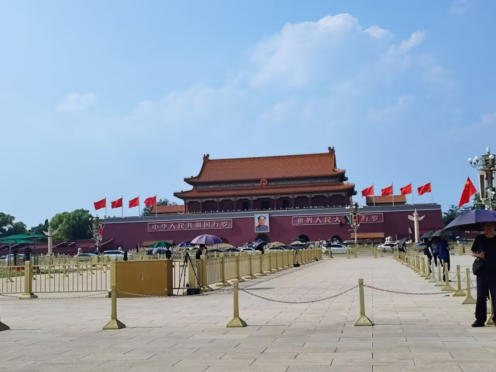

# 北京天安门-第一百零一期

出国家博物馆就看到了不远处的北京天安门，以前只在电视上出现的场景映入眼帘，看着红色的城墙和远处风姿勃发的军人站姿，从心底里涌现出我是中国人的自豪。

## 技术类分享

### 设计模式糟糕透了

[https://luminousmen.com/post/design-patterns-suck/](https://luminousmen.com/post/design-patterns-suck/)

深有体会，有时候确实代码设计一些设计模式，从而导致代码逻辑复杂，难以理解，有些开发者自以为这是让自己的代码变得高级的一种方式，但是往往过于复杂，就会让人难以理解，其实最好的代码就是通俗易懂的代码。

### Playwrite Tanzania:很像苹果手写体

[https://fonts.google.com/specimen/Playwrite+TZ?preview.script=Latn](https://fonts.google.com/specimen/Playwrite+TZ?preview.script=Latn)  
这个字体真的非常像苹果的那个开机 hello 的手写体，很好看，八九不离十，有需要可以玩玩看。

### 编译器和语言设计导论

[https://dthain.github.io/books/compiler/](https://dthain.github.io/books/compiler/)

编译器将用高级语言编写的程序翻译成用低级语言编写的程序。对于计算机科学专业的学生来说，从零开始构建编译器是一项重要的学习经历：这是一个充满挑战又趣味十足的项目，它能帮助学生深入了解计算机科学的方方面面，既有理论性很强的，也有实践性很强的。评论中看到很多人说作者是一位非常优秀的老师，可以推荐给大学生看看。

## 非技术类分享

### 如何向素不相识的人寻求帮助

[https://pradyuprasad.com/writings/how-to-ask-for-help/](https://pradyuprasad.com/writings/how-to-ask-for-help/)

把一个"大家都知道但很少做好"的社交技能拆解成了可操作的决策框架。它的核心洞察——把注意力从"我需要什么"转向"对方会怎么想"——本质上是一种产品思维：你的求助信就是你的产品，对方就是你的用户。四条启发式覆盖了从冷启动信任、信息密度、行动成本到退出机制的完整漏斗，适用面很广（求职、找导师、商务合作、开源社区提问等）。

### 书籍展示效果

[https://press.stripe.com/the-big-score](https://press.stripe.com/the-big-score)

有意思，介绍书的动画很好，打开之后很丝滑

### 高考分数填报模拟器可视化

[https://agentsfeed.org/app-demo/gaokao/index.html](https://agentsfeed.org/app-demo/gaokao/index.html)

有点卡顿，出来的时候有点晚了，今年填写本科一批志愿已经结束了，国家也出来了阳光志愿平台，跟这个有点像。

### 或许你应该学点东西

[https://www.marginalia.nu/log/a_135_learn/](https://www.marginalia.nu/log/a_135_learn/)

感觉自己上半年过得有点浑浑噩噩的，希望自己下半年开始学习一些新的东西，解锁新的体验， 像素画、盲打、3D建模、音乐、书法、木工、编织、一门语言——任何实用且吸引我的东西。文章不是鸡汤式的"相信自己"，而是以过来人的口吻做期望管理，帮你理解学习过程中的痛苦是正常的生理机制，从而坚持下去。

### 有机地图

[https://organicmaps.app/](https://organicmaps.app/)

对于我这样非常容易迷路的人来说，有爱去爬山，很多时候原路返回我知道，但是从未走过的路就容易迷失方向了，但是毕竟是外国的产品，对国内的地图来说，肯定不详细。
