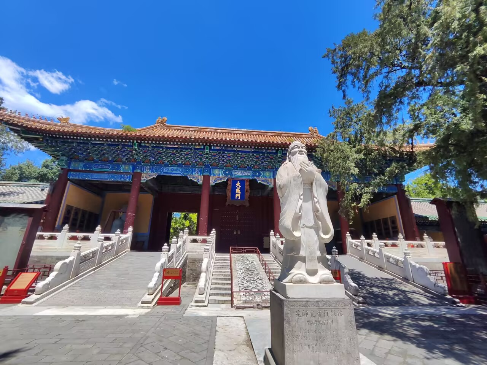

# 雍和宫-第一百零四期

逛完雍和宫，吃了午饭，就来了国子监，正好这两个景点很近，就几乎相邻，所以这天就玩了两个景点，国子监做为以前最高的学府，还是很大的，里面有一棵最大的树，听说能辩奸臣，觉得还挺有意思的

## 技术类分享

### 机器学习博士求职指南

[https://silviasapora.github.io/blog/ml-interviews.html](https://silviasapora.github.io/blog/ml-interviews.html)

第一次求职总是会有很多新奇的事情发生，坦然面对求职压力以及努力备战，都是每个打工人要面对的，作者是一个美国的机器学习博士毕业生，已经进入到DeepMind工作，这篇文章是她的求职过程回顾和总结。

### 使用DNS通过ACME认证

[https://hsm.tunnel53.net/article/dns-for-acme-challenges/](https://hsm.tunnel53.net/article/dns-for-acme-challenges/)

如何利用 DNS-01 挑战来完成 ACME 协议（Let's Encrypt 等）的证书签发验证，尤其针对服务不在公网或无法开放 80 端口的场景。

### 哈希算法比较MD5&sha-256

[https://lemire.me/blog/2025/01/11/javascript-hashing-speed-comparison-md5-versus-sha-256/](https://lemire.me/blog/2025/01/11/javascript-hashing-speed-comparison-md5-versus-sha-256/)

MD5 和 SHA256 都是常用的哈希算法，本文探讨在 JavaScript 语言中，这两种哈希算法，谁的生成速度更快？答案可能跟你想的不一样。

## 非技术类分享

### 只要你建造，他们就会来

[https://www.benlandautaylor.com/p/if-you-build-it-they-will-come](https://www.benlandautaylor.com/p/if-you-build-it-they-will-come)

这篇文章讲述了组织活动的重要性，加入一个团体最快捷有效的方法就是组织活动，也就是我们团体的核心活动。在我接触过的所有团体中，社交活动和各种活动的需求远远大于供给。要让人们参与进来就像在海滩上免费派发冰淇淋一样难。你可以通过定期参加别人的活动来结交朋友，但如果你也组织自己的活动，邀请你想结交的人，或者帮忙筹办别人的活动，结交朋友会更容易、更快捷。

### GPT广告

[https://ads.openai.com/](https://ads.openai.com/)

OpenAI正式推出ChatGPT广告平台，允许广告商在ChatGPT对话中投放广告。此举引发社区激烈讨论，批评者认为当AI助手为广告主服务时将失去用户信任，Kagi等竞品强调"用户付费、无广告"模式的价值。支持者则认为这是免费产品的合理商业化路径。

OpenAI应该不至于缺钱需要投放广告来增加收益，越多人使用的工具，大家最讨厌广告了。

[https://longnow.org/ideas/richard-feynman-and-the-connection-machine/](https://longnow.org/ideas/richard-feynman-and-the-connection-machine/)

### 浏览器的物理精确黑洞模拟器

[https://blackhole.plav.in](https://blackhole.plav.in)

哈佛黑洞研究所的天体物理学家 Alexander Plavin 开发了一个基于浏览器的物理精确黑洞模拟器。用户无需注册即可在浏览器中观察相对论效应（光线弯曲、多普勒增亮），还支持 AR/VR 模式将黑洞"放进房间"。摄像头模式下可观察黑洞对真实环境的引力透镜效应。该项目开源，不收集任何用户数据，相机画面完全在本地处理。

黑洞一直对人类来说，都很神秘，一个是因为它的强大，一个则是它的可怕，如何产生的这样效果，目前是世界未解之谜。

### 法国西南部吉伦特省的大规模野火

[https://www.france24.com/en/live-news/20260726-french-firefighters-face-pyrocumulonimbus-for-first-time](https://www.france24.com/en/live-news/20260726-french-firefighters-face-pyrocumulonimbus-for-first-time)

法国西南部吉伦特省的大规模野火产生了该国有记录以来首个"火积雨云"（pyrocumulonimbus）——一种由野火自身热量驱动的雷暴云，能制造狂风和闪电并引发新火点。大火已烧毁超420平方公里森林，摧毁240余栋房屋，迫使22万人撤离。消防部门表示火势可能持续数周，新一轮热浪即将来袭。科学家警告气候变化正使此类极端火灾现象更加频繁。
