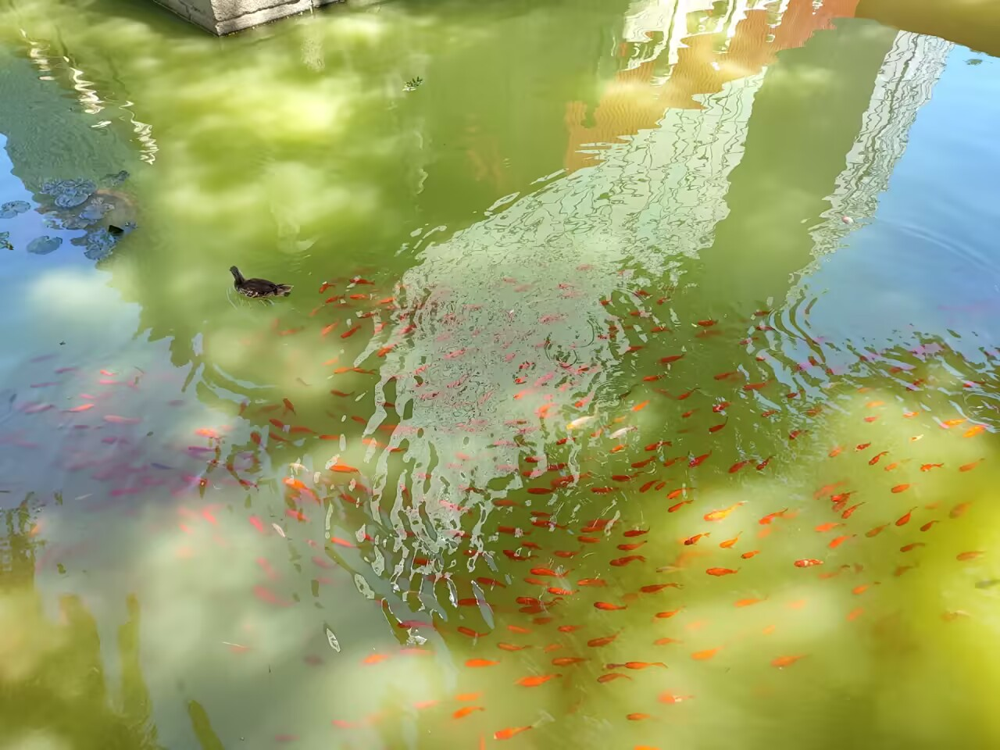

# 锦鲤-第一百零六期

听说看到锦鲤就会有好运发生，毕竟鲤鱼跳龙门，所以通常喜欢养红色的鱼，还有一种说法，因为是大红色，代表有喜事发生，所以现在景点里面，都养着大大小小的锦鲤，看到并不稀奇，而且很多，但是在鱼塘里看到有鸭子，这就很有意思了，这是人养的，还是野鸭子呢！

## 技术类分享

### PGSimCity - How PostgreSQL Works

[https://nikolays.github.io/PGSimCity/](https://nikolays.github.io/PGSimCity/)

PGSimCity 是一个独立的非商业教育项目，用 3D 可视化方式展示 PostgreSQL 数据库内部工作原理。它将 PostgreSQL 集群的架构比拟为一座城市，通过 WebGL 交互式场景让用户直观理解数据库的进程模型、存储机制、查询执行等内部组件如何协作。支持亮色/暗色主题，提供引导式导览功能。HN 社区获889分高评。

### 在SlopCodeBench上对Opus 5进行基准测试

[https://github.com/humanlayer/advanced-context-engineering-for-coding-agents/blob/main/benchmarking-opus-5-on-slop-code-bench.md](https://github.com/humanlayer/advanced-context-engineering-for-coding-agents/blob/main/benchmarking-opus-5-on-slop-code-bench.md)

作者在SlopCodeBench（一个2026年3月发布的长期编码基准测试）上对比测试了Claude Opus 5、Opus 4.8和Sonnet 5。该基准的特点是模型不会一次性获知全部问题，而是需要随着需求逐步演进代码库。测试结果显示Opus 5的严格通过率仅为24%（17个检查点中通过4个），且所有模型都出现了代码膨胀问题——Opus 5生成的函数数量是Opus 4.8的五倍。作者认为这证明当前模型仍无法在无人监督下可靠地完成真实软件工程任务。

### Needle2

[https://cactuscompute.com/needle](https://cactuscompute.com/needle)

Cactus 公司发布 Needle2——一个仅 14MB 的 Agent 型 LLM，专为手机、可穿戴设备、智能家居和机器人设计。整个模型是单一 14MB 二进制文件，运行仅需 28MB 内存（4500 万参数、2bit 压缩）。在树莓派5上解码速度达 500 tokens/s，在 Meta Quest 3S 等 VR 设备上达 400-1500 tokens/s。在工具调用和设备操作基准测试上，Needle2 与体积大 5-70 倍的小模型互有胜负。之前的大模型比的是参数多，现在又开始比小体积，感觉现在将AI部署在硬件上，还是不太聪明的样子，不知道以后会发展成什么样子，期待一下。

## 非技术类分享

### 比许多德国人更德国化

[https://mertbulan.com/more-german-than-many-germans/](https://mertbulan.com/more-german-than-many-germans/)

作者 Mert Bulan 是一名土耳其计算机科学毕业生，2017年通过 Erasmus 奖学金前往德国汉堡实习。文章讲述了他如何打破对德国人"冷漠、不友好"的刻板印象，从室友的信任到团队的包容，最终获得全职工作机会并定居德国的经历。这篇个人随笔展现了跨文化融入和职业成长的真实故事。

### Stowaway 是一个实时天空可视化网站

[https://stowaway.live/](https://stowaway.live/)

Stowaway 是一个实时天空可视化网站，能显示用户头顶上方所有飞机和卫星的实时位置，用户可以选择任意一架飞机或卫星进行"搭便车"视角体验——基于真实地形、物理模拟的太阳月亮星空，呈现逼真的第一人称飞行视角。创作者表示由于 HN 流量暴增导致 Google 3D Tiles 配额被打满，正在开发缓存层解决地形贴图节流问题。该项目获得 428 点赞和 61 条评论。 就是地图不太精细，不太能仔细看到各个区域的位置。

### Claude 如何标记 AI 生成内容

[https://support.claude.com/en/articles/16266773-how-claude-marks-ai-generated-content](https://support.claude.com/en/articles/16266773-how-claude-marks-ai-generated-content)

Anthropic 发布了 Claude 如何标记 AI 生成内容的官方说明。HN 讨论中，社区高度关注假阳性问题——担心完全由人类撰写的内容也可能被误判为 AI 生成，而这种误判可能被教育机构等用来惩罚无辜者。 确实现在除了能人工监督外，没有什么能区分是否是ai生成的内容，这样就会产生想法，让ai来判断哪些是ai生成的，但是准不准又是另一回事，如果判断错了，会带来什么危害，还是未可知。

### 随着人工智能吞噬网络，互联网的集体记忆正在消失

[https://thewalrus.ca/google-search-is-dying/](https://thewalrus.ca/google-search-is-dying/)

加拿大杂志 The Walrus 的 Vass Bednar 撰文指出，AI 正在侵蚀互联网的集体记忆功能。Google AI 摘要频繁编造错误信息，德国法院已判定 Google 对 AI Overview 中的虚假陈述承担责任。FiveThirtyEight 十年档案被迪士尼删除、Wikipedia 因 AI 截流面临资金危机、独立出版商搜索流量暴跌 60%。文章论证互联网正从"链接网络"退化为"答案引擎"，公共知识的存档功能正在系统性崩溃。
