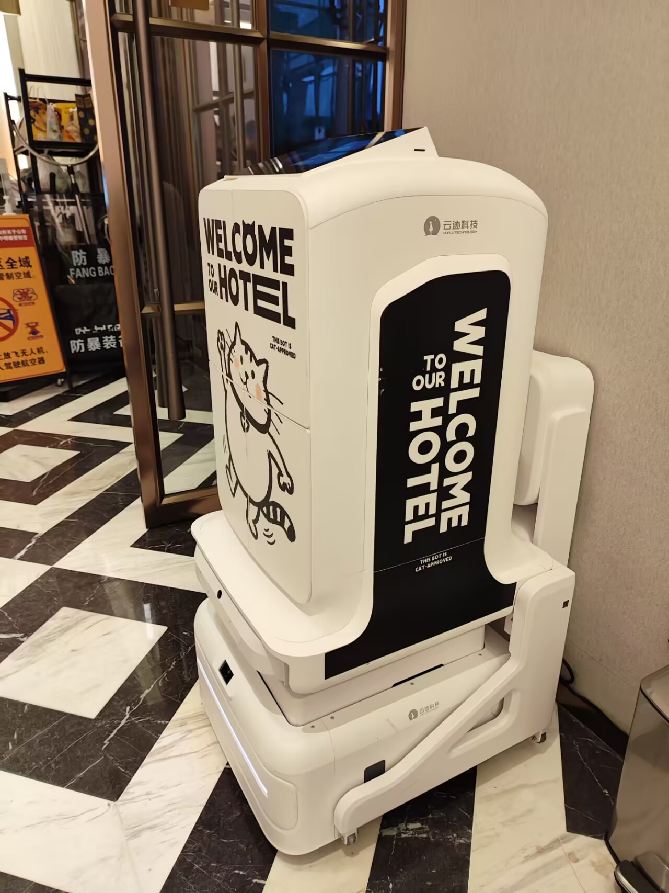

# 送货智能机器人-第一百零八期

住在北京一环内，酒店里有智能送货机器人，有点意思，这个机器人明细比外面扫地的机器人更加智能，它所到之处电梯、走廊的门会自动打开，四个人围着它不让过，它会跟你说话，礼貌的让你让让它，它要上电梯，会让你给它挪空间，挺有趣的。

## 技术类分享

### 迷宫算法

[https://www.jamisbuck.org/mazes/](https://www.jamisbuck.org/mazes/)

有动画说明这个算法是怎么运行的，挺有意思的，特别是回溯算法，这个很常见，看到运行动画，就很好了解其轨迹了。还有很多我不认识的算法，看到各个运行轨迹，还是感触颇多。

### Typ练打字

[https://typ.ing/](https://typ.ing/)

一款简洁优雅的在线打字练习工具，强调用户体验和感受。界面设计干净，关注打字时的心理状态而非单纯追求速度指标。用户可以通过实际打字来感受其独特的交互设计理念，产品定位为"关心你感受的打字训练器"。

### HTML可以做到这些

[https://chrisburnell.com/html-can-do-that/](https://chrisburnell.com/html-can-do-that/)

文章列举了大量以前需要 JavaScript 才能实现、现在纯 HTML 即可完成的动态功能。包括：Popover 弹出层（无需 JS 的信息展示）、原生 Dialog 对话框、通过 name 属性实现的手风琴分组详情、Command 属性控制元素交互、图片懒加载（loading="lazy"）等。展示了 HTML 标准正在大规模吞噬原属 JavaScript 领域的功能，让开发者用更少代码实现更多交互。

### 别抄AI的回答

[https://dontpastetheai.com/zh-cn](https://dontpastetheai.com/zh-cn)

确实AI的回复，如果你都不阅读，那这样就会导致你思考的越来越少，而且你的脑子就会生锈。

## 非技术类分享

### AI Token经纪人

[https://vectoral.com/blog/who-are-the-token-brokers](https://vectoral.com/blog/who-are-the-token-brokers)

文章调查了一个新兴的"AI Token经纪人"市场。这些经纪人从拥有未使用AI算力额度的初创公司手中低价收购积分，再以30-80%的折扣转卖给其他买家。作者通过直接联系经纪人、浏览信用额度交易网站（如AI Credits、CheapCredits等），揭示了这个灰色市场的运作方式：经纪人充当代理转发请求，单日可提供10万美元的供应量。文章指出，虽然积分互换在创业圈不是新鲜事，但这个市场正在被商业化和规模化。

### AI本该节省时间，减少工作量

[https://decrypt.co/357527/ai-save-time-instead-created-new-kind-burnout](https://decrypt.co/357527/ai-save-time-instead-created-new-kind-burnout)

为什么 AI 不仅没有减少工作，反而增加了工作呢？ 原因可能有下面几点。

（1）工作职责范围扩大。产品经理现在开始编写代码，研究人员开始维护服务器，人们的工作职责不再那么分明，而变得模糊不清。员工们开始处理职责范围之外的工作，AI 让这种转变变得切实可行。

这产生了连锁反应。工程师们突然发现，自己需要审查、纠正和指导非程序员同事的代码，因为那些同事正在"氛围编码"（vibe coding）。

在自己专业以外进行工作自动化的人，实际上是给其他人带来了更多的工作。

（2）工作/生活界限模糊化。AI 的对话式界面让工作变得轻松便捷，不再有面对空白页面的无助感，也没有令人望而生畏的学习曲线。

因此，员工们开始在离开办公桌前（比如上厕所前）发送"快速提示"，让 AI 在他们离开期间处理一些琐事。许多人甚至在休息时间也输入提示词，让 AI 去跑。这些在非工作时间使用 AI 处理的工作累积起来，导致休息时间减少，工作时长大幅增加。

（3）多任务处理激增。由于 AI 给人一种错觉，任务可以在后台处理，因此员工被要求同时管理多个工作流程。

这样做表面上可以提升生产力，但实际上往往转化为不断切换注意力以及更长的任务清单。

（4）以上因素的自我强化循环。 AI 让事情变得更简单，于是员工们做了更多事情，导致更加依赖 AI 来简化这些事情。如此循环往复，最终导致倦怠。

研究人员指出："一些参与者表示，虽然他们感觉工作效率更高了，但并没有感觉轻松，反而感觉比以前更忙了。"

（5）解决方法。研究人员提出，为了解决 AI 带来的职业倦怠，公司应该制定有意识的对策，规范员工如何使用 AI。

1. 做出重要决定前，停一会手头的工作。
2. 安排工作顺序，以减少上下文切换。
3. 预留时间进行真正的人际交往。

### 想要成为一名优秀的作者，就去更多地阅读

[https://nappertime.com/the-golden-rule-of-becoming-a-better-writer/](https://nappertime.com/the-golden-rule-of-becoming-a-better-writer/)

确实现在很多人都沉迷于手机，不会看书，更别说纸质书了，大多数人就看看小说，都还是一些无脑的情节，我大学的时候看书，还会被同学嘲笑成书呆子，哈哈哈，记忆犹新呀。

### 有抱负也是一个好爸爸

[https://nicholascharriere.com/blog/being-ambitious-and-being-a-dad/](https://nicholascharriere.com/blog/being-ambitious-and-being-a-dad/)

作者 Nicholas Charriere（YC创业者、Srcbook创始人）分享了同时追求事业野心和做好父亲之间的矛盾。他研究了乔布斯、爱因斯坦、马斯克等伟大创始人的传记，发现他们大多是糟糕的父亲。作者拒绝"把育儿外包"的方案，坚信陪伴时间的数量比质量更重要。他重新定义了野心：既要建造伟大的东西，也要成为伟大的父亲，并通过专注、健康管理和严格的时间规则来实现两者兼顾。

我也觉得小孩子生出来，就要负责，不可以只养不教，尽管是爸爸是家里的顶梁柱也是一样的，爸爸一直不在家里，不教小孩子，那就会让小孩子对爸爸更加陌生，而且这也是爸爸的义务。
