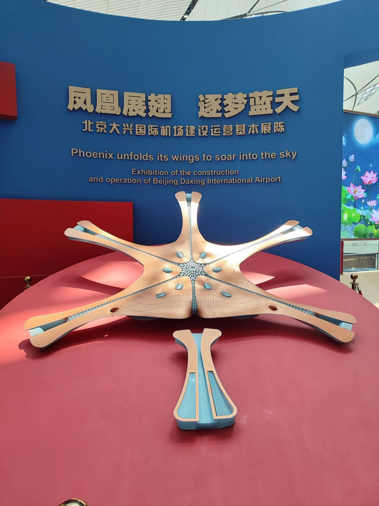

# 北京大兴国际机场-第一百零九期

在北京吃了五天，怎么也没想到，在北京吃的最后一顿餐，我爸妈觉得最好吃，在机场吃的外婆菜，单点没有选择套餐了，我也觉得清淡，确实不错，吃完之后，发现机场内部竟然有展览，就逛了一下，机场的模型竟然是凤凰展翅。

## 技术类分享

### 认证令牌的存储位置

[https://neciudan.dev/most-secure-way-to-store-auth-token](https://neciudan.dev/most-secure-way-to-store-auth-token)

本文认为，网站的认证令牌不应该放在 localStorage，而应该放在 Cookie。 将 session 存在 HttpOnly + 服务端 session 的 cookie 中；涉及第三方 OAuth token 时，用 BFF（Backend for Frontend）模式让浏览器永远不接触 token。

### git exclude

[https://marijkeluttekes.dev/blog/articles/2025/09/03/git-exclude-a-handy-feature-you-might-not-know-about/](https://marijkeluttekes.dev/blog/articles/2025/09/03/git-exclude-a-handy-feature-you-might-not-know-about/)

有些本地文件不想提交到仓库，也不适合写入 gitignore（会影响其他人），那么就可以用 git exclude 文件。

### css打印样式设置

[https://piccalil.li/blog/printing-the-web-making-webpages-look-good-on-paper/](https://piccalil.li/blog/printing-the-web-making-webpages-look-good-on-paper/)

如果要把网页打印出来，CSS 的打印样式应该怎么设置，本文教你入门。

## 非技术类分享

### 窗口交换

[https://www.window-swap.com/Window](https://www.window-swap.com/Window)

这个网站可以看到世界各地不同的用户上传的自家窗外的照片，可以随时打开，也可以指定地点，这边下雨太多，看到世界其他地方艳阳高照，还真养眼，感觉通过眼睛看到不同的风景是一种享受。

### 世界上最多的立体书

[https://www.thisiscolossal.com/2026/07/daniel-gonzalez-matthew-reinhart-popup-book-los-anglees-library-world-record/](https://www.thisiscolossal.com/2026/07/daniel-gonzalez-matthew-reinhart-popup-book-los-anglees-library-world-record/)

美国洛杉矶中央图书馆，为了庆祝建馆100周年，制作了一本世界最大的立体书，正在图书馆大厅展出。仅仅是看照片就觉得很惊艳。不敢相信如果亲眼看到，会有多震撼。

AI 的真正风险不在于使人懒惰，而在于让"懒惰"看起来像"高效"。花十分钟读一篇摘要，把它发到社交媒体上，你感觉自己很高效，但实际上什么都没记住。-- [Hacker News 读者](https://news.ycombinator.com/item?id=47555081)

### 做一个软件工程师的疯狂

[https://0x1.pt/2025/04/06/the-insanity-of-being-a-software-engineer/](https://0x1.pt/2025/04/06/the-insanity-of-being-a-software-engineer/)

建造房屋时，需要很多人参与：建筑师、土木工程师、水管工、电工、泥瓦匠、室内设计师、屋顶工、测量员、铺路工，等等。你不会指望一个人，甚至一家公司，完成所有这些工作。

但是，很多公司现在招聘程序员，往往希望一个人完成所有开发工作，比如全栈程序员。
