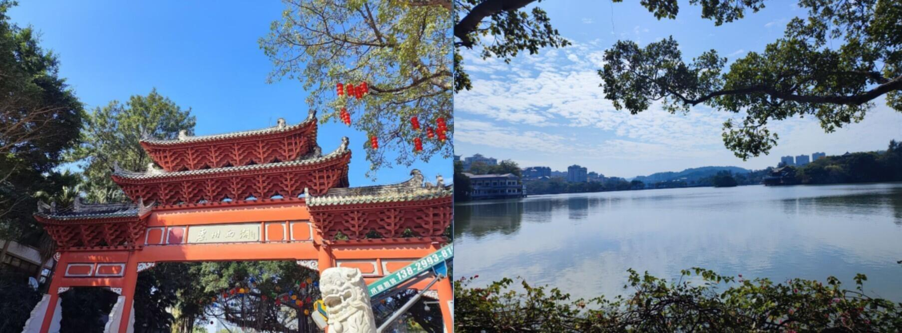

# 惠州西湖-第十一期

欲把西湖比西子,淡妆浓抹总相宜;听说惠州西湖是当初苏东坡被贬流放之地,从苏东坡来了之后,惠州西湖的名声就传开了,是国家5A级景区.

### 技术类分享

#### react-rnd

[https://github.com/bokuweb/react-rnd](tab:https://github.com/bokuweb/react-rnd)

一个好用的依赖库组件，React编写， 可调整大小和可拖动的组件，可限定拖拽范围，非常丝滑。

#### web推送消息
[https://pqvst.com/2023/11/21/web-push-notifications/](tab:https://pqvst.com/2023/11/21/web-push-notifications/)

记得今年年初，就做过一个类似的技术方案，由于客户端是网页，所以用户可能长期打开页面一直未关闭，那客户端是不知道，项目部署成功了，需要刷新页面，来获取最新的功能，如果用户长时间未操作，再次进行页面操作，卡顿或出错了，用户才会主动刷新页面这个操作。所以当时是想能做一个推送消息的功能，主动告诉页面更新了，需要刷新页面。当初是开发了一个webpack插件来实现这个功能，读取commitId来判断更新。

这篇文章中，作者使用了serviceWorker，而且新增了一个node服务端，广播消息给客户端，有点像socket。

#### 如何估计不重复元素的个数

[https://justinjaffray.com/a-charming-algorithm-for-count-distinct/](tab:https://justinjaffray.com/a-charming-algorithm-for-count-distinct/)

通常计算不重复元素，要不就是sort，不然就是hash，缺点就是需要不同元素数据成正比的内存。这篇文章介绍了一种算法，在能够容忍一些不准确性的清晰下，能大大减少所需的内存量。

### 非技术分享
#### share

[https://share.aitimi.cn/](tab:https://share.aitimi.cn/)

一款生成代码和文本分享卡片的网页工具，可以设定字体和字型大小，可以用于写技术文章时，搞点新奇的创意，毕竟长期工作的眼睛，针对审美好的文章，更有耐心看。

#### 你无法理解编程中所有内容的5个原因

[https://blog.stackademic.com/5-main-reasons-why-you-wont-understand-everything-in-programming-085d650f4891](tab:https://blog.stackademic.com/5-main-reasons-why-you-wont-understand-everything-in-programming-085d650f4891)

在这个领域发展的人，应该都有这样的时刻，质疑自己，为啥自己无法看懂代码，这很正常，但又会让自己焦虑疑惑，自己难道不适合这个领域吗？比起质疑自己，我觉得挑战更有意义，虽然现在的自己也还有很多不懂的地方，但是没关系，我可以慢慢挑战这些难题，今天想不出来，那就休息一下，谁能说明明天的我还是不行，或者谁能证明以后的我还是不行呢？

#### chatGPT无法完成的5项编码任务

[https://blog.stackademic.com/5-coding-tasks-chatgpt-cant-do-ebdadbb75900](tab:https://blog.stackademic.com/5-coding-tasks-chatgpt-cant-do-ebdadbb75900)

今年chatGPT盛行，快速卷起了人工智能革命，刚刚出现的时候，很多人都说chatGPT能够替代程序员了，它能够自动编码，只要有足够的指令控制，国内也很多人将百度换成了chatGPT，大家都纷纷说效果很好，但是也来看看哪些功能是chatGPT无法代替的吧~~~

#### 

#### FigureToCartoon
[https://ai-cartoon-figure.club/home](tab:https://ai-cartoon-figure.club/home)
一键将图片转换成日漫风、3D 风、手绘风等等

#### 2023总结

[https://github.com/saveweb/review-2023](tab:https://github.com/saveweb/review-2023)

这个仓库收集了国内网友的2023总结

#### paint-board

[https://github.com/LHRUN/paint-board](tab:https://github.com/LHRUN/paint-board)

🎨 一个强大的多端绘图板，汇集了许多创意画笔，体验全新的绘图效果！

demo地址：[https://songlh.top/paint-board/](tab:https://songlh.top/paint-board/)
