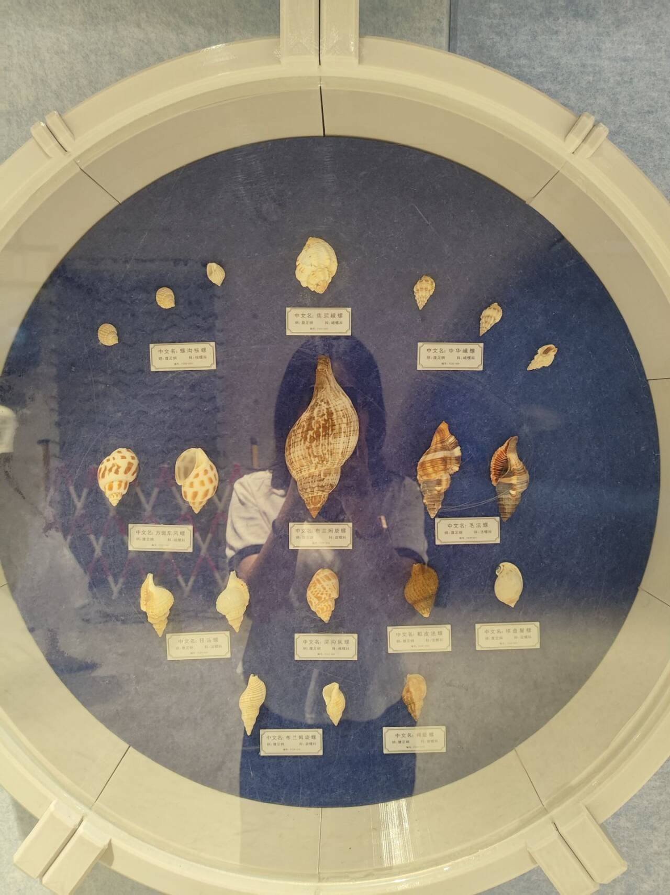

# 羽衣甘蓝汁-第一百一十一期

去散步的时候，走进一个走廊，发现全部都是贝壳和海螺的展示，海螺放在耳朵旁是可以听到海浪声的，还挺浪漫，这种大的海螺就可以上珍藏级别了。

## 技术类分享

### 反转版小行星（Asteroids）网页游戏

[https://spaceships.treybastian.com/](https://spaceships.treybastian.com/)

这是一款反转版小行星（Asteroids）网页游戏——玩家不再操控飞船，而是放置引力井来牵引和弹射太空岩石。游戏采用矢量风格画面，支持触控和键鼠操作，玩家需要利用重力场引导石头击中飞船。HN社区讨论集中在游戏的视觉辨识度和操控手感上。

### 异步等待的设计空间探索

[https://cel.cs.brown.edu/blog/design-space-async-await/](https://cel.cs.brown.edu/blog/design-space-async-await/)

JS 的 Promise 一旦创建就立即开始执行、await 保证让出一个 microtick、未处理的 rejection 不会自动向上传播（需要手动 catch 或监听 unhandledrejection ）。如果未来你接触 Rust（Tokio/Smol）或 Swift 的异步编程，最容易踩的坑就是 Eagerness 和 Extent 的差异——Rust 的 Future 不 poll 就不跑，Swift 的 structured concurrency 会在作用域结束时自动取消子任务。

### 小编程技巧

[https://will-keleher.com/posts/small-programming-tricks-matter/](https://will-keleher.com/posts/small-programming-tricks-matter/)

日常工程效率很大程度上来自零散的小知识积累，如了解 TCP_NODELAY 与 Nagle 算法的关系、用 fzf 增强终端历史搜索、SQL 中无 FROM 的 SELECT 测试技巧、正则表达式的 \b 词边界断言、git log -S 代码考古、JS 的 Array.flatMap 和 Promise.withResolvers 等。这些不需要深厚理论基础但能显著提升开发体验的实用技巧值得持续积累。 这些就造成了工作经验。

## 非技术类分享

### 三体问题图谱

[https://www.threebodyorbits.com/#atlas](https://www.threebodyorbits.com/#atlas)

一个可视化展示三体问题周期解的交互式图谱网站，收录了3915个经过机器精度预计算的平面牛顿三体周期轨道，支持动画演示、排序和浏览。数据来源于多篇经典天体力学论文，以Creative Commons许可开放。HN社区称赞其动画流畅、组织精美，讨论了勾股三体问题中的弹射轨道等话题。

### 管他呢，反正都要做出来

[https://www.joelotter.com/posts/2026/09/make-it-anyway/](https://www.joelotter.com/posts/2026/09/make-it-anyway/)

承认 AI 能力的现实，不试图说服任何人站队，但坚定地说出了一个朴素的立场：如果做的过程本身没有乐趣，产出就失去了意义。对于手艺人来说，"怎么做"和"做出来"同样重要。

### 百年来第一个新猫科动物物种

[https://www.nationalgeographic.com/animals/article/meet-the-first-new-cat-species-discovered-in-100-years](https://www.nationalgeographic.com/animals/article/meet-the-first-new-cat-species-discovered-in-100-years)

科学家发现了一个世纪以来首个新猫科物种——Leopardus tilcayo（蒂尔卡约虎猫），体重仅3-4磅，外形酷似家猫但体型更小。该物种此前被误归为已知虎猫亚种，通过基因分析和形态学研究最终确认为独立物种。这一发现引发了动物保护和生物分类学界的广泛关注 ，它的形状像小猫咪一样萌，但是皮肤确像小老虎。
