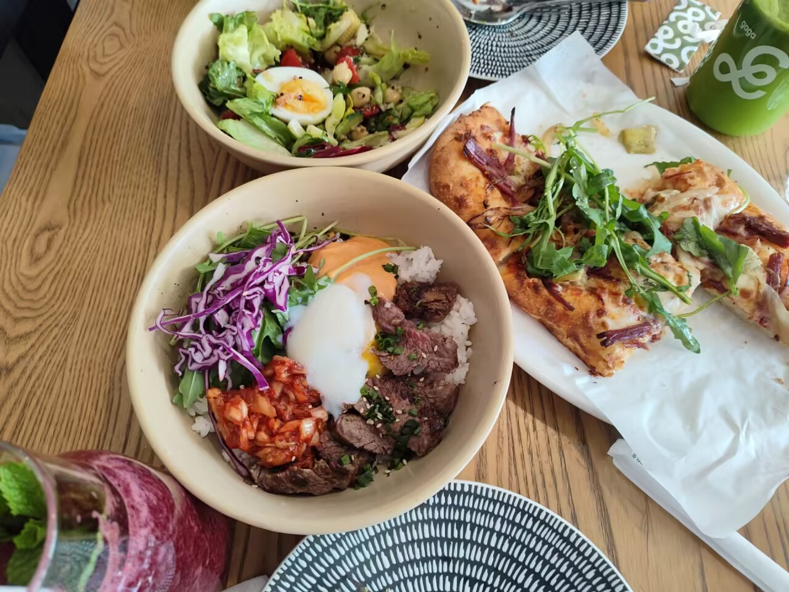

# 西餐-第一百一十三期

今年中秋过节，也是如愿跟我姐姐吃上了漂亮饭，披萨很香，之前是不太爱吃披萨的人，但是这家餐厅的披萨做的特别到位。

## 技术类分享

### 电梯算法

[https://john.fun/elevators](https://john.fun/elevators)

本文介绍电梯的算法，写得比较简单，没有代码实例，但有动画，解释了这个问题的复杂性在哪里（如何缩短等待时间）。

### 图解分布式系统原理

[https://www.codedump.info/dist-system-cn/](https://www.codedump.info/dist-system-cn/)

本系列采用图示和直观解释的方式，深入探讨分布式系统背后的核心思想。

### AI文本水印工作原理

[https://declaude.org/watermarking/](https://declaude.org/watermarking/)

欧盟最新规定是，大模型生成的内容必须带有水印。图片水印和视频水印还比较容易，文本内容怎么插入水印呢？

本文解释其中的原理，可以控制单词的出现频率，来加入水印。另可参考 Anthropic 公司的[新闻稿](https://www.anthropic.com/news/claude-text-watermark)。

### 关闭SSH端口

[https://www.michelebologna.net/2026/ssh-port-22-fwknop-single-packet-authorization/](https://www.michelebologna.net/2026/ssh-port-22-fwknop-single-packet-authorization/)

公网的服务器每天都会遭受无数次恶意的 SSH 请求，企图登录。常见的应对方法是，将默认的 SSH 端口 22 改成其他端口。

作者提出一种新的方法，服务器关闭所有 SSH 端口，根据客户端的口令，动态打开 22 端口。

这样阻止恶意攻击的方式，还挺别致。

## 非技术类分享

### 荷兰跟中国

[https://jaapgrolleman.com/degrees-of-wealth/](https://jaapgrolleman.com/degrees-of-wealth/)

我是荷兰人，在中国生活了八年。那些日子里，出租车司机和同事总爱问我："荷兰和中国哪个更好？"

现在，我回到荷兰定居，人们却反过来问我：想念中国的生活吗？

这两个问题都不容易回答。这是两种不同的生活，很难比较。

住在上海的时候，我曾经瞧不起荷兰那些老旧的科技----银行卡、政府的纸质信件、乏善可陈的基础设施。回到荷兰后，我也确实怀念中国豪华的电动汽车，以及便捷的换电功能。但是，荷兰的自行车基础设施实在太棒了，而且阳光明媚的日子里骑车出行乐趣无穷。

大多数荷兰人比上海人富裕，但家中却没有空调，他们开着更小、更老旧、配置更少的汽车。公共交通相比之下糟糕透顶。手机更小、分辨率更低、速度更慢----电视也是如此。商店周日关门，人们仍然使用现金或银行卡支付。

有一次，我想打电话给我的荷兰银行，在它的网站上费了九牛二虎之力才找到电话号码，然后电话排队等上15分钟才能问到一个10秒钟就能解决的问题。而在中国，银行 App 里就有聊天功能，可以立即联系到客服人员。

荷兰的公共厕所也比较少，因为维护成本太高，政府不愿意为此买单。私人保姆或清洁工也少得多，因为价格极其昂贵，我们只能重新开始全职在家做饭，外出就餐很贵，外卖选择也很少，而且送餐速度很慢。

但是，荷兰人有更多的空闲时间，而且住的房子更大，通常前后院都有草坪。由于物价更高（包括商品和劳动力），荷兰的二手市场规模更大----自行车、汽车、家具等等，物品必须回收利用、修理或尽可能延长使用寿命。

在上海，我们会在网上购买婴儿用品，阅读关于最新款玩具或带有人工智能功能的婴儿摄像头的介绍。而在荷兰，我的父母仍然保留着我小时候用过的玩具、婴儿床和餐具----三十多年后的今天，我的小孩还在用。

总的来说，荷兰是一个规模较小、技术水平较低的社会。规模小体现在市政厅只有一个办公窗口，而上海却有数百个市民服务中心，每个中心都设有数十个服务台。据我所知，我生活的小镇只有一台自动取款机和一个小型图书馆。

在我看来，荷兰是一个拥有充裕时间的国度，人民过着节俭的生活，而中国是一个急切变革的国度，迅捷而急躁，人们争先恐后争取自己的机会。

回到最初的问题----荷兰和中国哪个更好----我的回答依然是，这两个国家各有自己的长处和不足，两种生活截然不同。

### 程序员的职业未来

[https://newsletter.powderworks.dev/p/tabs-spaces-hand-tools-and-seat-belts](https://newsletter.powderworks.dev/p/tabs-spaces-hand-tools-and-seat-belts)

他不是主观臆断，而是依据行业的内在逻辑，分析接下来最可能的发展。

他说，大家要记住，大多数的商业软件开发是一个工业流程，而非手工流程。所谓"工业流程"，就是软件生产必须符合工业化的要求，也就是提高效率、降低成本、保证可靠性和稳定性。

工业化是软件行业的内在动力，AI 只是恰巧符合工业化的要求。展望未来，有几点预测。

（1）AI 大模型将越来越智能、速度越来越快、价格越来越便宜。

（2）编码代理（coding agent）会不断改进，功能越来越强大。

（3）AI 的估值泡沫或许会破裂，甚至可能引发衰退，但编码代理将长期存在，不会消失。它们已经以某种形式，永久成为软件开发流程的一部分。

（4）公司管理层将继续向程序员施加巨大压力，要求程序员尽可能多地使用编码代理。公司希望降低软件开发的技能门槛，并增加程序员的工作强度。在公司眼里，如果市场部的销售人员也能开发软件，那就再好不过了。

（5）那些用 Zig、Clojure、Elixir 和 Haskell 等冷门语言编写的专业项目，如果缺乏真正充分的理由，将被淘汰，并让 AI 自动重写成更符合主流模式的语言，例如 Python、Ruby、TypeScript 和 Rust。

（6）手工编码将会受到越来越严格的限制。软件行业的下一步，将是量化代码的质量标准，能够自动检测代码的质量，尽可能地实现高质量代码生产的自动化。

（7）代码质量检测的自动化工具将不断涌现，且越来越易用和便宜。到了那个时候，大多数软件都不应该通过手工或个人创作的方式完成，这样做在经济上也越来越不可行。

（8）那些还想手工编码的程序员，可能只能业余时间在家里搞。行业标准将越来越倾向于要求程序员尽可能多、尽可能频繁地完成工作。

（9）程序员的主要工作，将变成帮助 AI 变得更好，审查 AI 生成的代码，测试 AI 做出的更改，减少错误。

### AI的红皇后效应

[https://www.cst.cam.ac.uk/news/red-queen-hypothesis-new-way-forward-self-improving-ai](https://www.cst.cam.ac.uk/news/red-queen-hypothesis-new-way-forward-self-improving-ai)

红皇后是小说《爱丽丝镜中奇遇记》的虚构人物，她说过一句名言："你拼命奔跑，也只能留在原地。"

这被称为"红皇后效应"，用来描述进化生物学的一种假说：物种必须时刻保持进化，才能在物种的竞争中生存下来。

现在，AI 领域似乎也出现了"红皇后效应"，每一种大模型都必须保持进化，一刻也不能停，才能在激烈竞争中生存下来。
