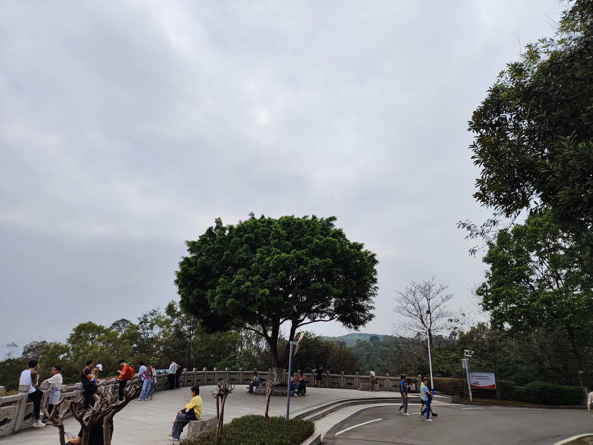

# 苍天大树-第十七期

周末去爬山了，看到这么茂盛的树，忍不住拍下来，远远望去，就像迎客松一样，很多人都在此处停留休息和拍照，看到好的事物，就要分享呀~

## 技术类分享

#### Web Components Eliminate JavaScript Framework Lock-in

[https://jakelazaroff.com/words/web-components-eliminate-javascript-framework-lock-in/](tab:https://jakelazaroff.com/words/web-components-eliminate-javascript-framework-lock-in/)

文章的核心观点是Web Components可以显著减少对特定JavaScript框架的依赖，从而提高应用程序的灵活性和可维护性。文章中使用Web Components组合React、Solid、Svelte 和 Vue制作了一个功能丰富的todolist。这个想法很新颖，去除各个框架之间的差异性，组合在一起编写，提高应用程序的灵活性，但同时也增加了维护成本。

#### javascript沙箱

[https://juejin.cn/post/7346865556328644623](tab:https://juejin.cn/post/7346865556328644623)

第一种方式jsonp，这还是当初学习跨域的时候，学习的方法；第二种方式with关键字和new Function，学习JavaScript基础的时候，学到过；第三种方式是现在工作经常遇到的，通过iframe来实现跨域通讯；第四种方式web workers，一直就知道，但是未使用过，遇到大量计算，不想要页面阻塞的时候，可以使用。

#### 简历不会写，看看大佬如何说？

[https://mp.weixin.qq.com/s/ft8RNqG7q0wGcxKkwszCuQ](tab:https://mp.weixin.qq.com/s/ft8RNqG7q0wGcxKkwszCuQ)

沐洒老师是一位在腾讯大厂工作的大佬，看看大佬如何教我们写漂亮的简历吧。特别适合刚入社会的学生看，也是适合不知道怎么写自己简历的人看。

#### motion

[https://github.com/framer/motion/](tab:https://github.com/framer/motion/)

发现一个React编写的动画库，效果不错，可以看看源码实现
## 非技术类分享

#### 除了独立开放，程序员的第二曲线

[https://mp.weixin.qq.com/s/GnJ1QG--TG6pCc-673NhDw](tab:https://mp.weixin.qq.com/s/GnJ1QG--TG6pCc-673NhDw)

感觉跟着卡颂老师，真的能学会一些自己目前思考不到的东西，普通人认为，为什么你要有这样的思考，后面你又埋怨为什么自己想不出这样赚钱的想法？任何东西都不会凭空掉馅饼一样，出现在你面前，需要你及时思考，提升自己的眼界和格局。

#### 做leader的感悟

[https://juejin.cn/post/7327107254603759643](tab:https://juejin.cn/post/7327107254603759643)

文章中作者是一位经验丰富的前端leader，其实刚进社会的学生，确实容易把leader高尚化，觉得leader无所不能，但是相处久了，发现leader就是每天开开不完的会，吃饭和下班时间都比组内人晚，有很多人找，沟通能力要很强。所以我觉得其实leader最重要的一点，是管人，管理组内的工作，但是大多数程序员只适应了被人管，所以缺少自己主动管理，需要具备什么样的能力，其实推己及人，问问自己希望自己的leader是什么样的，自己就做成什么样子的，无论是对组内人，还是对待领导。

#### 英伟达CEO黄仁勋斯坦福大学演讲

[https://finance.sina.cn/chanjing/gsxw/2024-03-11/detail-inamxtkr1619017.d.html](tab:https://finance.sina.cn/chanjing/gsxw/2024-03-11/detail-inamxtkr1619017.d.html)

2024年3月初，英伟达CEO黄仁勋回到母校美国斯坦福大学，进行了两次演讲，讲述了自己的经历和对 AI 的看法。这是演讲的中文翻译。
