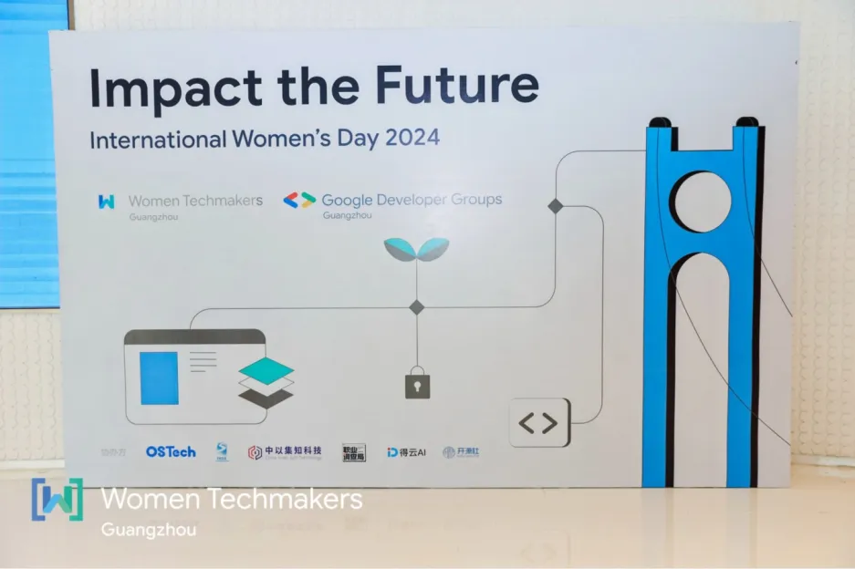

# Impact the Future - 第二十期

WTM活动如期举行，这是我第二次参加了，确实在分享中能感受到来自女性的力量，也给了我一些勇气，面对选择，面对困难，我们总是胆怯自卑，但是时间会让我们学会自信，学会独立，学会变强。

## 技术分享

#### MySql整体架构

[https://juejin.cn/post/7143614079532269598](tab:https://juejin.cn/post/7143614079532269598)

感觉我对关系型数据库还是不太了解，需要多多补充一些后端知识，提高我的知识水平，这样能对业务钢架了解。

#### 域名发散和域名收敛

[https://cloud.tencent.com/developer/article/1136774](tab:https://cloud.tencent.com/developer/article/1136774)

[https://www.cnblogs.com/coco1s/p/5365179.html](tab:https://www.cnblogs.com/coco1s/p/5365179.html)

为什么要有域名发散技术，为什么要有域名收敛，作者分析的很彻底，重点讲解了域名收敛，和http请求过程如何针对域名进行解析。而且域名发散并不是最好解决浏览器并发域名限制，而是使用http2的多路复用，即SPDY协议。

#### JavaScript防止Http劫持和XSS

[https://www.cnblogs.com/coco1s/p/5777260.html](tab:https://www.cnblogs.com/coco1s/p/5777260.html)

文章讨论了HTTP劫持、DNS劫持和XSS攻击，并且提供了一些方法来防御部分HTTP劫持和XSS攻击。文章中还提供了实际代码示例和讲解。

## 非技术分享

#### 写周记
[https://doingweeknotes.com/](tab:https://doingweeknotes.com/)
周记，感觉有点像我们小时候老师让我们写日记，只不过周记是每周写一份，总结自己这一周做了什么，复盘自己哪些做的不好的地方，思考下次遇到这样的事情，该如何处理。感觉这也是输出的一种方式，对于团队来说，那自然是好的，但是一个团队所有人都能坚持做这样的事情，是难得的，这需要每个人都认可这种方式，而且每个人愿意花时间来总结。不过能坚持这样的团队，一定是每个人都有收获。

#### 如何跨域中产阶级

[https://www.youtube.com/watch?v=FsYCf_YuYvs](tab:https://www.youtube.com/watch?v=FsYCf_YuYvs)

这是一个视频，讲解了什么是中产阶级，以及中产阶级面对的问题，分享者也分享了一些案例，说实话我比较喜欢聆听来自不同领域，不同背景的人的解说，因为自己的眼界有限，所以能听到跟自己不是同一领域的人的分享，能刺激自己产生更多思考。

