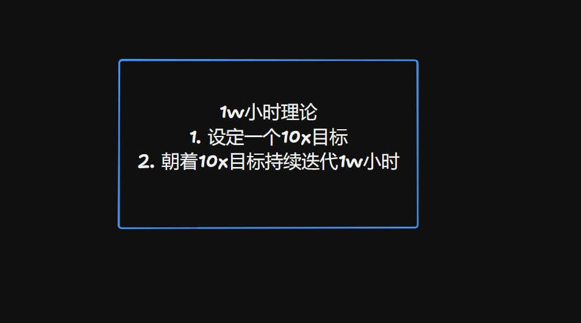

# 1w小时理论-第二十一期


创业成功归根结底在于执行。一个好的想法、一个优秀的团队、一个出色的产品和卓越的执行是成功的关键。
1w小时理论是指：

1. 设定一个10x目标
2. 朝着10x目标持续迭代1w小时

## 技术分享


#### node-screenshots

[https://github.com/nashaofu/node-screenshots](tab:https://github.com/nashaofu/node-screenshots)

一个跨平台、零依赖的 Node.js 模块，用于截图和录屏。主要实现是使用Rust能力，顺便安装了一下Rust环境，第一次认真看Rust代码，好像C++，但是变量又是let定义。


#### nircmd

[https://www.nirsoft.net/utils/nircmd.html](tab:https://www.nirsoft.net/utils/nircmd.html)

小型命令行实用工具，允许您在不显示任何用户界面的情况下执行一些有用的任务。通过使用简单的命令行选项运行 NirCmd，您可以写入和删除注册表中的值和键、将值写入 INI 文件、拨号到您的互联网帐户或连接到 VPN 网络、重新启动 Windows 或关闭计算机、创建快捷方式到文件、更改文件的创建/修改日期、更改显示设置、关闭显示器、打开 CD-ROM 驱动器的门等等

#### node-desktop-screenshot

[https://github.com/johnvmt/node-desktop-screenshot](tab:https://github.com/johnvmt/node-desktop-screenshot)

这是完全用node编写的截图工具，其实就是使用上面的nircmd命令行

```javascript
childProcess.spawn(path.join(__dirname, "bin", "scrot", "scrot"), [options.output]);
```


#### 截屏防盗机制

上面分享了这么多截屏功能的实现，接下来分享一下如何实现禁止截屏。
如果你正在使用Electron开发桌面应用程序，可以通过设置setContentProtection(true)来防止窗口内容被其他应用程序捕获，这包括截屏软件。当启用内容保护时，尝试截屏该窗口将会得到一个黑屏图像。
官方文档：[https://www.electronjs.org/docs/latest/api/browser-window](tab:https://www.electronjs.org/docs/latest/api/browser-window)

```javascript
const { BrowserWindow } = require('electron');

let win = new BrowserWindow({
  // 其他配置...
  webPreferences: {
    // 启用内容保护
    contentProtection: true
  }
});
```

对于更高级的需求，你可能需要监控系统级别的行为，这通常涉及到操作系统API或第三方库的使用。例如，在Windows上，你可以尝试使用Windows API或PowerShell脚本来监控和阻止截屏软件的运行。这种方法需要深入了解操作系统的内部工作机制，并且可能需要管理员权限。

完全禁止截屏在技术上是非常困难的，因为用户总是可以通过一些方式（如使用另一台设备拍摄屏幕）来绕过这些限制。因此，这些方法更多的是提高截屏的难度，而不是完全阻止截屏。在设计应用程序时，应该考虑到这一点，并采取适当的安全措施来保护敏感信息。


#### js原生截图

[https://github.com/likaia/js-screen-shot](tab:https://github.com/likaia/js-screen-shot)

源码里，浏览器截屏有两种方式，一种是使用html2canvas来截图，另一种是前面提到的WebRTC。

#### 通过连词造句学英语
[https://github.com/cuixueshe/earthworm](tab:https://github.com/cuixueshe/earthworm)


## 非技术分享


#### 如何成功打造一个youtobe账号

[https://timqueen.com/youtube-start-channel/](tab:https://timqueen.com/youtube-start-channel/)

我发现善于在媒体上露面的人，表达能力能得到很大的提升，而且表达能力的提升，可以提高分析能力，这些软技能在我目前的生活和工作中，是没有提升空间的，我在想我是不是也可以尝试录制视频，放到网上去。


#### 一个有趣的“动漫”网站

[https://wizardzines.com/comics/](tab:https://wizardzines.com/comics/)

把一个知识点总结成一张图片，优美而简洁，如果有中文翻译版，解救一下我脆弱的语言，那该多好


#### 1w小时理论

[https://mp.weixin.qq.com/s/7O34Oiaj9d-7Y-zrfZgLtw](tab:https://mp.weixin.qq.com/s/7O34Oiaj9d-7Y-zrfZgLtw)

说实话，我还是第一次听到这个理论，不过给自己设计10x的目标，这需要很有胆量，同时也要是很有理想的人，大多数人没有这样的勇气，也没有这么努力。


#### Sam Altman创业手册

[https://jxp73q7qjsg.feishu.cn/docx/WCNZdKDa4o2eUrxK5ElcfBXEnah](tab:https://jxp73q7qjsg.feishu.cn/docx/WCNZdKDa4o2eUrxK5ElcfBXEnah)

飞书文档里面提供英文链接，里面很多人评论，有创业想法的人可以看看，全文翻译成了中文。

#### The End of Front-End Development

[https://joshwcomeau.com/blog/the-end-of-frontend-development/](tab:https://joshwcomeau.com/blog/the-end-of-frontend-development/)
AI的到来，会导致前端开发的终结吗？文章中作者有新的看法，同时也对比了其他方向，比如后端，前端真的比后端更容易替代吗？如果你想看看不一样的看法，那就来瞅瞅这篇文章吧。

#### How to learn stuff quickly

[https://www.joshwcomeau.com/blog/how-to-learn-stuff-quickly/](tab:https://www.joshwcomeau.com/blog/how-to-learn-stuff-quickly/)

好像很多人都喜欢问，如何快速得到一件东西，如何快速学习一项技能，如何快速得到一个机会，但是似乎很少人去思考慢，如何慢一点生活，如何慢一点度过一天，如何慢一点掌握。

