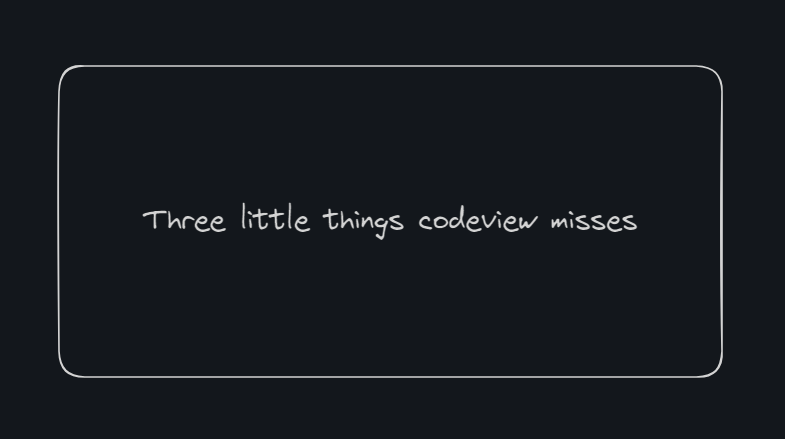

# Three little things codeview misses-第二十二期

我觉得优秀的人codeView，不会忽略这三个问题，但是一般人都会忽略这三个问题，其实codeView需要从小养好习惯。

## 技术分享

#### 输入url背后发生了什么？
[https://github.com/vasanthk/how-web-works](tab:https://github.com/vasanthk/how-web-works)

当我们在浏览器中输入 google.com 时，背后发生了什么？  一个很经典的工程师问题的思考路径案例，「当我们在浏览器中输入 google.com 时，背后发生了什么？」，可以从解析 URL 聊到 HTTP 协议、服务器响应、浏览器渲染、前端原理，同样也是一个经典前端面试问题

#### 键入网址到网页发生了什么？

[https://xiaolincoding.com/network/1_base/what_happen_url.html](tab:https://xiaolincoding.com/network/1_base/what_happen_url.html)

这是常见的面试题，但是如何巧妙的回答一直我在思考的问题，回答的太细，一直也说不完，从网络请求到页面渲染，内容多到可以写一本书；回答的太简洁，又会不会让面试官觉得你理解的不够透彻，所以多看看其他人的回答。

#### codeView时，被忽略的三件小事

[https://www.piglei.com/articles/three-little-things-on-code-review/](tab:https://www.piglei.com/articles/three-little-things-on-code-review/)

命名规范+引导性注释+沟通方式，这三件小事确实是所有leader应该注意的，目前我就处于编码的最底层，我的code都需要经过codeView才能被合并，但是真的很少人指出前两种问题，说明大家都忽略了，至于第三种，就更有意思了，有些人会觉得在别人的code中找到问题，而感到心情愉悦，不曾考虑他人感受，指出了问题，然后不给出具体意见的，也比比皆是，可能就是让你猜，不过我还是很乐意让别人codeView，因为可以发现自己的不足。

#### javascript一长串的解释

[https://github.com/lydiahallie/javascript-questions](tab:https://github.com/lydiahallie/javascript-questions)

哇，是一个有趣的知识点，可以多看看，这正是JavaScript不同于其他语言的地方，当然也有人说这是JavaScript的问题，容易产生编码问题。

## 非技术分享

#### 汇编游戏

[https://ofrak.com/tetris/](tab:https://ofrak.com/tetris/)

这个讨论很火，哪些哪些书籍或者资源可以理解现代汇编器，后面就有人提供了一个游戏，我试了一下，脑细胞还不够我完成第一关，看来汇编知识我是忘得查不多了.

帖子如下：

[https://news.ycombinator.com/item?id=40104823](tab:https://news.ycombinator.com/item?id=40104823)

#### 没人买书

[https://www.elysian.press/p/no-one-buys-books](tab:https://www.elysian.press/p/no-one-buys-books)

我一直觉得看纸质书是一种享受，但是没想到竟然会没人买书，看来时代变化，现在人们都不喜欢看书了，是现代教育太注重书本，然后基础教育之后的我们，就不想看到书了吗？还是网络社会，大家都能通过各种途径获取知识，所以觉得看书这种古老方式落后了，应该有各种各样的原因吧，不过还是希望能静下来看书的人多一点~

#### 好看的个人博客搭建

[https://github.com/Innei/Shiro](tab:https://github.com/Innei/Shiro)

有点梦幻的主题和动画加持，让博客更加美观了，不过比起使用这样的主题，我更好奇如何搭建这样的主题。
