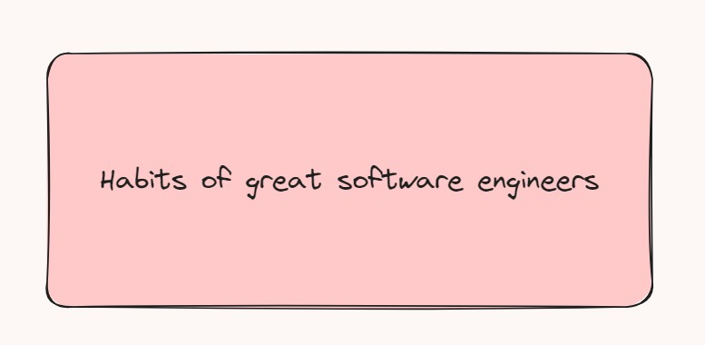

# Habits of great software engineers-第二十三期



优秀的软件工程师习惯，一起变得越来越优秀呀~
祝大家五一节快乐呀~五一节回家了，回家就像打卡一样，一件件事情，都要慢慢完成，好在有家人陪伴。很久没有见到的长辈，这次都看到了。


## 技术类分享

#### promise

[https://www.lydiahallie.com/blog/promise-execution](tab:https://www.lydiahallie.com/blog/promise-execution)

JavaScript中Promise对象的深入解析，它通过可视化的方式帮助读者理解Promise是如何工作的。很好奇这样的可视化工具是什么，或者是自己维护开发的。

#### Tauri

[https://github.com/tauri-apps/tauri](tab:https://github.com/tauri-apps/tauri)

跟electron相似，可以构建跨平台的桌面app，stars数量也很高，不知道会不会比electron省内存一些，可以试试。

#### main-thread-scheduling

[https://github.com/astoilkov/main-thread-scheduling](tab:https://github.com/astoilkov/main-thread-scheduling)

这个 JS 模块号称可以把计算量大的任务放到主进程，同时又不会阻塞主进程，UI 界面保持对用户的随时响应。它的源码有学习价值。


#### nanid

[https://github.com/ai/nanoid](tab:https://github.com/ai/nanoid)

一个小型、安全、URL 友好、唯一的 JavaScript 字符串 ID 生成器。

获取唯一的id值，之前只知道lodash里面的uniqueId，今天同事分享这个nanoid更加安全可靠，使用的是使用硬件随机发生器。uniqueId的实现就是内部存储一个变量，从而对输入的字符串进行累加。

```javascript
const uniqueId = require('lodash/uniqueId')

console.log(uniqueId('uni')) // uni1
console.log(uniqueId('uni')) // uni2
console.log(uniqueId('uni')) // uni3
console.log(uniqueId('uni')) // uni4
```


nanid的浏览器环境内具体实现：
```javascript

export const scopedUrlAlphabet =
  'useandom-26T198340PX75pxJACKVERYMINDBUSHWOLF_GQZbfghjklqvwyzrict'
export let nanoid = (size = 21) => {
  let id = ''
  let bytes = crypto.getRandomValues(new Uint8Array(size))
  while (size--) {
    // Using the bitwise AND operator to "cap" the value of
    // the random byte from 255 to 63, in that way we can make sure
    // that the value will be a valid index for the "chars" string.
    id += scopedUrlAlphabet[bytes[size] & 63]
  }
  return id
}

```

获取随机数，大家都会想到使用Math.random()，但是生成的随机数不一定是唯一的，不能做唯一id值，所以很多时候，我们还会想到Date.now()时间戳，但是同一毫秒内，还是存在误差，所以用做唯一id也还是有隐患；而且不同应用，同一时间，就无法保证唯一了。

还有performance.now()，方法返回一个精确到毫秒的时间戳，比上面的Date.now()更加精准，并且不受系统时间更改而改变，也就说你更改了系统时间，但是这个值是不会发生变化的。但是Date.now有的问题，performance.now依然存在，精度限制，不包含随机性。


安全随机数的生成，还可以看这篇文章：

[https://gist.github.com/joepie91/7105003c3b26e65efcea63f3db82dfba](tab:https://gist.github.com/joepie91/7105003c3b26e65efcea63f3db82dfba)

## 非技术类分享


#### always sprinting(永远冲刺)

[https://cbh.bearblog.dev/always-sprinting/](tab:https://cbh.bearblog.dev/always-sprinting/)

敏捷开发有一个问题，就是它要求"新的冲刺在上一个冲刺结束后立即开始。"
有了这个规则，程序员就陷入了永远冲刺的陷阱。
其实无论是写代码还是跑步，都不能一直处于冲刺状态，人是需要休息的，能维持长久运动的状态，一定是自己身体调节得当。


#### 优秀的软件工程师的习惯

[https://vadimkravcenko.com/shorts/habits-of-great-software-engineers/](tab:https://vadimkravcenko.com/shorts/habits-of-great-software-engineers/)

因为喜欢编程，喜欢这份职业，所以努力朝着这个方向靠近，这些优秀的习惯，共勉！！！


