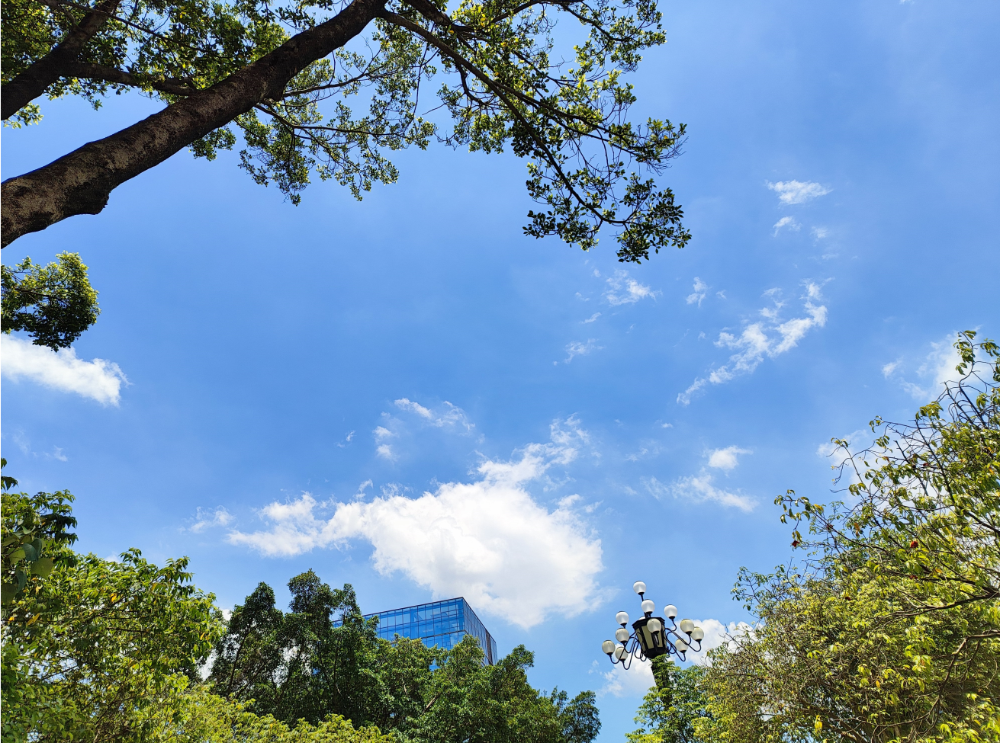

# 像蝌蚪的云朵-第三十期

这周天气终于转晴了，天空就像穿上了白蓝相间裙子一样，开心的我约上了周末体检，虽然约同事一起去，但是同事有事婉拒了，为了不浪费这么好的天气，我决定一个人去体检，这还是第一次体验免费体检的待遇。

## 技术类分享

#### 如何实现静态网站搜索功能

[https://lirantal.com/blog/2023-01-01_-how_to_add_client-side_search_to_your_astro_blog_static_website/](https://lirantal.com/blog/2023-01-01_-how_to_add_client-side_search_to_your_astro_blog_static_website/)

这周重新整顿了一下我的周刊，使用Astro搭建了静态网站，也添加了GitHub的讨论功能，耗时一天，但是看着成果还是很不错的，遇到了Astro中本地动态图片插入问题，占用时间比较长。

#### QUIC如何取代TCP以提高速度和安全性

[https://engineeringatscale.substack.com/p/how-quic-is-displacing-tcp-for-speed](https://engineeringatscale.substack.com/p/how-quic-is-displacing-tcp-for-speed)

既HTTP2以来，HTTP3有重大突破，既能解决了TCP3次握手，又解决了UDP传输数据稳定性，QUIC协议这篇文章通熟易懂，使用占比也已经有30%了。

#### Stable Diffusion 图片生成原理简述

[https://blog.cnbang.net/tech/3766/](https://blog.cnbang.net/tech/3766/)

很多文章讲解LMM大模型原理，难的有文章讲解图片生成原理，显然文生文的回复更加简单，但是文生图更加困难，首先需要的就是大量的图片模型，目前国内的文生图要不是使用Stable Diffusion 的模型，不然就是效果还达不到Stable Diffusion 。

## 非技术类分享

#### 不要成为房间里面最聪明的人，努力成为最善良的人

[https://www.jorgegalindo.me/en/blog/posts/do-not-be-the-smartest-in-the-room-try-to-be-the-kindest](https://www.jorgegalindo.me/en/blog/posts/do-not-be-the-smartest-in-the-room-try-to-be-the-kindest)

只有少数人会想念房间里最聪明的人，而每个人都会想念最善良的人。

## 信息的获取难易程度与对你的用处的关系
0️⃣ 想和大伙接地气聊聊 信息的获取难易程度与对你的用处的关系，有很强关联性，信息获取的成本越高对你的用处越大，反而越小。
1️⃣ 获取过程不需要任何成本甚至喂你嘴里的信息对你越没用。想你不停看的的短视频/算法新闻/信息流均属这一类，基本上没有太大的输入价值，甚至还想通过你的浏览让他的利益最大化，比如卖广告收益、种草购买收益、SEO 流量暴涨完成 KPI 指标，这种信息看多了让你越来越不聪明。
2️⃣ 获取过程需要你寻找很久甚至要付出不少成本的信息对你越有用。比如说每月付费 20 刀订阅的 ChatGPT、花时间选书花钱买书还要花精力看完、需翻译且梳理很久才看得懂的论文期刊、前几年买中概股亏钱的经验，这种都算很有成本代价的信息来源，从此获取到的信息有很多甚至会让你一辈子都记住这个经验，甚至短期看花了点儿成本，但是长期的收益会大很多，比如说我不碰中概股了以后…
3️⃣ 相比信息获取成本高，对你的价值越大之外，还有一个很有用的技巧，就是将学习到的高质量的输出，看 100 篇不错的技术文章效果对于正在学习技术的同学不如一次高质量文章输出，也不如自己基于学习到的写个小玩具成长大。
4️⃣ 这三个过程又和现在的大模型知识训练很像，大模型对标我们的大脑。假如是大量的垃圾信息甚至是错误信息去训练一个模型，最终效果肯定是这个模型变得相比没有训练前更负分了；假如是经过整理的甚至是花钱购买精挑细选的知识数据的训练大模型，甚至还氪金用的好显卡，那模型效果会比想象得更好；再往后者就很像是类似特斯拉的 FSD 以及机器人，把训练好的能力再去实际使用，把过程再拿回来调优，好比有输入后进行输出再回调，那效果就特别牛逼了。

