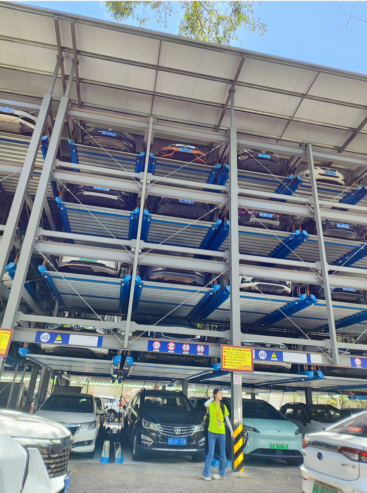

# 升降式停车场-第三十二期

还是第一次见到这种升降式停车的，为了在露天的停车场地多停车，大城市还真是在想办法，不过这样有个很大的缺陷，停车和取车都很慢，取车的时候等了半小时，在这炎炎夏日等车也是一件很痛苦的事情。科技还需不断进步，才能给人类带来便捷。

## 技术类分享

#### HTML属性和DOM属性

[https://jakearchibald.com/2024/attributes-vs-properties/](https://jakearchibald.com/2024/attributes-vs-properties/)

文章中介绍了HTML属性（attribue）和DOM属性（property），对比了React和Vue两种框架的使用情况，也说明了两者的主要区别，这种概念性比较容易混淆。

#### DOM事件和Pub/Sub终极指南

[https://pinjarirehan.medium.com/the-ultimate-guide-to-dom-events-and-pub-sub-fe1c36e4eacb](https://pinjarirehan.medium.com/the-ultimate-guide-to-dom-events-and-pub-sub-fe1c36e4eacb)

页面上常见的交互事件大多数都是使用DOM实现，为什么呢？因为更好理解，其他人维护也更加清除，但是Pub和Sub呢？更适合于比较复杂的处理情况，更加庞大的信息处理，以及涉及到很多状态维护，之前听说过网易云的桌面端不好升级，就是因为涉及到的状态处理，各处不一样，要升级维护比较困难，所以后面就使用了Pub和Sub，实现了升级。

## 非技术类分享

#### 为什么一切都变成了一场游戏

[https://www.gurwinder.blog/p/why-everything-is-becoming-a-game](https://www.gurwinder.blog/p/why-everything-is-becoming-a-game)

即使在一个一切都是游戏的世界里，你也不必按照别人的规则行事;你有一个广阔的开放世界来创造你自己的世界。原来控制人欲望的，竟然是游戏的奖励，渴望得到奖励，所以产生欲望，只是这样的游戏是否健康，却无人察觉，或者说察觉之人已经得到奖励，一眼能看穿游戏的本质，就能快速得到奖励。

#### 为什么你可能是NPC

[https://www.gurwinder.blog/p/why-you-are-probably-an-npc](https://www.gurwinder.blog/p/why-you-are-probably-an-npc)

NPC: 非玩家角色

在第三级问题上，保持沉默。在次要问题上，要谦虚。在主要问题上，要充满激情。你的大脑在形成信念时总是会试图节省时间——这就是它所做的——但节省时间的最好方法不是走通往“真理”的捷径，而是根本不走任何路线。因此，如果你想停止成为NPC，只需对所有与你无关的事情说“我不知道”。这将使您有时间在所有事情上不成为NPC。

藏书阁又能多一本书：置身事内 - 中国政府与经济发展

#### flowcv

[https://flowcv.com/](https://flowcv.com/)

凭借其轻松的编辑器和可调整的模板，您可以轻松创建出色的简历和求职信。使用 Flow CV 简化您的工作申请流程。使用专业材料更快地完成完美的工作。

#### 雨天避雷的误解

[https://www.outsideonline.com/outdoor-adventure/hiking-and-backpacking/lightning-safety-facts-hikers/](https://www.outsideonline.com/outdoor-adventure/hiking-and-backpacking/lightning-safety-facts-hikers/)

原来，下雨天躲在树下或者山洞里，并不能避雷，站着比躺下更友好，闪电喜欢高大的结构、孤立的结构和尖锐的结构。金属并不会吸引闪电，生活小技巧又增加了，哈哈哈~

#### Git故事，这次没这么好玩了（英文）
[https://blog.brachiosoft.com/en/posts/git/](https://blog.brachiosoft.com/en/posts/git/)

原来git的出现还有这样一段故事，收费的BitKeeper，回顾了Git的起源和发展，以及它如何从Linus Torvalds个人的一个项目成长为全球软件工程师的标准工具，正是因为开源精神。
