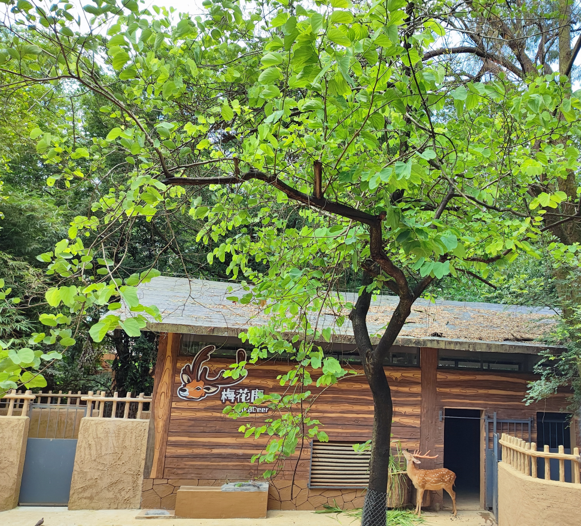

# 自由与约束-第三十三期

动物园的动物，失去自由，被困在在动物园里，但是享受着每天有人饲养，不需要为了生活奔波的日子，不用面临危险，似乎也是很不错的生活，但是如果是人生，一眼能望到头的日子是否会过于平淡，缺失色彩呢？

## 技术类分享

#### TypeScript学习

[https://github.com/linbudu599/TypeScript-Tiny-Book](https://github.com/linbudu599/TypeScript-Tiny-Book)
找到一个阿里巴巴大厂程序员学习Typescript的仓库，他是出了一本掘金小册，这是源码学习仓库，其实Typescript的复杂用法还是很需要掌握的，毕竟现在这么多依赖都使用Typescript编译了。

#### VueConf 2024

[https://vueconf.cn/?continueFlag=a4e8306cfaa0a66aaece5258e30c6573&s_trans=5686952880_&s_channel=4](https://vueconf.cn/?continueFlag=a4e8306cfaa0a66aaece5258e30c6573&s_trans=5686952880_&s_channel=4)

今年的Vue Conf，在深圳举行，好多人都去了，里面包含PPT和video，没去的也可以了解这次会议的内容，了解将来Vue的发展和变化。

#### SEOJuice

[https://rectangular-sink-33e.notion.site/SEOJuice-Help-Center-ff8e563bcbbf4ece9ada859b8e30673e](https://rectangular-sink-33e.notion.site/SEOJuice-Help-Center-ff8e563bcbbf4ece9ada859b8e30673e)

一款优化网站SEO的工具，但是这是它的帮助中心，里面介绍了什么是SEO，如何实现增加网站的SEO，如何追踪SEO的效果。

SEO，即搜索引擎优化，是使您的网站对 Google 等搜索引擎更具吸引力的做法。 目标是让您的网站在人们搜索与您提供的产品相关的主题时在列表中显示得更高。这很重要，因为您的网站排名越高，看到它的人就越多，您可能获得的访问者就越多。

## 非技术类分享

#### 刻意练习

[https://www.yuque.com/eden2f/life/qkz5bzdgxaguhvtn](https://www.yuque.com/eden2f/life/qkz5bzdgxaguhvtn)

在语雀现在也能找到很多质量不错的文章了，在逛一逛中突然看到，刻意练习这本书可以进入我的待读书单了。

####  AI 制造业应用

[https://new.qq.com/rain/a/20240701A04VGO00](https://new.qq.com/rain/a/20240701A04VGO00)

可以看出国内各行各业都在紧跟时代风潮，各种AI应用不断出现，但是为啥中国的AI应用没有走向世界的原因，是本质上，这样的应用能给人类带来什么，能如何改善人类生活，很多跟风出现的产品，缺乏务实的功能，就只是成为了体现从众而已。

#### 拼接和重定向控制肖像动画

仓库：
[https://liveportrait.github.io/](https://liveportrait.github.io/)

测试地址：
[https://huggingface.co/spaces/KwaiVGI/LivePortrait](https://huggingface.co/spaces/KwaiVGI/LivePortrait)

效果如下（gif图）：

video效果:
<video width="800px" preload loop controls><source src="../../images/1720578119605.mp4" type="video/mp4"></video>

这表情变化的模仿还是很不错的，不过需要是正脸，效果更好，侧脸和脸不全，会有些奇怪，而且如果除了脸部表情的变动，还有头部的移动，就还是会别扭。

