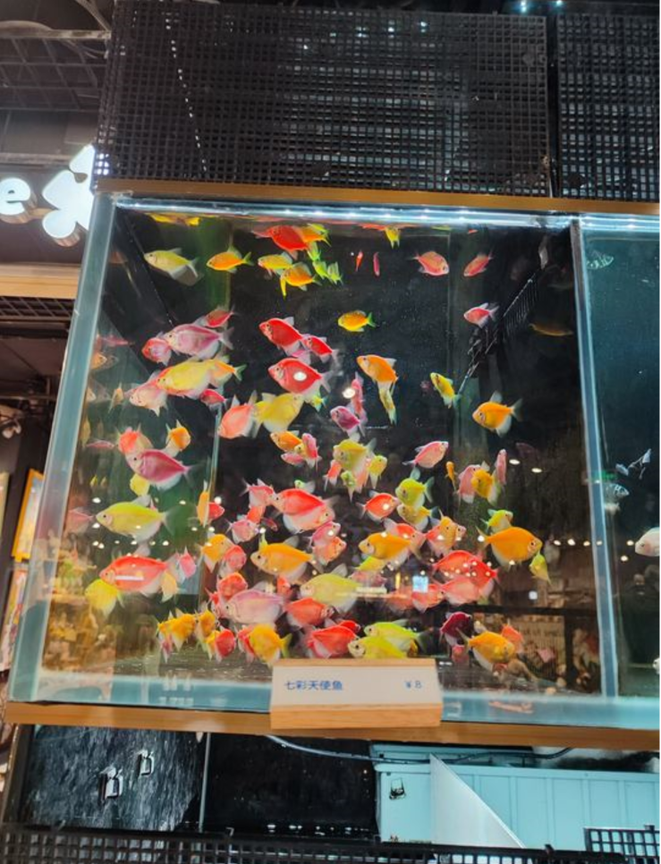

# 七彩天使鱼-第三十五期

去逛商场的时候，发现了五颜六色的鱼儿，真的很小只，又很漂亮，眼睛看到美丽的生物，总是焕然一新的感觉。

## 技术性分享

#### 收录免费的汉字字体

[https://wangchujiang.com/free-font/index.html](https://wangchujiang.com/free-font/index.html)
又多了一项字体选择，有时候看长篇文章，还是希望字体样式好看点，看的赏心悦目，文章的样式真的对于留住目光有影响。

#### 基本功 | 一文讲清多线程和多线程同步

[https://tech.meituan.com/2024/07/19/multi-threading-and-multi-thread-synchronization.html](https://tech.meituan.com/2024/07/19/multi-threading-and-multi-thread-synchronization.html)

这篇技术文章技术含量还是很不错的，多线程情况下，会遇到的各种问题和情况，都说明的很清楚，还提到了各种锁，其实在多节点的多线程情况下，数据同步是难题，避免在线程中共享数据。最快的同步就是没有同步。

说实话，美团的技术文章分享，格式上有点问题，代码片段的字体实在是太小了，费眼睛，我将页面放大到175%才能看清，但是页面的放大，导致其他地方的文字也随之放大，就会产生很奇怪的影响，不知道为啥没有人优化一下这样的问题，难道美团不重视技术分享，但是既然发布出来了，就要维护好它，给使用的观众一个舒适的感觉。

#### CSRF 攻击和防御 - Web 安全常识-哔哩哔哩

[https://b23.tv/h7TcfAm](https://b23.tv/h7TcfAm)
这个视频在B站算讲的清楚的CSRF知识点的了，攻击者如何发起攻击，要如何防御，讲的还算清楚，平时开发还是算少去了解攻击相关方面的知识，但发现其实还挺有意思的，像是如何与黑客斗智斗勇一样。

####  DNS域名解析过程-哔哩哔哩 

[https://b23.tv/9iZxSs4](https://b23.tv/9iZxSs4)
技术蛋老师的网络知识讲解还是很有名的，风格幽默风趣，知识点通过他的比喻，能够更快让我这样记性不好的人记住，上课老师如果有一半愿意这样分享知识点，那应该掌握的知识点的人和喜欢老师的人会大幅度上升。

## 非技术性分享

#### 乔木日志-飞书

[https://bytedance.larkoffice.com/docs/doccnCMWN4yePMZB5GbnJnReB6c](https://bytedance.larkoffice.com/docs/doccnCMWN4yePMZB5GbnJnReB6c)

乔木大佬的每日总结，之前我觉得一周总结一次就很了不起了，但是一山还有一山高，人外有人呀，像乔木大佬学习。
#### 恐慌在科技就业市场上

[https://matt.sh/panic-at-the-job-market](https://matt.sh/panic-at-the-job-market)

从公司的架构、规模、公司的薪酬范围，再到如何录用，面试技巧，这篇文章很长，但是却让我产生了很大思考，现在面试准备，你猜不透面试官的心理，是因为面试官根本就不想要了解你以为的，而是要了解这个岗位本身需要的是什么样的人，也不会考虑你是否有创造力，因为创造力也是不确定性，无法保证，就像面试官不想了解你的工作经验，而是通过他以为的方式考验你是否达到标准而已。

大多数面试过程甚至不考虑一个人的实际工作、经验和能力。你必须时刻敞开心扉，活在人们面前，对一系列毫无意义的问题立即给出答案，因为如果你不能在没有准备的情况下解决一个毫无意义的问题，你显然不能在你的余生中做任何有价值的事情。

#### 免费的国外的CDN上传

[https://imagekit.io/](https://imagekit.io/)

找到一共宝藏的网站，可以免费上传文件，生成连接，之前找这种服务，但是国外的要不是限制访问，国内的是还不稳定，一直没有找到合适的，所以直接把文件图片存在了仓库中，成为了公共资源，但是看到大家说GitHub有上传下载流量限制，超过会收费，不能存储超过50M的文件。

#### 我会告诉年轻的自己，该知道的一些事情

[https://anthonynsimon.com/blog/advice-to-younger-self/](https://anthonynsimon.com/blog/advice-to-younger-self/)

重视真实性而非美好，年轻的自己都会觉得世界很美好，但是真实的世界会打击我们，一步一步将自己推向成熟。让别人开心不是你的工作，这真的很重要，特别是女孩子，时刻该关注的是自己本身，而非他人。

#### 更好的阅读方式

[https://medium.com/@kevinnokiawriting/reading-books-is-useless-heres-a-better-way-to-read-b3a49e157948](https://medium.com/@kevinnokiawriting/reading-books-is-useless-heres-a-better-way-to-read-b3a49e157948)

读书的目的是研究并应用它，写下，突出，重复，直到留在脑海中。不过针对我，读书能让我处于另一个世界，去观察一个新世界。
