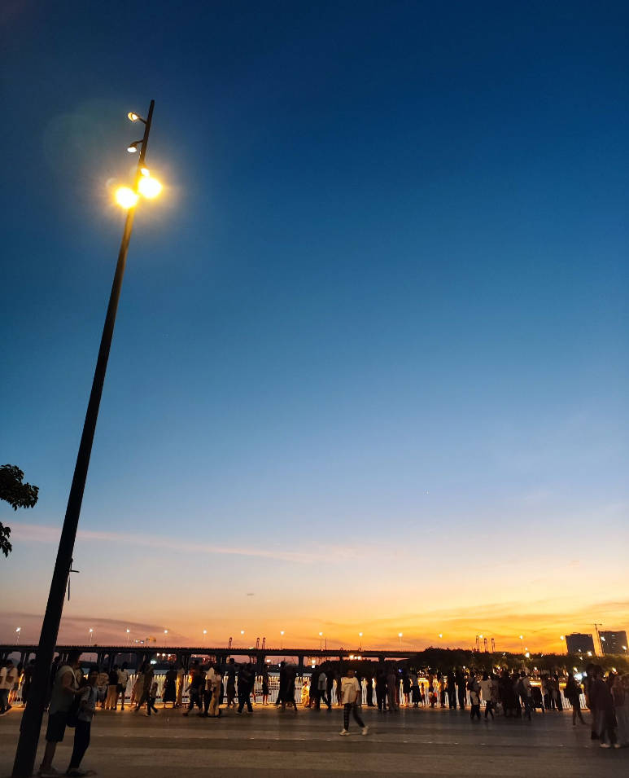

# 海边夕阳-第四十四期



以前看不到海的孩子，终于看的了海边，对海有无数的憧憬和向往，现在终于能亲眼看到了，心中没有万分欢喜，反而很平静，以前的自己，还是孩子时，总是天真浪漫，无拘无束，现在的自己，已然长大，再来拥有，却无心中澎拜之意了。


## 技术类分享
### 生成花里胡哨的二维码
[https://github.com/zhengkyl/qrframe](https://github.com/zhengkyl/qrframe)


这个二维码生成器有点特别，生成的二维码都开始有艺术氛围了。感兴趣的可以看看，这说明大家对审美的要求已经越来越高了，哈哈~


### discord如何存储一万条数据


[https://discord.com/blog/how-discord-stores-trillions-of-messages](https://discord.com/blog/how-discord-stores-trillions-of-messages)


discord原来最开始是将数据存储在MongoDB上，后面改进成了Cassandra 数据库，但是也遇到了问题，来看看数以万亿的通讯网页端是如何解决问题的吧


### ViteConf2024
[https://viteconf.org/24/replay](https://viteconf.org/24/replay)

ViteConf今年的演讲分享出来了，了解Vite接下来的发展和变化，可以看看，虽然视频好长，但是可以挑喜欢的看，有每个人时间段显示。最近尤大大开新公司了，接下来Vue开源的朋友也就不再是为爱发电，希望VoidZero越办越好。


### UPNG
[https://github.com/photopea/UPNG.js](https://github.com/photopea/UPNG.js)


最近做了一个功能，图片压缩，jpg图片是能够很好压缩的，使用<font style="color:rgb(51, 51, 51);">canvas的toDataURL方法</font>

```javascript
canvas.toDataURL(mimeType, quality);
```

<font style="color:rgb(51, 51, 51);">其中</font>`<font style="color:rgb(51, 51, 51);background-color:rgb(248, 248, 248);">quality</font>`<font style="color:rgb(51, 51, 51);">就是图像的质量。</font>

<font style="color:rgb(51, 51, 51);">但是此方法只适合image/jpeg或者image/webp，所以，PNG的图像压缩无法使用此API。PNG的前端压缩这里使用的是 UPNG.js。</font>

```javascript
UPNG.encode(imgs, w, h, cnum, [dels])
```

<font style="color:rgb(51, 51, 51);">其中的</font>`<font style="color:rgb(51, 51, 51);background-color:rgb(248, 248, 248);">cnum</font>`<font style="color:rgb(51, 51, 51);">就是用来设置PNG压缩损失的，0的话是无损。</font>

<font style="color:rgb(51, 51, 51);"></font>

## 非技术分享


### 人工智能公司有用吗？


[https://benn.substack.com/p/do-ai-companies-work](https://benn.substack.com/p/do-ai-companies-work)


这篇文章引起了热议，这周的黑客新闻日报中，很多人终于开始思考人工智能的公司，现在已经这么多了，但是还是有人不停的在这个方向上卷，真的有用吗？来看看这篇文章所说的观点。


里面一句话我感到震撼，市场需要非理性才能让你保持偿付能力，我觉得除了市场以外，公司也需要非理性才能让优秀的人一直待下去。


### 死亡教会我活着的意义


[https://www.bilibili.com/video/BV1wz421B7hq/?spm_id_from=333.1007.top_right_bar_window_history.content.click&vd_source=c911472d8a2e121a97f38e0efe3f375e](https://www.bilibili.com/video/BV1wz421B7hq/?spm_id_from=333.1007.top_right_bar_window_history.content.click&vd_source=c911472d8a2e121a97f38e0efe3f375e)


很少接触生病的人，也很不喜欢医院这个地方，这个负能量很高的地方，但是没想到痊愈的病人，离开医院竟然没有高兴，长期呆在医院里，与外界世界脱轨，原来会这么影响生活，生活在总有各种各样的人，我们能接触到的也只是少数人，去聆听他们内心的声音，觉得大家都在为更好的活着而努力，虽然医院是负能量很高的地方，但是医院能让生病的人好起来，挽救生命，又是如此的高尚。


