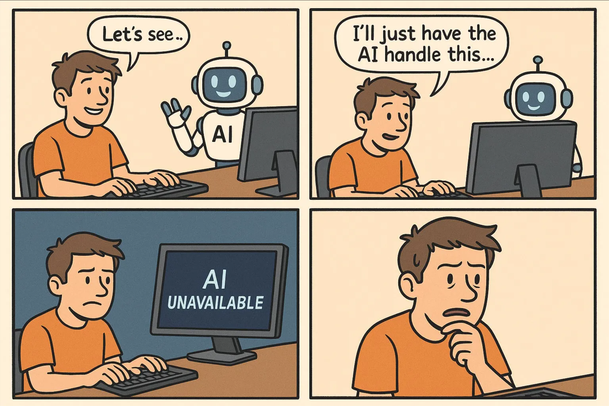

# 避免人工准时代进的萎缩-第四十七期

现在作为程序员，大家都会有焦虑，现在AI发展如此迅速，大家都依赖使用AI，将来有一天AI能够替代自己的技能，这个时候自己该怎么办？过度依赖确实有长期风险，下面是一些小妙招。

**践行“AI ”安全——始终验证并理解**

**2.基础编程无需AI——有时候，努力一下也挺好的**

**3.在向AI提问之前，务必先自己尝试解决问题**

**4.使用人工智能来增强代码审查，而不是取代它。**

**5.积极学习：跟进并不断迭代。**

**6.记录学习日志或列出“AI 辅助”清单。**

**7.**_**与**_**人工智能结对编程。**

现在AI最大的弊端，它给出的答案未必一定是正确且最优的，还是需要人去干涉和理解

## 技术类分享

### 文本转换为语音

[https://easyvoice.ioplus.tech/](https://easyvoice.ioplus.tech/)

这是一个开源的模型，不知道为什么，我尝试的时候，生成的语音没有各种多角色，看示例是可以支持多角色的，一段文案转换成语音，如果有多角色声音，就会更加逼真，让人听着有身临其境的感觉。

### 给好奇者的 WebRTC

[https://webrtcforthecurious.com/zh/](https://webrtcforthecurious.com/zh/)

假如你对 Web 实时同学感兴趣，可以看看这个「给好奇者的 WebRTC」，挺适合入门者学习。双向通视频如何实现，我以前对这个方向感兴趣过，这次看到这么详细的文章，有点小确幸。

### 线上故障应急处理

[https://jt26wzz.com/posts/0007-online-firefighting-real-world-lessions-from-4-years-on-call/](https://jt26wzz.com/posts/0007-online-firefighting-real-world-lessions-from-4-years-on-call/)

作者是在 CDN 做基础设施研发，积累了很多线上事故处理方案，颇有感触，开发其实都或大或小要经历一下线上事故，这样抗压能力才能变强。

### 网站的明暗主题一键实现

[https://theme-toggle.rdsx.dev/](https://theme-toggle.rdsx.dev/)

这个网站的明暗主题一键实现的效果挺好的，使用 view transitions api，直接 Copy 代码就可以使用，省去了一些自己写适配的成本。

## 非技术类分享

### Vector

有各种各样的卡通图标，样式比较好看，可以媲美于国内的iconfont了，有需求的可以收藏一下网址。

[https://vectorcraftr.com/](https://vectorcraftr.com/)

### 如何避免在 AI 时代的技能退化

[https://addyo.substack.com/p/avoiding-skill-atrophy-in-the-age](https://addyo.substack.com/p/avoiding-skill-atrophy-in-the-age)

如何使用 AICoding，而不让你辛苦掌握的工程技能消失。其实过度依赖AI，那肯定是不利于自己职业规划和发展的，毕竟人越来越懒惰，那就越来越躺平，越来越容易被替代，看一下这个文章，让自己不再这么容易被AI替代吧。

### 警惕在 AI 时代变成不思考

[https://www.dutchosintguy.com/post/the-slow-collapse-of-critical-thinking-in-osint-due-to-ai](https://www.dutchosintguy.com/post/the-slow-collapse-of-critical-thinking-in-osint-due-to-ai)

大家对 AI 越有信心，就越不会进行独立思考，反过来，越不信任 AI，就越可能质疑结果，验证信息，并深入思考。使用的人并不是一开始就懒，不少人还是经验丰富的工程师，但当 AI 可以快速、自信、清晰地给出结果时，他们就会出于惰性，放弃要思考的部分，不再质疑，不再核实，全盘接受。

### 假设 AI 未来真的能在写代码和系统设计上超过人类，那还有必要学习编程和系统设计吗？

[https://baoyu.io/blog/ai-surpass-humans-coding-necessary](https://baoyu.io/blog/ai-surpass-humans-coding-necessary)

宝玉的一篇文章，里面这 2 句话说得很好「程序员的时间窗口不会太短，架构师的时间窗口会很长」，「没有人知道未来的 AI 时代需要什么样的知识和技能，但是保持学习的人总是能最快跟上未来的趋势的」。
