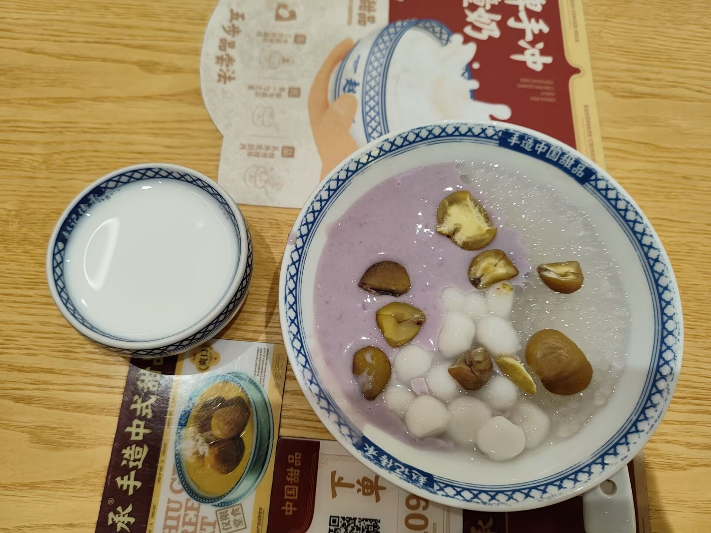

周末去吃了心心念念的赵记传承甜点，确实不错，不是很甜的那种，口含绵密，刚好有我爱吃的芋泥+板栗，很nice~

## 技术类

### 今天学点啥
[https://metaso.cn/study?utm_source=ai-bot.cn](https://metaso.cn/study?utm_source=ai-bot.cn)

这个AI工具，直接丢给他pdf和文档，能够生成视频讲解，挺有意思的，还有ppt等等，虽然都是需要你丢东西给他，然后生成内容，到时候如果能做的，我只需要说出我想要学习什么知识点，然后就生成视频讲解，应该更加适用。

### AdaCpp
[https://www.adacpp.com/zh/landing](https://www.adacpp.com/zh/landing)

一个基于浏览器的在线 C++ 学习环境，可以编辑/编译代码，并有 AI 的代码解释，正好可以给小杜玩玩。

### [在没有 IPv4 连接的情况下使用 Internet](https://jamesmcm.github.io/blog/no-ipv4/)
[https://jamesmcm.github.io/blog/no-ipv4/](https://jamesmcm.github.io/blog/no-ipv4/)

在具有 IPv4 和 IPv6（直接和 NATed）流量的 VPS 上创建 WireGuard VPN 服务器。

使用网络命名空间通过此 WireGuard 接口运行另一个 VPN。

使用`unshare`技巧在该网络命名空间内运行 Docker。

使用 WireGuard 时调试 MTU 问题。

它真正展现了 Linux “自己动手修复” 方法的优势。

### [Qwen VLo：从“理解”世界到“描绘”世界](https://qwenlm.github.io/blog/qwen-vlo/)
[https://qwenlm.github.io/blog/qwen-vlo/](https://qwenlm.github.io/blog/qwen-vlo/)

AI绘图大模型，可以根据用户输入的文字，更改图片的效果了，看着示例很不错，可以更换背景，生成你想要的图片，并且也可以组装了，比较智能，但是AI生成的图片跟实际拍摄的图片还是有很大的差别，让人能一眼就发现这是AI生成的。

[https://chat.qwen.ai/](https://chat.qwen.ai/)

这个AI绘图功能确实不错，可以收藏用。

## 非技术类

### 8000mAh手机电池，说明什么
[https://www.sohu.com/a/905525880_115831](https://www.sohu.com/a/905525880_115831)

大家发现了吗，手机的电池正在越变越大。你可以看一下你的手机，电池容量是多少。仅仅三四年前，手机电池一般都是 4000mAh（毫安时），最多就到 5000mAh。但是在去年（2024年），电池容量增加到6000mAh。今年（2025年）更是出现好几部8000mAh的手机。更让人惊奇的是，这些手机并没有因为更大的电池，而变得更重更厚。

以某品牌的 8000mAh 手机为例，重量209克，厚度7.98毫米，跟一般的大屏手机差不多。

为什么手机塞进了更多的电池，却没有变重？

原因很简单，电池技术在这几年出现了突破。大家应该听说过"固态电池"。它不同于现在的锂电池，最大特点是更高的能量密度，也就是同样的重量可以储存更多的能量。

但是，固态电池还在测试中，量产时间最快也要等到2027年。目前，真正进入市场的是“半固态电池”。半固态电池介入传统锂电池与固态电池之间，电解液是固态和液态的混合物。2023年4月份，宁德时代[宣布](https://wallstreetcn.com/articles/3686879)将要生产凝聚态电池，也就是半固态电池。

根据厂家公布的数据，这种电池的能量密度是 500 Wh/kg，也就是每公斤可以储存0.5度电，传统锂电池的能量密度是 250 Wh/kg。

所以，手机从锂电池换成半固态电池，重量不变，电量翻一倍，正好从 4000mAh 增加到 8000mAh。从时间上看，半固态电池是2023年发布，2024年投产，2025年进入消费电子产品，时间也刚好。

可以预期，随着越来越多手机换成半固态电池和将来的固态电池，续航时间不再成为问题，充电焦虑将彻底消失。

以今年发布的 8000mAh 手机为例，续航时间就非常惊人。根据[评测](https://www.sohu.com/a/905525880_115831)，它可以连续播放25小时的视频。也就是说，中度或轻度使用时，可以两天一充，甚至三天一充。

### MyRingOne
[https://myringtone.app/](https://myringtone.app/)

免费无需注册的铃声搜索下载网站，提供 MP3 格式铃声。我试了一下，大多数歌曲真的能搜索到，不过由于是铃声，不是完整的歌曲，还是有差异的。

### 编程最差的学生，为什么成了AI时代的最大赢家？
[https://sspai.com/post/100369](https://sspai.com/post/100369)

当执行层面的障碍被 AI 扫清后，真正的价值创造发生在更高的层面 —— 理解人性需求、做出价值判断。学生们开始明白，技术只是工具，洞察才是核心。

