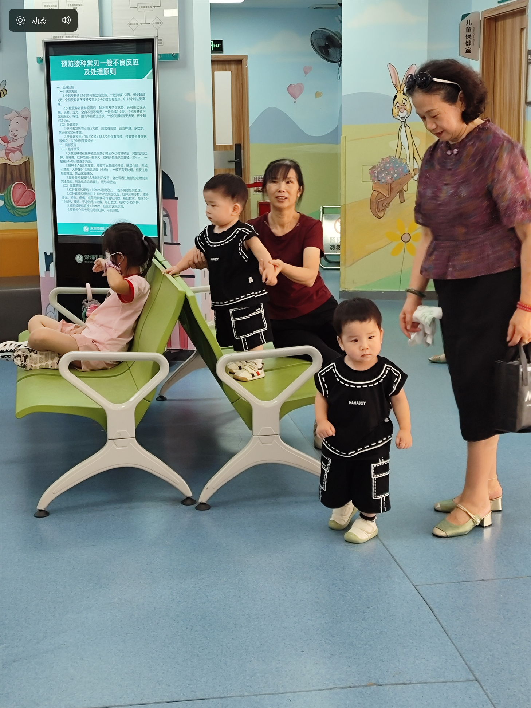

# 双胞胎-第五十期

周末去打疫苗，看的一对双胞胎小朋友，很可爱，听他们母亲说，小孩子打完疫苗，有时候会有反应，晚上不好睡觉，除了一个保姆，一个她婆婆外，再加上他们夫妻两，才能应对两个孩子，这样想想感觉小孩子好难抚养，母亲真的很伟大。

## 技术类

### ECMAScript 2025 的新增语法

[https://2ality.com/2025/06/ecmascript-2025.html](https://2ality.com/2025/06/ecmascript-2025.html)

JS 语法标准发布了2025版，本文罗列了今年的7个新增语法。

### 使用 JS TTS 和 Highlights 构建句子级阅读器

[https://jsdev.space/tts-sentence-reader/](https://jsdev.space/tts-sentence-reader/)

教你用浏览器的 API，通过内置的 TTS 语音引擎，写一个句子朗读器。中文和英文都可以朗读，但就是声音有点太机器化了。

### 感觉像GIF的SVG

[https://koaning.io/posts/svg-gifs/](https://koaning.io/posts/svg-gifs/)

文章的移动的图像，竟然是svg，而且体积只有49kb，这就实现了SVG的高清，又实现了体积小，快来看看是如何运行的吧。

## 非技术类

### 一道数论趣题：2010年江西高考理科数学压轴题

[https://github.com/ruanyf/weekly/issues/7184](https://github.com/ruanyf/weekly/issues/7184)

2010年江西高考理科数学压轴题是一道数论背景题，这道题构思巧妙，需要对构造比较熟悉，对数学思维是一次很好的训练。

相比参考答案太简单，这篇解答非常详细介绍如何导出构造，从而让中学生也能理解。

### 在没有博士学位的 10 年时间里，从 Python 程序员到分布式系统研究人员

[https://emptysqua.re/blog/from-python-programmer-to-distributed-systems-researcher-in-10-years/](https://emptysqua.re/blog/from-python-programmer-to-distributed-systems-researcher-in-10-years/)

作者的一篇回忆文章，总结了自己的人生，写得很鼓舞人。

他在高中想学舞蹈，但是被 3D 动画片吸引，去读了计算机本科，毕业后成了 Python 程序员，后来靠着自学和努力，现在是分布式系统研究员。

### 添加功能是因为 ChatGPT 错误地认为它存在

[https://www.holovaty.com/writing/chatgpt-fake-feature/](https://www.holovaty.com/writing/chatgpt-fake-feature/)

评论：

[https://news.ycombinator.com/item?id=44491071](https://news.ycombinator.com/item?id=44491071)

chatGPT给出的答案，有可能是错误的，那如何应对这样的错误，或者如何证明这答案是不是可取的，就需要人为去干涉，最近也有同事过于详细AI给的答案，然后在电脑上操作了不该操作的命令，然后电脑系统崩溃了，这种情况并不少见，由此可见，我们现在使用AI的频率越来越高，就导致了太信任AI，产生的后果也挺严重的，希望在使用AI的过程中，我们一直保持自己的见解，能明辨是非的能力。
