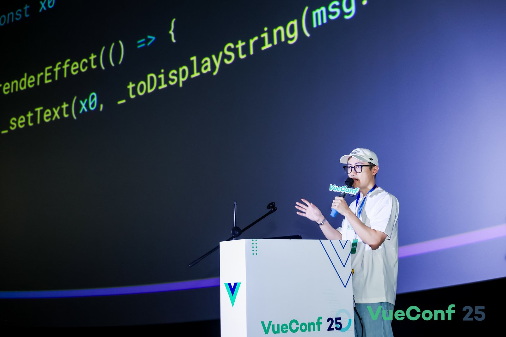

这一次在朋友的邀请下，亲自去现场参加了技术分享会，说一下感受，技术方面分享肯定参差不齐，这是让我没想到的，我以为，上台分享的人一定都很优秀，观感方面，电影院很大，容纳了400-500人，坐的也比较满，这就导致了不好走动，且有些味道，而且坐一天真的有点难为我，趁着茶歇时间，下来买了一个水，呼吸一下新鲜空气。然后就是可能中午菜离我比较远，吃的有点拘谨，没有吃饱，但是看一天分享下来，脑力消耗比较大，很饿。

## 技术类

### 前端开发人员
[https://roadmap.sh/frontend](https://roadmap.sh/frontend)

[https://godbasin.github.io/front-end-playground/faq.html](https://godbasin.github.io/front-end-playground/faq.html)

看的有人在KM上分享，每当不知道自己该学什么的时候，就看看前端规划图，很有道理，每个人都应该人手一份。

### VueConf2025尤雨溪主题演讲ppt
[https://mp.weixin.qq.com/s/S0DYFfwvMIGsQJpe3JsrrQ](https://mp.weixin.qq.com/s/S0DYFfwvMIGsQJpe3JsrrQ)

尤大大的梦想还是比较伟大，开公司，打算重新整顿JS生态，Vite现在发展已经达到了某种前所未有的高度，就连React都官方提示可以用Vite搭建React项目了，后面想要继续优化，就只有各种依赖相关的，比Eslint、Jest、Prettier、Babel等等底层的依赖，所以推出了Void Zero项目。

### Simple Chromium AI
[https://github.com/kstonekuan/simple-chromium-ai](https://github.com/kstonekuan/simple-chromium-ai)

Chrome 浏览器从138版后，内置了 Gemini Nano 模型，并提供 [AI Prompt API](https://developer.chrome.com/docs/ai/prompt-api?hl=zh-cn) 以便调用。

这个库就是浏览器 AI Prompt API 的封装，用起来更方便。

## 非技术类

### 等长运动是降压效果最好的运动
[https://mp.weixin.qq.com/s/FcFTTHzsTK-7qjLRlX-g4g](https://mp.weixin.qq.com/s/FcFTTHzsTK-7qjLRlX-g4g)

“等长运动”（平板支撑、扎马步、靠墙静蹲）是降血压的佳运动选择。等长运动显著优于传统的有氧运动（跑步、走路）、高强度间歇训练（波比跳、跳绳）和抗阻训练（撸铁、俯卧撑）。从降压效果来看，靠墙蹲可能是最有效的等长运动，可使血压降低11.41/5.09毫米汞柱。

这是我没有想到的，毕竟运动量并不大，而且不是全身运动。看来核心训练还是很有必要，转发给家里人。

### 中国最大的书
[https://www.baijiayoupu.com/c/6599.html](https://www.baijiayoupu.com/c/6599.html)

中国最大最厚的书，是清朝的玉牒，一册厚达85厘米，重约90公斤。好夸张，竟然是家的族谱，记载的皇族宗室男性就有10余万人，由宗人府负责编撰，目前收藏于北京的中国第一历史档案馆。

### 计算机好比自行车
[https://allaboutstevejobs.com/videos/misc/future_of_pc_1990](https://allaboutstevejobs.com/videos/misc/future_of_pc_1990)

摘自斯蒂夫·乔布斯1980年的访谈。

我记得，大概12岁的时候，读过一篇文章，应该是在《科学美国人》杂志。

那篇文章给出了地球上所有物种的运动效率，从 A 点到 B 点，同样的距离，它们消耗了多少能量。

结果，秃鹫位居榜首，运动效率最高，超越了其他所有生物。人类排在榜单的最后三分之一，对于"万物之王"，这个成绩实在不值一提。

但是，作者很有想象力，测试了人类骑自行车的效率，结果远远超过了秃鹫，荣登榜首。

这给我留下了深刻的印象。我们人类是工具制造者。我们可以制造工具，将自己的能力放大到惊人的程度。

对我来说，计算机就是思维的自行车。它能让我们超越自身的能力。

我认为，我们才刚刚处于计算机的早期阶段----非常早期的阶段----我们只走了很短的一段路，计算机仍在发展中，但我们已经看到了巨大的变化。

我认为现在与未来一百年即将发生的事情相比，根本不算什么。

:::color3
人类有哪些无法被AI所替代的事情？我认为是对现实世界的理解和感受，AI能帮你写代码但是他不能规划你们公司的业务，AI可以帮你解答很多不理解的事物但是无法帮助你人与人的沟通。其实现阶段的AI其实就类似于人类的超级外挂，人类负责的是指明方向，AI可以帮你在数字执行。

:::

