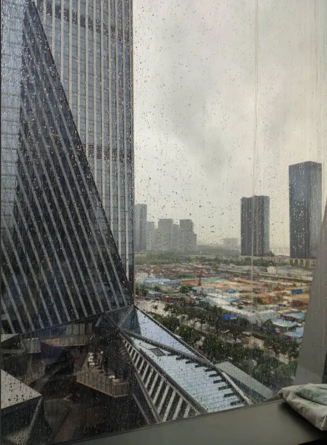

# 深圳大雨-第五十二期

深圳由于台风和季风的影响，连着下了两三周的大雨，这可是把我憋坏了，不能出去走动，还好可以在健身房运动一下，不然我就要发霉了,呜呜呜~

## 技术类分享

### 屏幕是如何工作的？

[https://www.makingsoftware.com/chapters/how-a-screen-works](https://www.makingsoftware.com/chapters/how-a-screen-works)

****

从物理像素到操作系统渲染，每一层都影响最终显示效果。你知道屏幕是如何绘制的吗？如何可以高清显示，快来看看。

### 你对Date了解多少？

[https://jsdate.wtf/](https://jsdate.wtf/)

里面包含了28道关于Date的题目，挺有意思的，值得一看。

### NodeJS 2025年的现代模式

[https://kashw1n.com/blog/nodejs-2025/](https://kashw1n.com/blog/nodejs-2025/)

Node.js 已经发生了巨大的变化，本文介绍现在应该采用的新写法。前缀的ES模块，确实更容易让人通熟易懂了解这种依赖，里面很多2025的新变化，可以一起看看学习。

## 非技术类分享

### 发现一个全球气温地图工具

[https://zoom.earth/maps/temperature/](https://zoom.earth/maps/temperature/)  
最近天气又非常热了，发现一个全球气温地图，很全，可以用这个来看看世界的火炉有哪些地方。最近一直下雨，天气又闷又热，三伏天真的很难受。

### 艾滋病疫苗

[https://newatlas.com/infectious-diseases/hiv-prevention-fda-lenacapavir/](https://newatlas.com/infectious-diseases/hiv-prevention-fda-lenacapavir/)

美国食药局 FDA 本周批准了，世界第一种艾滋病疫苗，一年打两次，就不会感染艾滋病 。不知道是不是真的。这种曾经无药可治的绝症，已经被解决了？

### Dan Wang的新书

[https://danwang.co/breakneck/](https://danwang.co/breakneck/)

Dan Wang（我不知道他的中文名），7岁随家人移民北美，现在是知名的经济分析师，在斯坦福大学胡佛研究所任研究员。

1、

这本书始于2021年的一次旅行，我从贵阳骑行到重庆。

我欣喜地发现，重庆这个西部省份的基础设施，比加州或纽约要好得多，而后两个地方的富裕程度比重庆高出几个数量级。

在令人叹为观止的青山绿水间，五天的艰苦骑行让我瞥见了真正的中国。它远不止于高耸的桥梁、宏伟的基建，而是在进行一种前所未有的社会工程，试图解决这个国家面临的问题。

2、

2023年我回到美国，在耶鲁法学院待了一段日子。那里是精英法学院，是雄心勃勃、想要跻身美国政府高层的人的捷径。

这段日子让我强烈感受到，美国是一个律师社会。

律师在美国社会占主导地位，这促使美国沦为一个诉讼至上的否决制国家。无论你想做什么事，反对者都会试图通过律师来否决你。

我相信，如果美国如此执着于一个主要为富人和权贵阶层服务的体系，它就不可能继续保持强国地位。

3、

我逐渐形成了这样的观点：中国是一个工程国家，它用大型工程（包括社会工程）来解决物质和社会问题，而美国则是一个律师社会，它用法律阻止几乎所有的事情，无论好坏。

除此之外，美国人和中国人从根本上来说很相似：永不停歇，渴望走捷径，最终推动着世界上大多数重大变革。

中国和美国的竞争不应该用上个世纪的陈词滥调来解释，比如社会主义 vs 民主主义。两国经常以竞争的名义，实现那些最疯狂的梦想，探索自己的道路。

4、

"工程国家"与"律师社会"的对比，可以解释很多事情。

美国依赖法律手段，比如征收关税和设计各种严苛的制裁机制。而中国则专注于用工程创造未来，比如建造更好的汽车、更美丽的城市、更大规模的发电厂。

5、

工程师并非能言善辩，往往表达不出他们不理解的内容，所以尽管中国在海外修建了道路和桥梁，但它们难以激发中国在全球的文化吸引力。

6、

我写这本书，部分原因是为了整理自己对中国的看法。

中国建立了一个资源丰富国家的良好运营模式。它在过去四十年里修建了多少英里的公路、建造了多少座新的核电站、生产了多少钢铁，写出来真的令人震惊。

我认为，美国不必像中国那样去建设基础设施，只要达到法国、日本或西班牙的建设成本水平就足够了。

尽管如此，美国仍然应该向中国学习。中国在公共交通、充足的住房、功能齐全的城市建设方面已经取得了很多成功。

7、

美国太多地方感觉像是被完好保存下来的、曾经的伟大文明的遗迹。美国人应该更清晰地审视那些通常被忽视和蔑视的工业成就。

8、

2024年底，我再次去上海，发现消费降级是真实存在的。高档餐厅不再难以预订，川湘菜馆正在占据主导地位。许多餐厅的菜品都是在集中式配送中心制作的。越来越多的餐厅更注重外卖，而不是堂食。而且，似乎有一种趋势是，三线城市的连锁餐厅正在向一线城市迁移，以更便宜的价格提供略逊一筹的菜品。

最糟糕的是网红文化。中国的网红文化比美国浓厚得多。在公共场所，随处可见许多人对着手机自拍。任何迷人的地方，无论是咖啡馆还是山顶，都挤满了专心拍照的人。在中国，经常可以看到情侣或朋友聚餐时几乎不怎么互动，只是低头看着手机。我记得有一次在上海丽思卡尔顿酒店喝咖啡，一群女孩坐在我旁边，围着蛋糕互相拍照，竟然拍了一个多小时。网红文化促使餐厅的菜肴更注重拍照效果，而不是味道。

9、

我没有在这本书的任何部分使用 AI。一位经济学家曾写道，他人生中大约有一半时间没有接触过互联网，这让他在互联网出现后更能体会到它的价值。我突然想到，三十年后，回首往事，我也会发现自己的人生分成 AI 之前和 AI 之后。

为了更贴近 AI，我最近搬了家，从耶鲁大学来到斯坦福大学胡佛历史实验室，现在我是那里的研究员。我原本想留在纽约市，但湾区太有吸引力，我决定今年年底重新开始写我的年度信件。硅谷是一个和中国一样奇特而又引人注目的地方，我感觉搬到那里完全合适。
