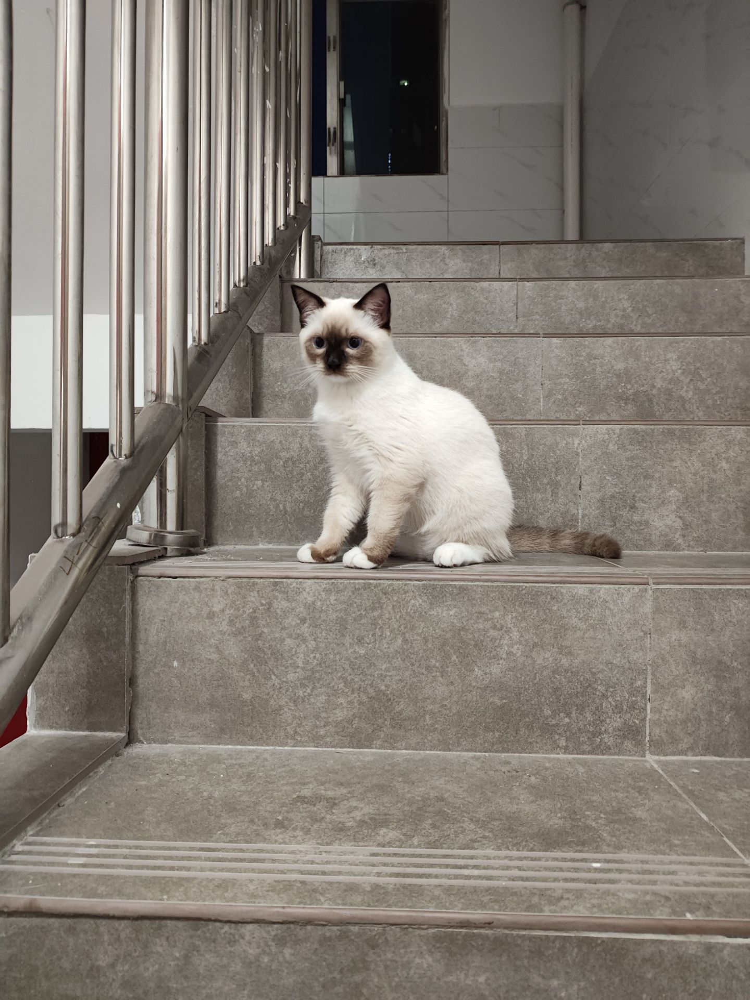

不知道是谁家的小猫咪出走了，在楼梯间遇到了它，可怜兮兮的看着我，应该是饿了，看着不像是流浪猫，这么可爱，应该主人不舍得它流浪吧，不过现在流浪猫真的很多，没有能力一直能养好猫，就不要轻易去养猫，毕竟小猫被养之后，被抛弃这样的情况会很糟糕。

## 技术类

### 锚点定位

[https://webkit.org/blog/17240/a-gentle-introduction-to-anchor-positioning/](https://webkit.org/blog/17240/a-gentle-introduction-to-anchor-positioning/)

CSS 的新语法"锚点定位"（anchor position），可以不使用 JavaScript，只用 CSS 就完成弹出菜单对某个锚点元素`<a>`的定位。

### 如何训练AI来检测恶意JS，让我们的网络冲浪更加安全

[https://blog.cloudflare.com/how-we-train-ai-to-uncover-malicious-javascript-intent-and-make-web-surfing-safer/?utm_source=engineering.fyi/](https://blog.cloudflare.com/how-we-train-ai-to-uncover-malicious-javascript-intent-and-make-web-surfing-safer/?utm_source=engineering.fyi/)

训练AI大模型来检测JS威胁，包括Magecart、加密货币和恶意软件，这个很新颖，也确实有利于社会，但是JS代码在发布后会进行压缩，这就导致判断逻辑更加困难，这里通过解析JS语法树进行分析，有些道理，遇到转义的字符就不处理。

### 如何使用WASM加速浏览器中的Notion？

[https://www.notion.com/blog/how-we-sped-up-notion-in-the-browser-with-wasm-sqlite?utm_source=engineering.fyi](https://www.notion.com/blog/how-we-sped-up-notion-in-the-browser-with-wasm-sqlite?utm_source=engineering.fyi)

文章介绍了 WASM SQLite，以及使用过程中遇到的问题，比如跨域隔离、损坏问题，替代方案每次只能在一个选项卡中进行，选择了 OPFS SyncAccessHandle Pool VFS，因为它没有跨域隔离的要求，而这会导致我们无法将其推广到 Chrome 和 Edge 以外的任何浏览器。完全异步地加载 WASM SQLite，并确保它不会阻塞页面加载 。这意味着初始页面数据很少会从 SQLite 加载。这很好，因为我们客观地确定了从 SQLite 加载初始页面的加速效果并没有抵消下载库带来的速度减慢。

## 非技术类

### Tor的秘密历史

[https://thereader.mitpress.mit.edu/the-secret-history-of-tor-how-a-military-project-became-a-lifeline-for-privacy/](https://thereader.mitpress.mit.edu/the-secret-history-of-tor-how-a-military-project-became-a-lifeline-for-privacy/)

原来暗网访问的网站就是Tor，一直知道有暗网的存在，现在很多人追求不在网络上泄露自己的隐私，所以使用暗网，但是何曾想到，使用暗网，恰恰就可能泄露了自己的隐私访问记录，M国还真是一家独大呀，美国政府大力资助 Tor，是因为这个项目对他们有利用价值。

### 人类为什么需要睡眠

[https://www.science.org/content/blog-post/it-all-comes-down-mitochondria](https://www.science.org/content/blog-post/it-all-comes-down-mitochondria)

在有氧状态下，线粒体的不间断活动会导致自身裂变，所以需要一个静止期（睡眠）来修复，并补充能量。

结论就是，只要生物需要氧气，就需要睡眠，因为有氧活动会消耗线粒体。
