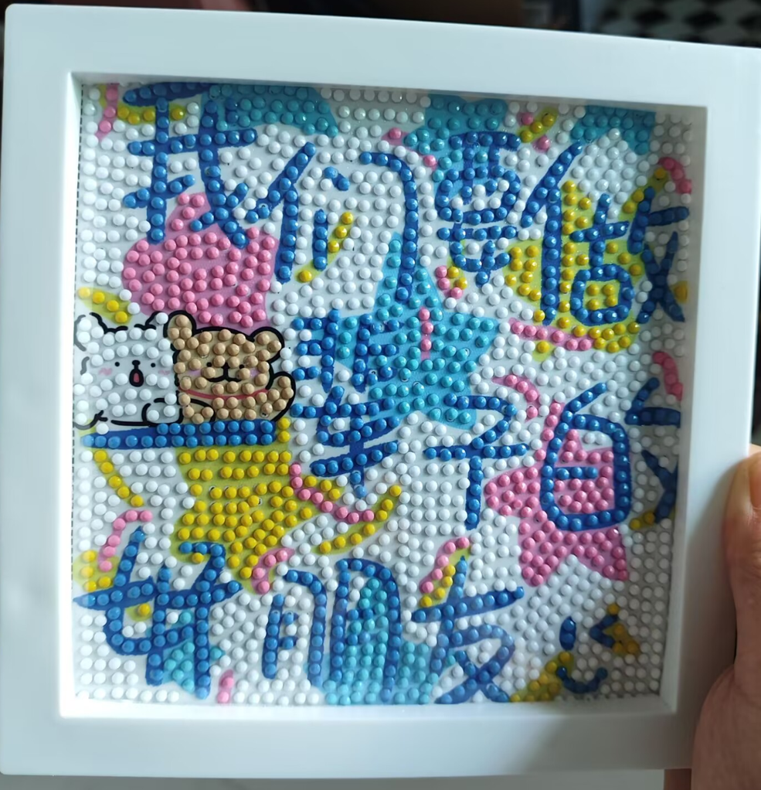

# 可爱的书包-第五十五期

趁着周末有空，给闺蜜准备生日礼物，每年我都会送闺蜜一个特别的礼物，这个礼物不一定很贵重，但是很特别，是无价之宝，我花费时间和精力做出来的，希望她收到的时候喜欢。

## 技术类

### Google新出的文本生成图片的AI

[https://aistudio.google.com/prompts/new_image](https://aistudio.google.com/prompts/new_image)

这是谷歌最新的"文生图"模型，可以在官网效果很是不错，我觉得，图片生成速度很快，效果相当好（下图是：明月如霜，好风如水，清景无限）

### JS生成迷宫

[https://jrsinclair.com/articles/2025/joy-of-immutable-data-recursion-pure-functions-javascript-mazes/](https://jrsinclair.com/articles/2025/joy-of-immutable-data-recursion-pure-functions-javascript-mazes/)

本文用通俗的语言，介绍一种生成迷宫的简单算法，给出 JS 的实现。按步骤一步一步实现，让我想到了学校数学老师教书的样子，也是一步一步实现。

### SVG路径交互指南

[https://www.joshwcomeau.com/svg/interactive-guide-to-paths/](https://www.joshwcomeau.com/svg/interactive-guide-to-paths/)

SVG的path是出了名的难搞，第一次看到它，完全难以理解，同时，`<path>` 元素也非常有用 。它们是在 SVG 中创建弯曲形状的唯一方法，而不是完整的椭圆。一旦你掌握了窍门，它们实际上使用起来很有趣！里面还有步骤动画讲解，非常详细。

## 非技术类

### 警车安装面部识别系统

[https://news.sky.com/story/facial-recognition-vans-to-be-rolled-out-across-police-forces-in-england-13410613](https://news.sky.com/story/facial-recognition-vans-to-be-rolled-out-across-police-forces-in-england-13410613)

英国内政部宣布，英国的警车将加装面部识别系统，警车一边开，一边扫描路上行人的面孔，跟警方的数据库比对。如果发现可疑人士，就发出警报。据称，该技术在伦敦试运行期间，12个月内已抓到了580名嫌疑人，效果很是明显。

### 沃兹尼亚克的故事

[https://daringfireball.net/linked/2025/08/15/woz-on-slashdot](https://daringfireball.net/linked/2025/08/15/woz-on-slashdot)

网络论坛 Slashdot 转载了新闻媒体关于他的生日报道。有人留言，惋惜地说，如果他没有卖掉苹果股票，早就是世界数一数二的富翁了。

沃兹尼亚克本人看到这条留言，在下面回复了一段话。

"我卖掉和捐赠了所有苹果股票，原因是财富和权力不是我生活的目的。

我更希望自己拥有快乐和幸福。我资助了圣何塞（我出生在那里）的许多博物馆和艺术团体，他们还以我的名字命名了一条街道。

二十年来，我一直公开演讲，收入可能达到1000万美元。这足够我用了。"

这段话令人想起一本介绍苹果公司历史的书籍，里面曾经提到沃兹的故事。

从学生时代起，他就对自己的财富漫不经心。后来有钱了，也依然如此。

他从不记录自己的开销，也懒得听取理财建议。别人寻求帮助时，他经常当场开出支票。

与乔布斯严格保管自己的苹果股票不同，他送给了父母、姐姐和弟弟400万美元股票，送给了朋友200万美元股票。父亲在他车里捡到过25万美元的未兑现支票，感叹说："像他这样的人不应该有那么多钱。"

有一次，他来到苹果公司大声宣布："我的律师建议多元化投资，所以我刚刚买下了一家电影院。"但这件事后来引起了一些麻烦。这家电影院位于圣何塞东区贫民窟，放映了一部黑帮电影，引发了社区的抗议。他参加了几次社区会议，听取了当地居民的意见，承诺他的剧院不会放映暴力或色情电影，然后他在空荡荡的、黑暗的剧院里度过了几个下午，坐着不停看电影，扮演审查员的角色。

### 95%的公司认为300亿美元的生成式AI是零回报

[https://thedailyadda.com/95-of-companies-see-zero-return-on-30-billion-generative-ai-spend-mit-report-finds/](https://thedailyadda.com/95-of-companies-see-zero-return-on-30-billion-generative-ai-spend-mit-report-finds/)

虽然说已经进入到AI时代，但是AI并还没有出现能影响人类生活的事物，只是单纯的输出文案，还远远不够产生回报。麻省理工学院报告称，尽管支出巨大，但只有 5% 的生成式人工智能项目能够创造价值。
