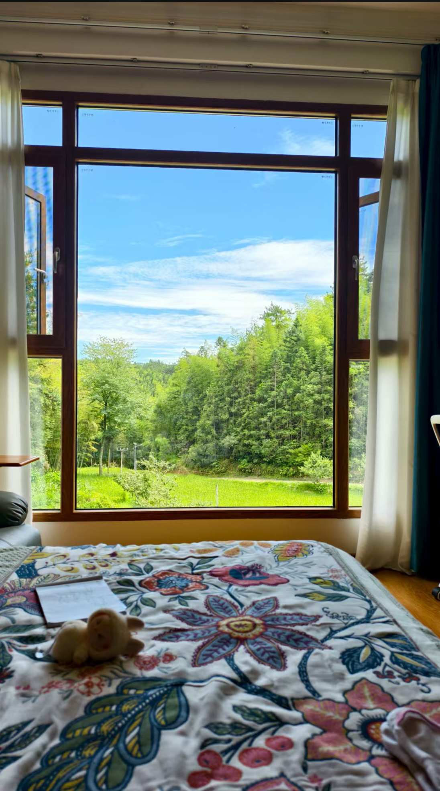

# 家乡的夏天-第五十七期

伯母发来的天空实在太美了，原来自己从小是在这么漂亮的地方长大了，以前天天在家还不在意，现在离家远了，想再看看这美丽的天空，还真难了。

## 技术类

### 一系列开源、可靠、全球 CDN 加速的开放 API 集合

[https://docs.60s-api.viki.moe](https://docs.60s-api.viki.moe/)  
一系列开源、可靠、全球 CDN 加速的开放 API 集合，包括日更资讯、榜单、翻译、百科、热搜这种常用工具接口的开放能力，也可以自己部署。这能让我想起，之前的自己，也是这样到处寻找可靠的API调用，因为设置数据库，数据库里面的数据从何而来，自己得费劲找半天，现在有这样的API，潜意识都是收藏起来，防止以后要用。

### Mihomo Party

[https://mihomo.party/](https://mihomo.party/)  
最近了解到一款开源的 Mihomo Party，作者更新频率高，经常可以体会到有趣功能，颜值很不错，简单工具化，最最最喜欢的是解决了我在各种不同网络环境下的稳定性。刚好明年自己购买的要到期了，可以试试新的工具。

### 物言卡片：用于制作卡片类的场景

[https://mono.cards](https://mono.cards/)  
一个有意思的小工具 物言卡片，用于制作卡片类的场景，比如链接、音乐、截图、代码，要发小红书的内容都可以，比较简洁。

## 非技术类

### 打工人留学的现实成本与结果

[https://sspai.com/post/101882](https://sspai.com/post/101882)

这篇文章很真实，作者面对的压力，以及压力和焦虑的情况下会如何做，给出的建议，都很值得我们学习，在生活中我们就是会遇到各种各样不如意的事情，如何面对和解决困境，是我们必修的课题。

也面对求职的应届生或者不如意事业的人，提供一个小建议，无论如何，请努力去相信自己，如果当下的一刻你觉得自己很差劲，但是请始终相信你不会一直停留在这个水平；你如果已经快要完全失去信心，请去做当下力所能及的事情。

### 在线图片预览

[https://photos.sambecker.com](https://photos.sambecker.com/)  
挺喜欢这个风格的在线照片展示，支持列表和网格两种风格，然后可以在右侧展示拍摄参数，假如你喜欢拍照，可以建立一个这样的网站来分享，我打算部署试试看去。

## 随便写写

这周了解了一位健身房兼职教练的故事，她是一个妈妈，十五岁初中毕业，因为家里她是老大，还有四个弟弟妹妹要读书，所以家里没有钱供她读高中了，初中毕业，二十岁生了小孩，二十岁来到深圳工作，什么工作都做过，但是因为没有本科文凭处处受限，她曾经也是朝九晚五的双休工作，工作完就回家躺着休息，但是现在她五点半下班后，开始兼职，每天晚上跑两个地方进行健身授课，只有周一晚上可以八点下班，其他晚上都是十点半才回家，没有双休，周末也上课，周日晚上不会进行上课，我问她为什么这么拼，身体受得了嘛？

她说等你有了孩子，当你的收入入不敷出的时候，你也会这么拼的，她跟我讲，她现在女儿十六岁了，读高二，现在她一直工作十三年了，深圳社保交了13年，不敢间断，还要继续交7年，医疗社保要交够25年，她最近有一个退休的同事，收到的退休金是每个月1837元，为了退休后能拿到这个钱，她不敢失业，不然每个月要给自己缴纳1千多块钱的社保。不然养老金后面就不会有。

感觉妈妈总是有无穷的力量，她们不会累嘛？不是，只是她们现在有小孩子，她们不敢累，所以现在人都不生小孩子，孩子生出来就会有无数的消费，而家长也要时刻绷紧这根弦，直到孩子长大成人，所有的爸爸妈妈都很伟大。
