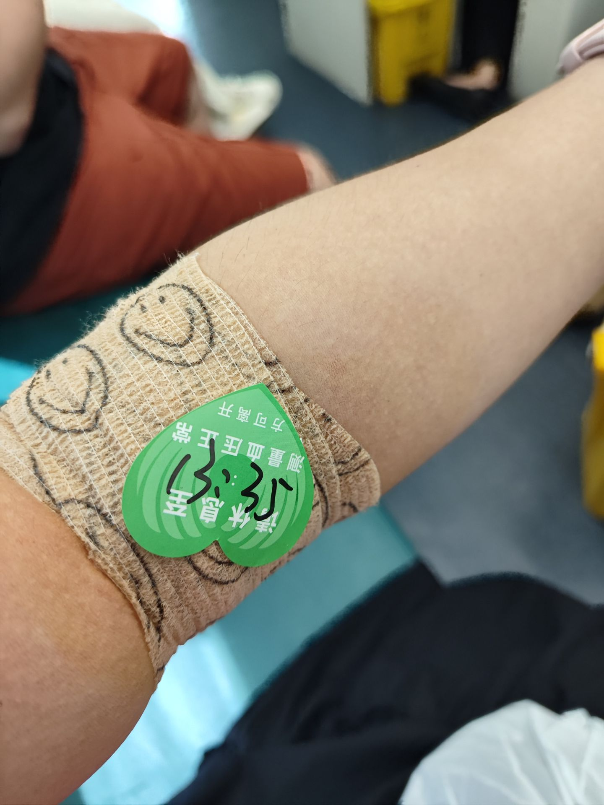

# 献血-第五十八期

正好公司有献血公益活动，就想参加了，最近身体很好，各项指标都非常健康，而且我睡眠、工作、生活、健身都很规律。虽然献血这件事很多人还是不太能理解，还是觉得会对自己的身体造成伤害，但是也有很多人改变了这种观念，其实我觉得这种公益活动，本身就是助人事件，你想参加就参加，没有什么这么多理由，也没有这么多恐惧。

## 技术类分享

### OAuth为什么这么设计？

[https://www.ducktyped.org/p/an-illustrated-guide-to-oauth](https://www.ducktyped.org/p/an-illustrated-guide-to-oauth)

文章写的通俗易懂，这是简述使用第三方应用身份登录的问题，这个场景还是很常见，比如我经常使用qq账号登录其他应用，比如腾讯视频，比如酷狗音乐等等，这种第三方如何获取到个人信息，就是OAuth协议。

### CSS的random方法

[https://webkit.org/blog/17285/rolling-the-dice-with-css-random/](https://webkit.org/blog/17285/rolling-the-dice-with-css-random/)

本文介绍如何使用 CSS 的随机数函数 random()，用纯 CSS 代码制作星空、转轮等。效果还是很好看，而且使用css实现，不需要阻塞主线程。

### KMP Compose中各种Effect上手指南

[https://mp.weixin.qq.com/s/f3H7uVbRABC9dMZVA-69JA?](https://mp.weixin.qq.com/s/f3H7uVbRABC9dMZVA-69JA?)

最近在写kotlin，css样式已经快熟悉了，但是逻辑方面，还属于一窍不通，浅学习一下。在 Compose 的声明式世界中，Composable 函数的核心职责是描述 UI。在这个UI周期之外，应用常常需要执行一些“副作用”（Side Effects），比如从网络加载数据、响应生命周期、或者与非 Compose 管理的对象交互。

## 非技术类分享

### 在线钢琴模拟器

[https://luhuadong.com/tools/piano](https://luhuadong.com/tools/piano)

这个有点意思，可以在线弹奏出钢琴的声音，不过如果要练一整首歌，还是要有实物练才好，毕竟就像打字一样，手指速度快更加灵活。

### 天体地图

[https://atlasof.space/mercury](https://atlasof.space/mercury)

这是不是很适合学地理的人学习，虽然现在自己身边没有什么学文科的人，但是对于了解星体，还是有帮助的，先收藏起来吧。

### 不适感让你更加强大

[https://desunit.com/blog/in-the-long-run-llms-make-us-dumber/](https://desunit.com/blog/in-the-long-run-llms-make-us-dumber/)

有一本畅销书曾经提出"兴奋效应"（hormesis）这个概念。它指的是少量的压力或不适感，会让我们变得更强大。

- 练习举重，肌肉可以增长。
- 接种疫苗，免疫力可以增加。
- 承担失败的风险，信心会增长。
- 通过解决难题，创造力得以扩展。

这种"兴奋效应"也适用于大脑，经常思考困难的问题，让思想经受考验，你才能学会思考。

但是，现在有了 AI，很多人就把问题交给 AI 去思考，让自己的大脑歇着。我担心，久而久之，我们会一步步丧失思考能力，直至变成生物傀儡。

最近有一项研究，科学家让参与者完全依靠 AI 来写论文，结果83％的人在写完后不久，无法引用自己论文中的任何内容。即使稍后让这些人重新独立写作论文，他们也会表现出大脑神经活动减少和无法完全投入思考，总是习惯性寻求 AI 的帮助。

研究人员创造出了"认知债务"这个词来描述这种现象：AI 确实带来了便利，但代价是牺牲我们的思考能力。

机器借给你脑力，你需要付出利息----你自身的思维能力。

:::success
我的建议是，明智地使用 AI，不要让它帮你解数学方程式，而要让它查看你的答案，来解释你可能错在哪里。你的原则是坚持独立思考，在这个基础上再加入 AI。

:::

思考可能会让你觉得很累、不舒服，但它是你大脑的训练场，不适感让你的思考变得更强大。

这确实是如果我们现在一遇到问题不进行思考，就直接询问AI答案和解法，久而久之就会丧失思考的能力，或者思考的能力变差，所以我们为了避免出现这种情况，要理智使用AI。
