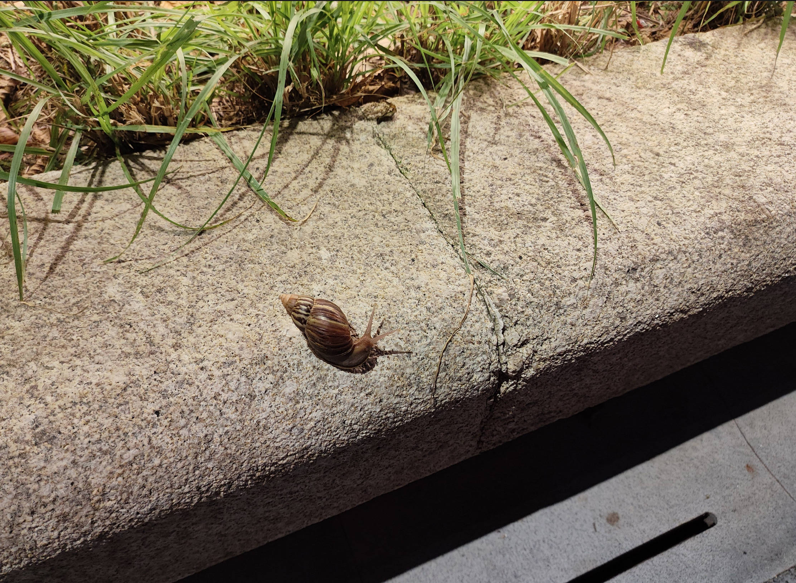

# 好大颗的蜗牛-第六十期

夜跑的回来的路上，看到一颗好大的蜗牛，虽然它爬的很慢，但是它一直都在坚持向前爬着。

## 技术类分享

### 数据库表名使用单数名词

[https://www.teamten.com/lawrence/programming/use-singular-nouns-for-database-table-names.html](https://www.teamten.com/lawrence/programming/use-singular-nouns-for-database-table-names.html)

本文解释为什么数据库的表名，user 好于 users。

使用user是这张表里面存了很多用户数据，但是使用user是表示每个人只有一种关系，我们不是在命名一个表，而是在命名一个关系。我们在描述用户 ID、他们的名字、地址等等之间的关系。并且对于用户数据只有一个关系。

### 一次NPM供应链攻击剖析

[https://jdstaerk.substack.com/p/we-just-found-malicious-code-in-the](https://jdstaerk.substack.com/p/we-just-found-malicious-code-in-the)

本周，几个流行的 npm 软件包（包括 Chalk 和 strip-ansi）被植入恶意代码，它们的周下载量达到10亿次。本文介绍这次攻击的详细情况。

### Markdown文件如何转换为精美文档

[https://www.xda-developers.com/markdown-notes-convert-documents-fast-pandoc-templates/](https://www.xda-developers.com/markdown-notes-convert-documents-fast-pandoc-templates/)

本文介绍通过 Pandoc 模版功能，使用一行命令将 Markdown 文件转成精美文档。

### CSS和SVG模拟液态玻璃效果

[https://kube.io/blog/liquid-glass-css-svg/](https://kube.io/blog/liquid-glass-css-svg/)

本文介绍只使用 CSS 和 SVG 文件来模拟苹果的液态玻璃效果。大家可以先看结尾的效果展示，非常惊艳（只限于 Chrome 浏览器）。

## 非技术类分享

### 独立数字音乐作者

[https://theodoruszq.wordpress.com/2025/09/06/%e7%8b%ac%e7%ab%8b%e6%95%b0%e5%ad%97%e9%9f%b3%e4%b9%90%e4%bd%9c%e8%80%85-independent-digital-musician/](https://theodoruszq.wordpress.com/2025/09/06/%e7%8b%ac%e7%ab%8b%e6%95%b0%e5%ad%97%e9%9f%b3%e4%b9%90%e4%bd%9c%e8%80%85-independent-digital-musician/)

作者没有任何乐理基础，使用 AI 做出了完全属于自己的第一首纯音乐，并且发布到 QQ 音乐。

### 美国优越的地理位置

[https://unchartedterritories.tomaspueyo.com/p/never-bet-against-america](https://unchartedterritories.tomaspueyo.com/p/never-bet-against-america)

本文详细解释美国的地理位置是多么优越，自然条件适合经济发展，外敌又很难入侵。美国作为世界第一大国，应该没有哪个国家轻易会对美国发动战争。
