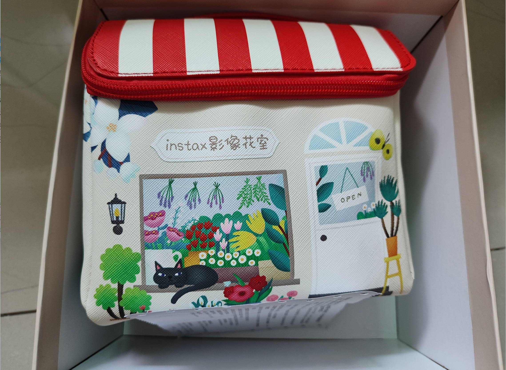

# 富士拍立得mini12-第六十四期

最近实在是工作太忙，经常加班赶项目，两个月终于快结束了，我要回归正常发布，周末清东西，发现去年别人送我的拍立得一直没有用，好吧，我连手机都不想带的人，怎么出门会随手带相机，积灰了一年，我还是挂闲鱼卖了吧，不然实在是占我空间和位置，我都没拍过几张。

## 技术类分享

### 避免使用@ts-ignore

[https://evanhahn.com/ts-ignore-is-almost-always-the-worst-option/](https://evanhahn.com/ts-ignore-is-almost-always-the-worst-option/)

实际修复类型错误、any、@ts-expect-error都比直接使用@ts-ignore更好，看看怎么论述的。

### 为什么typescript代码库充斥着var语句

[https://vincentrolfs.dev/blog/ts-var](https://vincentrolfs.dev/blog/ts-var)

一般来说，JavaScript 代码不应使用 var 语句，而要用 let 和 const。但是，TypeScript 官方编译器大量使用 var 语句，这是为什么？原因竟然是因为性能，确定它是否在变量的 TDZ 中对于解释器来说是一项艰巨的工作。如上所示，它不能静态完成，而是取决于非确定性运行时行为。这带来了对 TypeScript 代码库重大的惩罚。在将相当多的语句迁移到 `var` 后， [他们在某些基准测试中看到了 8% 的性能提升](https://github.com/microsoft/TypeScript/issues/52924)。

### 浏览器遇到撤销的HTTPS证书会怎样？

[https://nullpxl.com/post/revocation-confusion/](https://nullpxl.com/post/revocation-confusion/)

本文介绍浏览器怎么检查 HTTPS 证书是否被撤销。Chrome 基本上不会关心并允许用户浏览网站，而 Firefox 会显示可怕的安全屏幕。移动浏览器与桌面浏览器也是另一回事。

## 非技术类分享

### 一道几何题

[https://samjshah.com/2025/08/05/sangaku-puzzle-i-cant-solve/](https://samjshah.com/2025/08/05/sangaku-puzzle-i-cant-solve/)

正方形里面有一个小圆，请问小圆的半径与正方形边长的关系是多少？

这道题好像很不容易，答案是正方形边长的 4/33。

### AI编程只能解决70%的问题

[https://addyo.substack.com/p/the-70-problem-hard-truths-about](https://addyo.substack.com/p/the-70-problem-hard-truths-about)

根据我的观察，公司里面的高级程序员和低级程序员，使用 AI 的方式是不一样的。

高级程序员并不完全信任 AI 的输出，只是用 AI 加速项目。他们一般会审查和重构 AI 生成的代码，对于 AI 的架构决策也是抱着怀疑的态度。

初级程序员更倾向于跳过审查和重构，全盘接受 AI 的输出，从而导致"纸牌屋式"的代码：看起来能发挥作用，一旦投入使用就会崩溃。

我不知道，AI 未来会不会替代程序员，但是现阶段，AI 编程还不能解决100%的软件问题，但已经可以解决70%的问题。这相当于，AI 可以减轻高级程序员70%的工作量。

剩下的30%，依然需要依靠程序员的经验和专业知识，而初级程序员恰恰缺少的是这30%。

所以，听起来可能违反直觉：AI 对高级程序员比对初级程序员帮助更大，更容易产生工作成果。

现阶段的 AI，更像团队中的一个非常有干劲的初级程序员，可以快速编写代码，但需要不断的监督和纠正。你知道的越多，你就越能指导它。

所以，AI 的正确用法是，高级程序员用它来加速他们已经知道如何做的事情，初级程序员用它来学习该做什么。

这个现象确实存在，我现在也有同事，完全依赖于AI输出的代码，不自己进行理解，如果效果不达标，就一直询问AI，然后直到改到满意为止，这种行为，只对自己的提升有弊而已。AI出现的代码，真的完美吗？很多时候，还是需要人为去检查。

### Vibe Coding Cleanup 编码清理及服务

[https://donado.co/en/articles/2025-09-16-vibe-coding-cleanup-as-a-service/](https://donado.co/en/articles/2025-09-16-vibe-coding-cleanup-as-a-service/)

我是首次在一个招聘岗位上看的Vibe Coding,当时觉得，哇最近忙到产生了新的术语，我不认识了，然后就关注了一下这个词，Vibe Coding,氛围编程，不得不说现在使用AI确实比我们当初只能手敲代码，有不懂的就要查询文档，快了很多，但是确实AI的编程还是有时候会出现问题的。所以项目需要定时清理一下AI代码。

### 智谱模型GLM4.6

[https://mp.weixin.qq.com/s/0zJBg5hBbHLgGsoHjXADiQ](https://mp.weixin.qq.com/s/0zJBg5hBbHLgGsoHjXADiQ)

想不到国内的AI也很卷，过年的时候还是deepSeek，现在有出现了新的大模型更加只能，不过AI的功能现在被过于吹捧了，希望AI不要是泡沫文化。

### 不要这样管理软件团队

[https://simonsinek.com/stories/5-things-managers-do-that-leaders-never-would-according-to-simon/](https://simonsinek.com/stories/5-things-managers-do-that-leaders-never-would-according-to-simon/)

我读到一篇文章，讨论软件团队怎么管理，写得很好。

文章举了 IT 公司常见的六种管理，看得我心有戚戚焉，分享给大家。

作者说，下面这些做法都属于低级管理，是经理人级别（manager），最好提升到领导者级别（leader）的高级管理。

（1）发生事故时，严厉追责，惩罚员工

假如项目出现问题，客户怒不可遏，团队充满矛盾，这时低级管理的经理人立即开始追责，召开紧急会议，要"查明真相"，还会发送一封口吻严厉、措辞简洁的电子邮件，阐明"员工责任和公司期望"。

真正的领导者则会召集团队，跟大家说："现在很困难，但不是互相责怪的时候，而要同舟共济，我们一起想办法解决这个问题。"

（2）囤积信息

很多经理把信息当成机密情报，把关键细节藏得严严实实，以为这样就能赋予他们权力或控制权。给人的感觉是他们在管理一个秘密俱乐部，而你不在成员名单上。

真正的领导者恰恰相反，他们直接告诉大家，什么事我知道，什么事我不知道，什么事我在乎。因为他知道，信任建立在透明之上，而不是保密之上。

（3）政策武器化

低级管理的管理者会逐字逐句地引用手册，将政策作为挡箭牌，避免艰难的决策或令人不快的对话。

真正的领导者将政策视为保护人的护栏，而不是束缚人的手铐，一旦有必要，可以为人改变规则。如果团队成员遇到困难，他会当面询问："我怎样才能帮到你，即使这意味着要打破规定？"

（4）快速解雇员工

低级管理的管理者喜欢"慢慢招人，快速解雇"。他可能会对你说："你没有达到预期。今天是你最后一天了。"他的目的是杀鸡儆猴。

真正的领导者不会在员工离职时摧毁他们的信心，而是帮助他们搭建通往未来生活的桥梁。他会说："我注意到你工作很艰难，我们来谈谈哪些方面出了问题。如果这里不合适你，我们看看怎么帮助你在其他地方上岗。"

（5）回避艰难对话

一位经理注意到两位团队成员的关系紧张，但却什么也没说，心里希望事情能尽快过去。遇到困难的谈话，他会粉饰、回避或躲在电子邮件后面，以避免尴尬。

真正的领导者会积极应对，和双方一起坐下来，说："你们发生了什么，我们谈谈吧。"他明白，回避只会让事情变得更糟。艰难的谈话虽然会让人不舒服，但无论如何还是需要去做。

（6）奖励服从者

低级管理的管理者喜欢唯唯诺诺的人----那些点头称是、毫无异议地服从命令的人。他们表扬那些在会议上总是附和的人。

真正的领导者会积极寻找那些敢于挑战自己的人。他们想要那种能说"我觉得我们犯了一个错误"并详细说明理由的人，因为这样才能进步。

（7）总结

管理团队的关键是领导力，这跟你的头衔和位置无关，只跟你每天的心态和选择有关系。

你将员工视为人而非消耗品，与他们建立信任而非命令他们服从，创造一个让别人能够发挥最佳工作效率的环境，那么你就是领导者。

真正的领导者将每一次与他人的互动，都看作一次引领团队的机会。问题不在于你是否有权威，而在于你是否有勇气，站出来引领团队向正确的方向前进。
