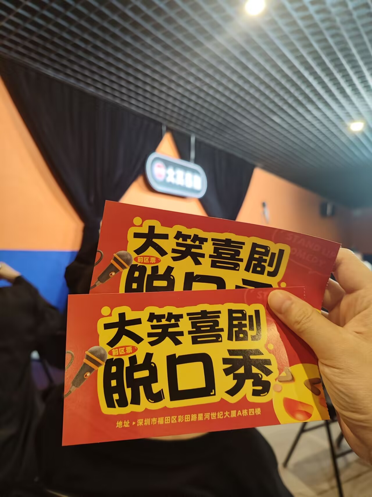

# 脱口秀-第六十六期

日思夜想终于有人陪我去看脱口秀了，今年可没少看脱口秀的表演，在抖音上面，每次看完都开口大笑，第一次线下体验，还不错，支持人说，他们北方人来南方表演，都有一个要求，那就是要矜持点，别吓坏别人了。哈哈哈。

## 技术类

### Typescript 就像 C#

[https://typescript-is-like-csharp.chrlschn.dev/pages/intro-and-motivation.html](https://typescript-is-like-csharp.chrlschn.dev/pages/intro-and-motivation.html)

这篇文章提出 TypeScript 的语法很像 C#，因为它们的设计者就是同一个人。

所以，当 TypeScript 需要提高性能时，可以考虑将代码转为 C#，现在 C# 也是跨平台的。

### 如何将网页动画压缩到每帧16.67毫秒

[https://koolcodez.com/blog/inside-the-frame/](https://koolcodez.com/blog/inside-the-frame/)

在元素absolute定位的时候，top和left会触发回流，但是使用transform和opacity，更改`变换`或`不透明度`通常由 GPU 处理，跳过重排和重绘。

### Burrows-Wheeler变换

[https://sandbox.bio/concepts/bwt](https://sandbox.bio/concepts/bwt)

本文介绍一种奇妙的算法 Burrows-Wheeler Transform（简称 BWT），它会把字符串打乱，使得相同的字符倾向于组合在一起。

它的奇妙之处是，打乱后还可以用逆运算，将字符串还原，从而使得这种算法很适合用来压缩文本。

## 非技术类

### 为什么NetNewsWire不是一个web应用

[https://inessential.com/2025/10/04/why-netnewswire-is-not-web-app.html](https://inessential.com/2025/10/04/why-netnewswire-is-not-web-app.html)

NetNewsWire 是一个桌面的 RSS 阅读器，总是有人要求作者，将其改成 Web 应用。本文是作者解释为什么不开发 Web 版，理由很充分。

### Unicode隐形字符的病毒

[https://www.koi.ai/blog/glassworm-first-self-propagating-worm-using-invisible-code-hits-openvsx-marketplace](https://www.koi.ai/blog/glassworm-first-self-propagating-worm-using-invisible-code-hits-openvsx-marketplace)

本文介绍一个令人叹为观止的 JS 病毒，它的恶意代码是用 Unicode 隐形字符写的，人眼看不见（上图的空白处），但是引擎会执行这些代码。

### 开源项目如何可持续发展？

[https://byroot.github.io/opensource/ruby/2025/10/09/dear-rubyists.html](https://byroot.github.io/opensource/ruby/2025/10/09/dear-rubyists.html)

一个老生常谈的问题，开源项目怎么才能可持续地健康发展下去？

很多人会说，需要有公司为开发者的时间付费。

这么说固然没错，但是更好的支持方式不是出钱，而是出人。最著名的例子就是 Linux 内核，绝大多数代码贡献都来自那些从内核获利的公司的员工。

如果那些公司不出人，只给项目团队捐款，让他们自己去写代码，内核不可能发展得这么快、这么好。

另一个很好的例子是 Ruby 语言。2019年时，Shopify 公司的一位工程师见到了 Ruby 语言的创始人 Matz。

工程师问 Matz 需要什么，Matz 回答说："我缺人手。"

工程师回到公司商量以后，Shopify 的 Ruby 团队开始参与 Ruby 语言的开发，结果产出了大量成果，使得 Ruby 语言核心提交者增加了十几人。

如果那天 Matz 回答"我缺钱"，然后 Shopify 捐款数十万或数百万美元，这对 Ruby 其实未必有利。

首先，谁敢担保 Ruby 的开发方向和决策，以后不会受到 Shopify 的影响？某个功能被接受到底是因为它本身的优点，还是因为它来自一个大赞助商？Ruby 又敢不敢拒绝来自 Shopify 的提案？赞助商的偏好可能会左右项目的开发。

其次，钱就是这样，一旦有了，你会产生依赖。如果将来大赞助商退出，你就不得不裁员，停止一些项目等等。所以，接受赞助的实体和个人往往会不自觉地考虑捐赠者的偏好，这样资金才能源源不断地涌入。

我并不是说开源项目不应该接受捐助，而是说大额的捐助难免会产生一些副作用。

下一次，如果你想支持一个开源项目，除了捐款，更好的方式是投入项目开发，为创始人分担一些工作。
