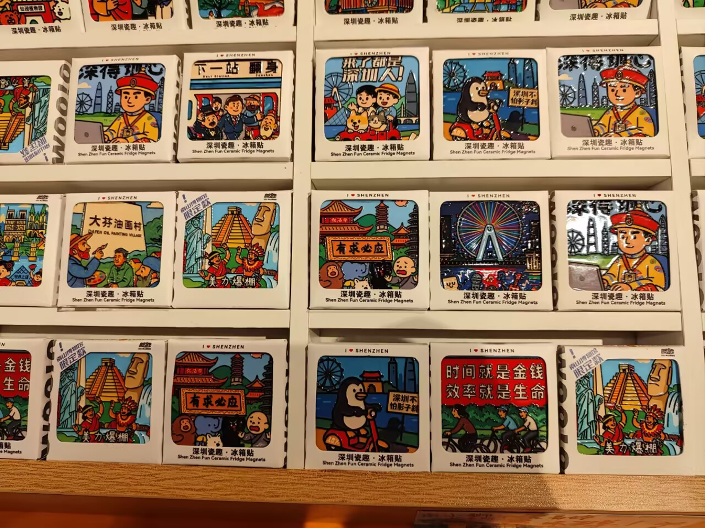

# 冰箱贴-第六十七期



这周跟很多朋友一起去逛博物馆，看的文创店有很多冰箱贴，有女孩子看到很喜欢，很想买，但是我却不怎么感兴趣，他们都笑话我，我就是纯理工思维。

幸福不是靠别人来施舍，而是要自己去赢取别人对你的需求和喜爱。

## 技术类

### 谷歌默认启用HTTPS协议

[https://security.googleblog.com/2025/10/https-by-default.html](https://security.googleblog.com/2025/10/https-by-default.html)

Chrome 浏览器公告，从明年（2026）10月起，将始终使用 HTTPS 协议。如果访问 HTTP 协议的网站，会跳出一个弹框（上图），用户确认后才可以访问。

这意味着，以后除了内网，HTTP 协议实际上被淘汰了。

### Liunx启动过程

[https://www.0xkato.xyz/linux-boot/](https://www.0xkato.xyz/linux-boot/)

本文简单清晰地介绍，按下电源开关后，电脑的启动过程，主板如何找到操作系统。这个还挺有意思，我之前就好奇过，电脑的启动会经过哪些步骤。

### 查看宽带占用的5种方式

[https://www.xda-developers.com/5-ways-to-find-out-whats-hogging-your-bandwidth-at-home/](https://www.xda-developers.com/5-ways-to-find-out-whats-hogging-your-bandwidth-at-home/)

什么程序在占用家庭网络的带宽？本文介绍5种查看方法。这个网站广告有点多，有点看不下去。

### CSS相对颜色

[https://ishadeed.com/article/css-relative-colors/](https://ishadeed.com/article/css-relative-colors/)

本文介绍一个新的 CSS 语法，从基础颜色生成相对颜色。比如将#000变成透明度0.1,我能想到的就是rgba，但是不知道原来sass也提供对应的函数，而不使用框架也可以，单纯的css也能实现。还有很多有趣的demo，可以看看。

```css
rgb(from #000 r g b / 0.1);
```

## 非技术类

### 被低估的软技能

[https://thoughtfulengineering.substack.com/p/new-series-underrated-soft-skills](https://thoughtfulengineering.substack.com/p/new-series-underrated-soft-skills)

工程师不仅需要具备技术技能，还要具备软技能，也就是人际交往的技能。

如果你不理解人类社会的复杂性，就无法理解公司或团队的工作方式，最终影响到自己的产出和扩大影响力。
