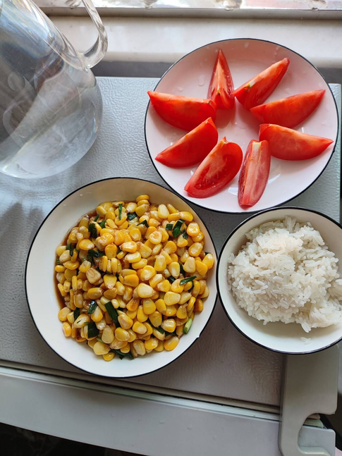

# 一日三餐-第七十期



周末得空，自己做饭菜，比起现在的人都喜欢吃荤菜，我还是比较喜欢吃蔬菜，健健康康，绿色蔬菜，这样简简单单、平平淡淡就是幸福的周末啦~

## 技术类分享

### Vibe Coding面试感受

[https://mp.weixin.qq.com/s/roURrNNBJ2J5ZqdFuU1tkA?poc_token=HMoRQWmjmlcIAKMw3fnAqLyaHS80URXqndqnba-O](https://mp.weixin.qq.com/s/roURrNNBJ2J5ZqdFuU1tkA?poc_token=HMoRQWmjmlcIAKMw3fnAqLyaHS80URXqndqnba-O)

作者团队的面试，开始改为让应聘者用 AI 实现一个功能，作者谈了实施的感受。

沟通能力，看来有AI的存在，人的软实力会变得越来越重要了。

### 中级程序员的标志

[https://dawranliou.com/blog/intermediate-dev/](https://dawranliou.com/blog/intermediate-dev/)

今年是作者从事专业编程的第十年，他认为自己属于中级程序员，总结了自己的工作内容。

他说，做到了这些事，你就达到了中级程序员的标准。

### 为什们B树比二叉树更适合数据库

[https://mehmetgoekce.substack.com/p/b-trees-why-every-database-uses-them](https://mehmetgoekce.substack.com/p/b-trees-why-every-database-uses-them)

B树的优势，高效磁盘，节点大小通常设计成4KB，减少读写次数，且自动保持平衡，对比二叉树，频繁磁盘，IO效率低下。

### C代码里面的URL

[https://susam.net/url-in-c.html](https://susam.net/url-in-c.html)

上面这段 C 语言代码里面有一个 URL，居然是可以编译的，这是为什么？

答案揭秘：

```plain
https:（标签定义） + //susam.net/（注释内容）
```

## 非技术类分享

如果你向人们展示问题，又向他们展示解决方案，人们就会受到触动并采取行动。

-- [比尔·盖茨](https://www.goodreads.com/quotes/731935-i-believe-that-if-you-show-people-the-problems-and)

### 为什么评估新模型越来越难

[https://simonwillison.net/2025/Nov/24/claude-opus/](https://simonwillison.net/2025/Nov/24/claude-opus/)

著名程序员西蒙·威利森感叹，他已经评估不了最新的大模型了。因为各种模型的能力越来越强，简单的题目都会解，必须用很高深的题目去测。目前看到的测试新模型的方法，开始让模型进行绘画，看绘画的效果。

### 对每一个要求“一点点”时间的人说不

[https://thoughtcatalog.com/ryan-holiday/2017/01/to-everyone-who-asks-for-just-a-little-of-your-time/](https://thoughtcatalog.com/ryan-holiday/2017/01/to-everyone-who-asks-for-just-a-little-of-your-time/)

有些人确实很难拒绝别人，但是不拒绝别人，你将花费很多时间在别人身上，自己的时间，要由自己把控，这才是最正确的选择。

经常有人对我说：

- 我想跟你简单聊聊天？
- 下周我们一起喝咖啡吧？
- 我们一起来讨论一下吧？

我的回答永远是：不，不，不。

我确实可以满足你的要求，但我就是不能做。

即使它们可能是重要的机会，即使只需要花费我15分钟，即使这是其他人都会同意去做的事情，我也不想做。

我必须限制一天中被别人占用的时间，否则我自己就没有剩下的时间了。

即使我让你占用我的时间以后，还会剩下一些时间，我也可能因此失去能量和专注力，再来利用好这些剩下的时间。

时间是我们最不可替代的资产----我们无法购买更多的时间。我们一秒钟都无法收回失去的时间。我们只能希望尽可能少地浪费。

但是现实生活中，不知何故，很多人将时间视为所有资源中最可再生的，用掉就用掉了，反正还有别的时间。

所以，如果你问我是否可以聊天或聚一聚，答案是不。我希望你能够明白，我这样回答的理由。
