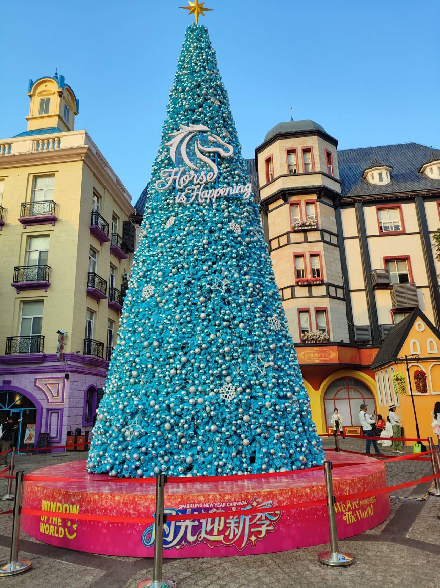

# 圣诞节快乐-第七十二期

由于圣诞节是在工作日，所以周末去补了一下圣诞节的氛围，看到了巨型的圣诞树，发现了一个行情，世界之窗旁边的欧洲小镇，虽然每次都人流很多，但是旁边的商铺却更新的很频繁，说明大家都是去玩的，不怎么消费，商家承受不起这边的商铺租金。

## 技术类分享

### 2025年CSS进展

[https://chrome.dev/css-wrapped-2025/#anchored-container-queries](https://chrome.dev/css-wrapped-2025/#anchored-container-queries)

Chrome 团队推出的 CSS 年度总结，今年的一些语法进展。

Dialog的关闭，慢慢都不需要用js控制了，这个很方便，CSS已经越来越简便功能，还有滚动标记，开始不需要使用这么多HTML元素了，这个也很适用。

### AV1适配编码格式

[https://blog.mozilla.org/en/mozilla/av1-video-codec-wins-emmy/](https://blog.mozilla.org/en/mozilla/av1-video-codec-wins-emmy/)

这又是一种新型的视频编码格式，也就是压缩算法，视频格式最常见的是H.264/AVC、适用于流媒体、监控、普通视频，H.265/HEVC适用于4K/8K超高清、蓝光。AV1编码：开源免费，正被Netflix、YouTube、苹果逐步采用。

目前主流的视频格式可以按**容器格式**和**编码格式**两个维度来分类。以下是详细的分类和常见格式：

---

### 容器格式（封装格式）

决定视频文件如何“打包”，包含视频、音频、字幕等轨道。

| 格式             | 特点                                 | 常见用途                 |
| ---------------- | ------------------------------------ | ------------------------ |
| **MP4** (.mp4)   | 最通用，支持多编码，兼容性极佳       | 网络视频、流媒体、存储   |
| **MKV** (.mkv)   | 开源，支持多音轨/字幕/章节，功能强大 | 高清电影、多语言资源     |
| **AVI** (.avi)   | 早期Windows标准，兼容好但压缩率低    | 老式视频文件             |
| **MOV** (.mov)   | Apple开发，适合专业编辑              | macOS、专业视频制作      |
| **WebM** (.webm) | 谷歌推动的开源格式，专为网络优化     | HTML5网页视频（YouTube） |
| **FLV** (.flv)   | 早期流媒体格式，逐渐被淘汰           | 旧版Flash视频            |
| **TS/M2TS**      | 流媒体传输格式，抗干扰强             | 数字电视、蓝光碟         |
| **MPEG** (.mpg)  | 标准视频/CD存储格式                  | 传统媒体                 |

### 视频编码格式（压缩算法）

决定视频数据如何压缩和解码。

| 编码格式       | 推出方                 | 特点                             | 应用场景                       |
| -------------- | ---------------------- | -------------------------------- | ------------------------------ |
| **H.264/AVC**  | MPEG                   | 平衡画质与体积，最普及           | 流媒体、监控、普通视频         |
| **H.265/HEVC** | MPEG                   | 比H.264压缩率提升50%，但专利复杂 | 4K/8K超高清、蓝光              |
| **AV1**        | 开放媒体联盟（谷歌等） | 开源免费，压缩率优于HEVC         | 未来流媒体（YouTube、Netflix） |
| **VP9**        | 谷歌                   | 开源，WebM默认编码               | YouTube、Chrome                |
| **VVC/H.266**  | MPEG                   | 下一代编码，压缩率再提升50%      | 未来8K/VR/沉浸式视频           |
| **ProRes**     | Apple                  | 高质量低压缩，适合后期编辑       | 专业影视制作                   |
| **AVC-Intra**  | 松下                   | 广播级高质量编码                 | 专业广播设备                   |

### 当前主流场景对应格式

1. 网络流媒体

YouTube/Netflix：H.264（主流）、VP9/AV1（4K+）

B站/国内平台：H.264、H.265

直播：H.264（兼容性最好）、H.265（节省带宽）

2. 专业影视制作

拍摄/后期：ProRes、DNxHD、CinemaDNG（RAW）

交付成片：H.264（预览）、H.265（4K交付）

3. 个人存储与分享

通用兼容：MP4（H.264编码）

高质量保存：MKV（H.265编码）

4. 新兴应用

VR/360°视频：H.265、AV1

低延迟直播：H.264、AVC

### 格式选择建议

| 需求         | 推荐格式                            |
| ------------ | ----------------------------------- |
| 上传网络平台 | MP4（H.264 + AAC音频）              |
| 保存高清电影 | MKV（H.265 + 多音轨）               |
| 网页内嵌视频 | WebM（VP9/AV1） + MP4（后备）       |
| 专业剪辑     | MOV（ProRes）/ MXF（DNxHD）         |
| 最小体积     | H.265 > H.264 > AV1（但需设备支持） |

### 未来趋势

- **AV1编码**：开源免费，正被Netflix、YouTube、苹果逐步采用
- **H.266/VVC**：超高压缩率，但专利问题可能限制普及
- **AI编码**：基于机器学习的编码器（如NVIDIA Maxine），压缩率革命性提升

## 非技术类分享

### 任正非最新访谈

[https://finance.sina.com.cn/hy/hyjz/2025-12-05/doc-infztptz9571666.shtml](https://finance.sina.com.cn/hy/hyjz/2025-12-05/doc-infztptz9571666.shtml)

文字采访有点多，我大致全部看了一下，可以看得出来，现在大批的优秀学生都特别关注人工智能领域，但其实着要是自己感兴趣的领域，再花精力学习才是重要的，盲目从众并不是什么好事，也并不是说除了AI领域，其他领域就不需要数学、不需要竞赛了。

主要围绕着AI和美国对中国的高技术封锁

（1）AI 无人化富余出的员工怎么办？

要发展再教育工程，例如实行学券制，给下岗人员一些学券补贴，把一些已经空着的学校、工厂变成职业学校，对下岗人员进行职业再教育。

（2）无人化进展速度不能快，还是要慢慢来，要使社会结构发展稳定。AI 带来的社会好处是总财富增加了，怎么分享这些财富？怎么重新造就一些人再上岗呢？这就是新的课题。

（3）以后是算力过剩，不是算力不足。

（4）华为公司当前最重要的是 CT（通信技术，Communication Technology），就是无线电、光通信、核心网、数据通信......。为什么？将来 AI 的感知与控制，要把数据传到几千公里外，必须要有一个先进的网络。AI 要真正产生出价值，需要全社会的协作，发挥各自的优势。没有网络的算力是信息孤岛，孤岛化的 AI 无法实现真正的智能。

（5）Meta 公司给几个青年人每个人上亿美元的签约金、千万美元的年薪，中国互联网上没有多大的声音波动，为什么？因为不羡慕了。现在国内一大批创业者，能力非常强。七、八人合作做一个公司，二、三十人合伙，股份全是他们的，做好了想拿多少拿多少。

（6）美国的土壤是适合种庄稼的，大量人才到美国成长这是好事情，并不是坏事情，包括中国的很多青年到美国去，在美国生根发芽，参与创造一些新的科技文明。

（7）美国创造的科技文明，对世界不是有害的，是有益的，我们也要支持美国科技文明的发展，因为美国创造的科技文明，关起来不去给别人用，那美国怎么赚钱？他赚你钱的过程中，同样促使你的产业进步。如果没有欧洲的文明，我们怎么可能有汽车、火车、轮船......？

（8）我们也渴望全球化，能享受站在巨人肩膀上，我们的自力更生是被逼无奈的。全要靠自己，是不敌全球化的，我们在许多方面落后国内企业使用的芯片至少一代。

（9）中国要更加开放，要向世界所有文明国家学习优点，容纳世界的文明进来，不能闭关自守。开放改革把国门打开了，让世界的文明进来，并没有产生文明冲突，文明叠加起来共同创造了一种价值，就是今天的新中国。

### AI炒股

[https://www.aitradearena.com/research/we-ran-llms-for-8-months](https://www.aitradearena.com/research/we-ran-llms-for-8-months)

如果让大模型炒股，会怎样？

国外有人做了实验，他们选了五个模型，每个模型有10万美元本金，进行了为期8个月的炒股。

模型每日根据实际股价，进行虚拟交易，目标是尽可能多盈利，结果总体令人满意。

指数上涨了12.3%，但是第一名 Grok 4 涨了56.1%，第二名 DeepSeek 涨了 49%，第三名 Claude Sonnet 4.5 涨了27.3%，第四名 GPT-5 涨了27%。

唯一的输家是 Gemini 2.5 Pro，它因为没有买科技股，亏了9.5%。

这到底是随机的结果，还是大模型真的善于炒股，值得进一步研究。
