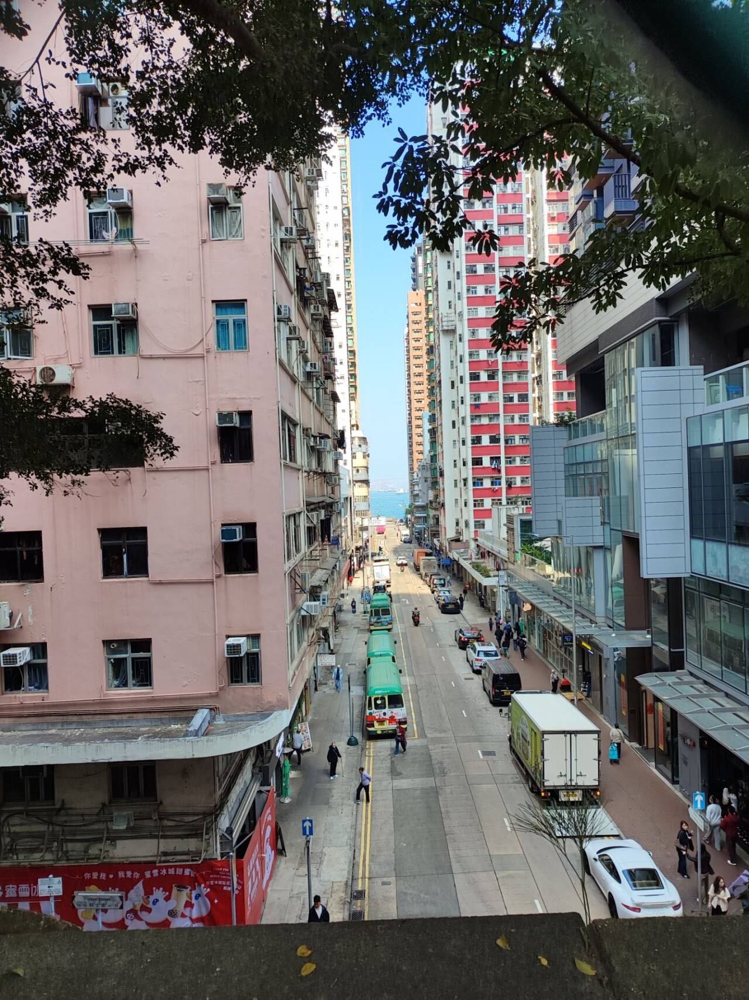

# 香港-第七十六期

办理港澳通行的一年，还是赶上了去香港一趟，觉得香港的路很窄，人很多，建筑大多数比较旧，不愧是有港式氛围的城市。

## 技术类分享

### Kimi K2.5，开源视觉SOTA-代理模型

[https://www.kimi.com/blog/kimi-k2-5.html](https://www.kimi.com/blog/kimi-k2-5.html)

Kimi K2.5 被定位为“迄今为止最强大的开源模型”，在 Kimi K2 基础上通过约 15T 视觉-文本联合令牌的持续预训练构建而成。其核心突破在于实现了**视觉编码能力**、**自主智能体集群**和**办公生产力**的三位一体融合。

### 作为工程经理十年学到的东西

[https://www.jampa.dev/p/lessons-learned-after-10-years-as](https://www.jampa.dev/p/lessons-learned-after-10-years-as)

作为下属和作为领导者，所需要的能力完全不一样，你的工作范围，如何带领团队，都是一个艰难且缓慢的过程，如何向上沟通、如何向下沟通，在我们成为工作者的时刻，就已经要慢慢学习和掌握的能力。

向上沟通需要策略，向下沟通需要透明度

### 经过两年的vibe coding，我又回归到了手写

[https://atmoio.substack.com/p/after-two-years-of-vibecoding-im](https://atmoio.substack.com/p/after-two-years-of-vibecoding-im)

一方面，你惊讶于它似乎如此理解你。另一方面，它会犯令人沮丧的错误和决策，明显违背你们建立的共同理解。

我同意，过去几个月我也有了类似的认识。给 LLM 投入一些任务所获得的时间价值不能忽视，我仍会使用它，但我已经从“100%全情投入氛围编码”转变为更为谨慎的态度。也许<40%使用率。原因如下：

- You cannot get away from the tech debt models produce
- 你无法逃避模型产生的技术债务

- Over time, these subtle issues compound into a codebase the LLM itself finds difficult to navigate and work in
- 随着时间推移，这些细微问题积累成一个 LLM 自身难以导航和作的代码库

- Simultaneously, you, the dev has lost the inherent and deep insight connection into the code where you _cannot_ troubleshoot without using AI and it's a self-reinforcing loop.
- 同时，你，开发者，已经失去了对代码内在且深刻的洞察连接，因为你*无法*在没有 AI 的情况下排查故障，这形成了一个自我强化的循环。

- You, the dev, become 0% productive when in the train or airplane because you forget how to write some algo or syntax and you lack the codebase's mental model
- 你，作为开发者，在火车或飞机上时，效率会变成0%，因为你忘了如何写某些算法或语法，且缺乏代码库的心理模型

## 非技术类分享

### Lovable 增长负责人 Elena Verna 分享 AI 下的增长策略

[https://www.youtube.com/watch?v=ES0N6SKmF40](https://www.youtube.com/watch?v=ES0N6SKmF40)

这个视频值得一看，Elena Verna 聊到了当前传统的增长策略的一些问题，以及在当前新一代软件下的用户增长的方法和手段，里面的一些方法挺赞同的，当然也可以看这篇[中文解说](https://www.woshipm.com/operate/6282139.html)，不过我不太喜欢这篇文章的风格，还是更推荐看原生视频。

### 背包三年，Simon 的旅行装备清单

[https://song.al/bag](https://song.al/bag)  
来源于 Simon 的一篇文章，写得很好，我通过这个种草了一些好东西，比如说那个包好看的，还有 Patagonia、Flower Mountain 鞋。

### 富途的投资干货

[https://news.futunn.com/news-topics/127/investment-practical-information-collection](https://news.futunn.com/news-topics/127/investment-practical-information-collection)  
虽然我对投资现在兴趣不大，但是可以看看一下市场分析，了解一下最新动态，也不错

### V2ex 上有一个推荐电影的帖子，感觉电影推荐得很不错，可以收藏下来慢慢看

[https://www.v2ex.com/t/1167104](https://www.v2ex.com/t/1167104)  
一、剧情与人文，注重人物、人生、社会议题与现实思考

1. 完美的日子
2. 超脱
3. 建筑学概论
4. 燃烧
5. 魔鬼深夜秀
6. 老无所依
7. 杀生
8. 实习生
9. 最佳出价
10. 心迷宫
11. 默默无闻
12. 中国女孩
13. 宇宙探索编辑部
14. 灿烂人生

二、爱情与情感，聚焦青春、浪漫、成长与欲望

1. 情书
2. 坠落
3. 你的名字
4. 白日梦想家
5. 再次出发之纽约遇见你
6. 初恋这首情歌
7. 醉乡民谣
8. 功夫熊猫 2
9. 蓝色情人节
10. 爱在黎明破晓前
11. 爱乐之城
12. 蜜桃成熟时
13. 一路向西
14. 色，戒
15. 灿烂人生

三、悬疑与思辨，融合悬疑、哲思、奇幻、恐怖与科幻

1. 信条
2. 如月疑云
3. 边境杀手
4. 安娜
5. 一战再战
6. 灯塔
7. 哭声
8. 仲夏夜惊魂
9. 遗传厄运
10. 心灵奇旅
11. 天空之城
12. 逆袭的夏亚
13. Mad God
14. 寂静岭
15. 密室逃脱
16. 林中小屋
17. 绝美之城

### 订阅的blog

<!-- 这是一张图片，ocr 内容为： -->

### 催菜不卖

<!-- 这是一张图片，ocr 内容为： -->

