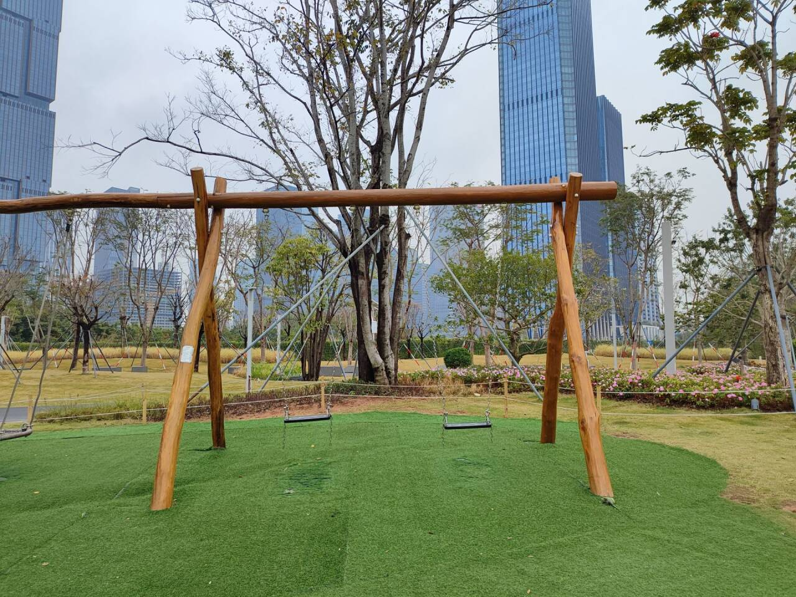

# 秋千-第七十八期

午饭后到公园散步，往常都是很多人，很多小朋友玩的秋千，由于今天天气灰蒙蒙的，可能会下雨，就没有小朋友在玩，想起自己小时候最想玩的就是秋千了，但是农村里真的没有这个，而且自己搭的怕有安全隐患，所以小时候就没怎么玩过，跟我姐一起组装过跷跷板玩，哈哈哈，小时候的美好记忆。

## 技术类分享

### 这个开源的《Agentic Design Patterns》中文翻译版不错

[https://github.com/ginobefun/agentic-design-patterns-cn](https://github.com/ginobefun/agentic-design-patterns-cn)  
这个开源的《Agentic Design Patterns》中文翻译版不错，构建智能系统的实践指南，对 Antonio Gulli 所著《Agentic Design Patterns: A Hands-On Guide to Building Intelligent Systems》的中英文对照翻译，一部全面的技术指南，涵盖了现代人工智能系统中智能体 (Agent) 设计的核心概念和实践方法，值得一看。

### 朱雀 AI 检测助手

[https://matrix.tencent.com/ai-detect/](https://matrix.tencent.com/ai-detect/)

这个朱雀 AI 检测助手对于检测 AI 生成的内容非常准，特别是对于中文场景的一些识别，可以 copy 一些你认为 AI 生成的内容去试试看，挺好玩的。

### LibPDF

[https://documenso.com/blog/introducing-libpdf-the-pdf-library-typescript-deserves](https://documenso.com/blog/introducing-libpdf-the-pdf-library-typescript-deserves)

TypeScript的pdf库，支持Node、Bun、浏览器中现代的API进行解析、修改、签名和生成PDF。

跟其他的PDF库进行对比，展示了它的优点和独特。以前思考过如何在浏览器上展示pdf然后进行操作，现在已经有这么成熟的工具了。

## 非技术类分享

### 100 种已经灭绝的生物展示

[https://100lostspecies.com](https://100lostspecies.com/)  
这个网站做得很棒，100 种已经灭绝的生物，全程用可视交互的方式带着你去探索，非常有美感，更多还是对已经不在的生物一种可惜了。最近看了李薇仪的重返狼群，我觉得万物生灵，都会有被需要保护的时刻，不要等待已经绝种了，人类再来惋惜。

### 这个 AI 世界时钟有意思

[https://clocks.brianmoore.com](https://clocks.brianmoore.com/)

最近测AI生成代码逻辑，有很多就让AI用前端代码，生成一个时钟，看看时钟的逻辑和显示是否正常，从而推断出AI的写代码能力。

### 这个 cursify 上面鼠标跟随的效果挺丰富的

[https://cursify.vercel.app/components](https://cursify.vercel.app/components)  
可以把这种功能恰当的放到你的网站上去，不过需要注意不能让效果反客为主了，可以随便点着看看效果。

### Andrej Karpathy 给大学生写的如何在课程中取得好成绩的建议

[https://cs.stanford.edu/people/karpathy/advice.html](https://cs.stanford.edu/people/karpathy/advice.html)  
这篇 Andrej Karpathy 给大学生写的如何在课程中取得好成绩的建议，挺好的，要是我上学时候看到这个就好了，相当于告诉你如何在考试中拿高分的技巧，当然也很适合各个阶段的学生。

平时不要熬夜、去上习题复习课，做复习计划，看往年卷子，前期先自己学，后期和别人一起复习，不要只和比你强的人混在一起，和弱一点的同学一起学，你会被迫去解释，而“教别人”对理解的帮助非常大，以及考试前要高强度冲刺。

考试的时候使用铅笔答题，先快速扫一遍所有题目，先做简单题，保持卷面简洁，永远不要提前交卷，注意每一题的分数，不要在错误方向做太久，最后 5min 假如还有卡住的地方，一定要停止，最后几分钟最值钱的事是，从头到尾检查你有没有漏小问、漏写单位、漏写结论、漏答题。

最后给到的最终建议，也挺好的，就是不要过于关注分数，除非你成绩很差，否则基本没人会在意你的分数，把自己提升到考试不容易翻车的水平后，应该把注意力转向更重要的事情，获得真实世界的经验，比如实习，做 side project 等等。

你的时间是宝贵而有限的资源。达到一个不会在考试中出错的阶段，然后把注意力转向更重要的事情。它们是什么？

获得真实的实际经验，参与真实代码库、项目或问题，除了无聊的课程练习外，都非常重要。那些认识你、能给你写推荐信、证明你有主动性、热情和动力的人非常重要。你在考虑申请工作吗？找个暑期实习。你考虑继续读研究生吗？积累研究经验！报名参加你学校提供的任何项目。或者联系教授或研究生，邀请他们参与你喜欢的研究项目。如果他们觉得你足够有动力和动力，这招可能奏效。不要低估这一点的重要性：一位在推荐信中写道你有动力、积极且独立思考的知名教授，完全远远超过其他一切，尤其是成绩这种琐碎的事情。申请前至少挤出一篇论文会很有帮助。另外，你还要知道，他们最让人反感的是那些过于兴奋的本科生，报名参加项目、见面几次、问了很多问题，结果在研究生或教授投入了那么多时间后突然放弃消失。不要成为这样的人（这会损害你的名声），也不要表现出你可能是这样的迹象。

除了科研项目，可以和一些人一起参与副业项目，或者更好的是，从零开始自己创业。为开源贡献，制作或改进一个库。走出去，创造（或帮助创造）一些酷炫的东西。请详细记录。写博客聊聊。这些才是几年后人们会关心的事情。你的成绩呢？他们是一路上必须应对的麻烦。好好利用你的时间，祝你好运。

最近弟弟高三压力有点大，正好发给他看看，听说他们考试完，老师在教师给他们放电影看，结果他没考好没心情，走到老师办公室继续学习了。

这个年纪是刚好知道自己想要的时候，以前总是觉得高中时间很多，可以慢慢来搞，现在自己的理想和现实存在差异，就会有落差，从而产生压力，一点点看着他长大，看着他成长，终于有点压力让他承受了。

## 关于人和AI

最近看到93的关于人和AI的看法，我觉得很理性和自我，特别是你是AI的主人，而非它的附属品，关于AICoding的态度也非常符合我的看法，其实AI是来让我们的生活更加美好的，这样才能长久。

在 AI 大肆被使用的阶段，我反而会更加关注 “活人感”，不喜欢 AI 生成和真实世界看起来差不多的东西，但是挺喜欢生成的新奇的创新的眼前一亮的精品。

最近中文社交时间线上，慢慢失去了一些 3 年前刚刚玩推时期的那种 “真实且独特的声音”，当时没有见过面的朋友相互交流好用的产品、技术，对于事情的特定看法，而且非常友善。

现在可能是被 “出海、搞钱、培训” 这些词给带起来了，出现了很多炸裂的譬如“兄弟们这个牛逼！这个必须要看！这个炸裂！”引流话术，然后配上一张很 AI 生成的图片一大段话的方式，最近封号其实我感觉还有一个原因是，看到有一些群相互点赞，相互关注，发布后相互加热度被识别出类机器人导致封号，反而变成了流量优先，而非交流、内容优先的趋势，不过也能理解，在内容面前还是赚钱第一。

所以你会发现，很多内容变成了好像是同一个 AI 发布，缺少了这个号本身的独特的味道，而且是成批量的出现，其实很多时候，我感觉每个人的独特感是自己最重要的东西，由你从小到大的生活经历、学习、感情塑造而成的独特人格，没有人的品味会和你完全一样，这会东西才是你最重要的东西，也是活着最有意思的东西。

当然，可能会被反问，那是不是不要用 AICoding 写代码了，其实不是，自己手写代码可以当做是一种享受，比如说自己做饭的过程和花钱直接下馆子吃的区别，虽然花了时间，但是快乐了自己，而 AICoding 是属于你早应该完成的但是你不想再做的事情让 AI 帮着去完成，但是这个过程其实你的独特想法，你对于整个过程的统筹还是把控在你的手里，而非全部在 AI 的手里，品味依旧是自己把控，开源也慢慢会变成代码不重要，产品效果创新点子变得更重要。

对于 AIGC 生成内容和生成图片也是一样，要什么效果还是掌握在人手里，而非全部完全依赖 AI 而不去思考，最担心的是把所有的事情全部授权给到 AI，自己来给 AI 生成的不良内容打下手，甚至帮忙推广，这样就反过来了。

最后，想说，在 AI 时代不要放弃你的活人感，你是 AI 的主人，而非是他的附属。
