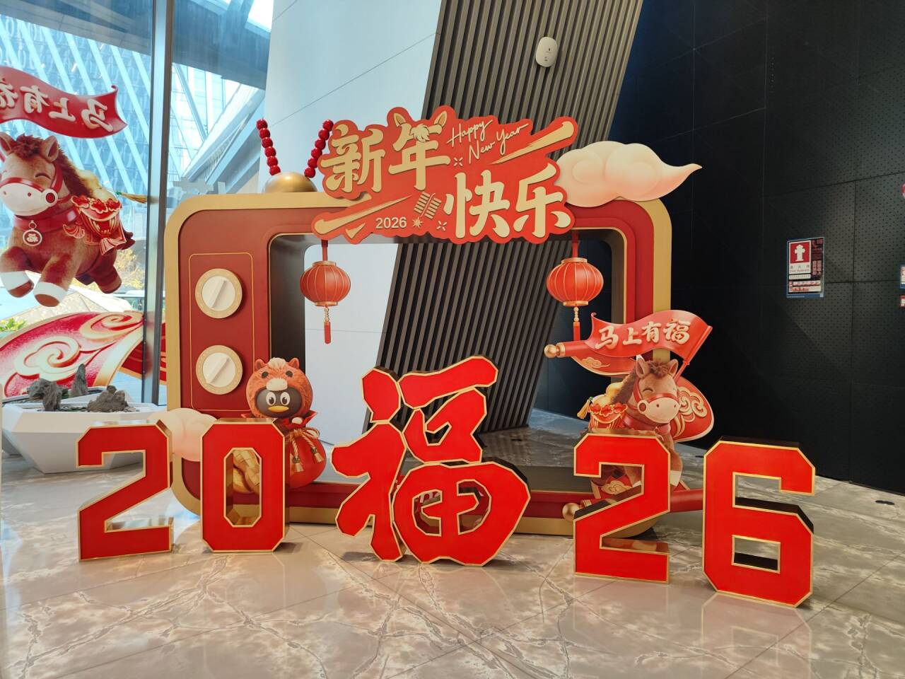

# 2026新年快乐-第七十九期

临近新年，到处都装饰起来了，今年年前没有休假，坚守到了最后一天，看到今天依旧有不少小伙伴没有休假，都还来上班了，今年最后一天上班，明天就回家了，周刊估计要休息到下个月了。

## 技术类分享

### Agentic Design Patterns

[https://adp.xindoo.xyz](https://adp.xindoo.xyz/)  
《Agentic Design Patterns》讲到了构建智能 AI Agent 系统的核心设计模式，包括：  
1、提示链、路由、并行化等基础模式  
2、反思、工具使用、规划等进阶模式  
3、多智能体协作、记忆管理、知识检索等高级模式  
4、安全防护、评估监控等实践模式  
对应中文翻译版本值得一看，可以了解一些 AI 下的体系知识。

### 2025 大语言模型年度回顾

[https://tw93.fun/2026-01-14/llm.html](https://tw93.fun/2026-01-14/llm.html)  
93大佬翻译的 《2025: The year in LLMs》，我觉得写得非常好，能够帮助我们很好看清楚去年这一年大模型领域发展的一切。

## 非技术分享

### Manus的创业史

[https://www.youtube.com/watch?v=UqMtkgQe-kI](https://www.youtube.com/watch?v=UqMtkgQe-kI)

这个是我最近一年看过的最有收获的一个访谈，非常推荐大伙一看  
对于自己后续的一些技术商业化，新技术发展判断挺收益的  
好喜欢季逸超这样接地气的技术牛人，和不喜欢的那种技术老登完全不一样

### 免费的国外插画网站

[https://storyset.com/](https://storyset.com/)

我看了一下跟阿里的很像，素材很多，支持换色，非常方便，能导出svg，渲染效果完美。

### 243 个工程师，最近一年买到的好东西

[https://tw93.fun/2026-01-24/good.html](https://tw93.fun/2026-01-24/good.html)  
谁说程序员之间的讨论就只在专业领域，其他方面依旧可以火热朝天。我们都是人类，拥有自己的喜好，比起大家一起抱怨各种各样的不公，我还是喜欢听大家说自己的爱好，但是最近同事之间，只有各种抱怨的话题，让我不想插嘴，也布评判，都羡慕别人拥有的美好，为什么不反思一下为什么自己不曾拥有，一昧的抱怨，解决不了任何问题，但是大家却会觉得抱怨出来，会让自己好受一点吧。

### 一个沉浸式的 3D/2D 网页可视化项目

[https://seanwong17.github.io/Mammalia-tree/](https://seanwong17.github.io/Mammalia-tree/)  
一个沉浸式的 3D/2D 网页可视化项目，探索哺乳动物 2 亿年的演化史诗，交互效果做得很不错，非常适合喜欢“考古”的小伙伴去玩玩

### 93的极简生活经验

[https://tw93.fun/2024-03-03/simple.html](https://tw93.fun/2024-03-03/simple.html)

我看了一下，我也比较喜欢简单，但是房间里东西也确实不少，如果保持极简，可以让房间更见美观和舒适，那是可以好好学习一下的。
