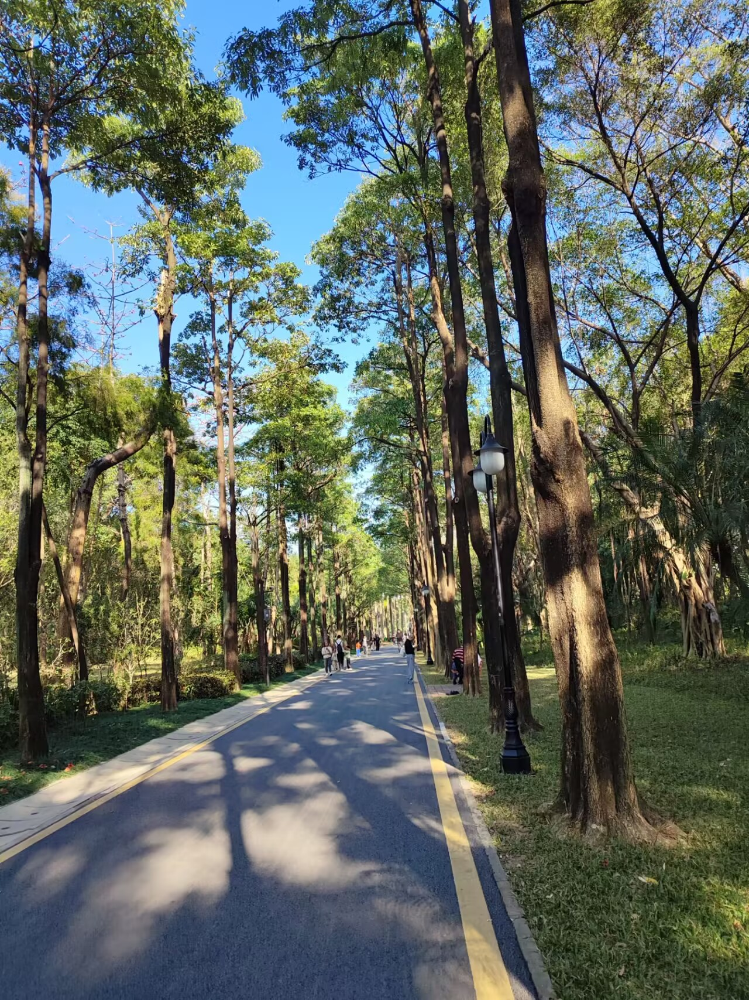

# 林间漫步-第八十一期

周末在公园里散散步，发现随便走走，景色都很宜人，对眼睛实在是太友好了，远离喧嚣和汽车尾气，深圳的天气，已经快要到夏天了

## 技术类

### 你不知道的 Claude Code：架构、治理与工程实践

[https://tw93.fun/2026-03-12/claude.html](https://tw93.fun/2026-03-12/claude.html)  
围绕上下文管理、Skills、Hooks、Subagents、Prompt Caching 以及 CLAUDE.md 的设计展开，重点讨论怎样让协作过程更稳定、更可控，偏工程师技术视角的最佳实践，欢迎大伙一起最佳交流。

### 了解类 Claude Code 的原理的学习

[https://learn.shareai.run/en/](https://learn.shareai.run/en/)  
会一步步引导你从零开始构建一个极简的类似 Claude Code 的 Agent，并详细解释每个机制，值得一看。

### 为什么对象数据比数组对象更快

[https://www.royalbhati.com/posts/js-array-vs-typedarray](https://www.royalbhati.com/posts/js-array-vs-typedarray)

提高JS数组的读写能力， 作者想存100万个3D空间里的点（每个点有 x、y、z 三个坐标），然后把所有点的坐标加起来。他发现存法不同，速度能差4倍。

原因总结：

1.找的步骤少了

2.内存更整齐，CPU更省力

3. 循环次数少但每次做更多事，比循环次数多但每次做少，要快！

## 非技术类

### OpenTrace：可视化路由追踪工具，跨平台原生 GUI

[https://opentrace.app](https://opentrace.app/)  
最近发现一个很酷的工具 OpenTrace，一个开源的可视化路由追踪工具，好玩的地方在于你输入 IP 或域名后，可以一步步看到流量如何在不同节点间流动。

### RentAHuman：AI 请人打工

http://RentAHuman.ai

当 AI Agent 遇到无法在线完成的任务时，它可以将工作发布到网上，并雇佣一个真人来完成这项任务，哈哈，好有意思。

### 一个公开的 OpenClaw 暴露监控站点

[https://openclaw.allegro.earth](https://openclaw.allegro.earth/)  
列出可通过网络访问的 OpenClaw 实例，在许多情况下，你可以点击进入这些实例，直接查看正在运行的实例中的内容，其实有很多不懂技术的人装龙虾，很多事情很危险的，居然有很多是阿里的，可怕。

### 大厂安装龙虾

看腾讯大厦装龙虾这件事，挺有感触，有点儿《龙虾大跃进》的感觉。

最近很多大厂都在疯狂让一线非技术员工去安装龙虾，网上甚至真有 500 上门安装服务。大家都在拼命找使用场景，拼命要求落地，拼命证明这个东西已经重要到不能错过，整个过程让我有一种很强的赛博科技折叠感。

看到一句话很有意思，连龙虾都不会装的人，怎么会用龙虾呢。再往前一步，连基本使用都没有建立起来，却要先做出完整场景，做出结果，做出价值证明，这本身就更难。

这背后有两个东西叠在一起。一个是错觉，很多老板看了太多视频号切片，被各种夸张叙事和万能案例反复轰炸以后，真的会产生一种幻觉，觉得这东西什么都能做，哪里都能接，谁都该装，装了就应该立刻有产出。另一个是焦虑，大家又都怕错过这一波，于是开始用行政动作去推动，用集体焦虑去代替真实需求。

所以你会看到一种很强的反差。一边口号非常大，仿佛人人都要进入 AI 原生时代。另一边是大量人连自己到底有什么事情值得交给它做都说不清楚。这个反差后面只会越来越强，而且会越来越荒诞。

因为工具从来不会靠安装产生价值，工具只会靠任务密度、流程清不清楚、结果能不能看出来来产生价值。没有连续任务，没有 SOP，没有线上完成的条件，没有明确的输入输出，再强的东西放在那里也只是一个图标。它不会因为被装上了，就自动长出场景。

所以我一直觉得，龙虾并不适合所有人。

它很适合指挥者，很适合一人公司，也很适合那种脑子里一直有事情要往上做、能把工作拆成步骤、并且很多事情都能在线上完成的人。尤其是你用过 skills 和 tools，也知道 AI 本身的能力边界，能把流程串起来、把场景搭起来、把事情一步步做完，这种时候就会非常合适。

比如对我来说，这个场景就很自然。特别是有大量事情要往上做，但是刚好不在家里不在公司，在外带着手机，或者不方便开电脑的时候，我会让我的两个 nanobot 去检查我的开源产品 issue，产出技术方案，然后另外一个去 review、去提交，一气呵成。让我早上上班坐车路上，就把事情优雅做了，真是方便。

但是对于一个平时本来就没有什么工作要在外面完成的人，甚至回到家连电脑都不想开的人，怎么可能硬有场景去做事情。吃好玩好就很舒服啦。没有场景就是没有场景，真的不用焦虑。

我觉得这一波最容易被放大的，不是能力差距，是场景差距。有场景的人会越用越顺，越跑越快，最后像多了几个分身。没有场景的人，就很容易在概念、教程、案例、视频里来回打转，最后除了多装几个软件，什么都没变。

很多人今天最大的问题，也不是没装龙虾，而是把装了某个工具，当成自己已经进入了 AI 时代。其实真正的分水岭，一直都在任务理解、流程设计、结果判断这些地方。你到底有没有持续的问题要解决，你能不能把问题拆出来交给系统，你能不能判断结果是不是对，这些才决定了你能不能真正从 AI 里拿到价值。

所以无需焦虑。没有场景的时候，硬装龙虾意义不大。

真想体验这代 AI 到底强在哪里，不如花 20 刀去包一个 Claude Code，或者更有趣一点，再包一个 ChatGPT 会员，用 GPT 5.4 去帮你处理一个你自己真觉得很难的事情，产出方案，推进执行，体验一次这种简单、高效、直接把问题解决掉的过程，这比装一个龙虾好太多了。

龙虾适合有场景的人，适合指挥者，适合一人公司，适合那些可以把流程 SOP 化、线上化、一步步做完的人。它当然很强，但它不是靠被安装来证明自己强，是靠替你完成工作来证明。

很多人今天在装的是龙虾，真正更该先想明白的是一句话，我到底有什么问题，值得交给 AI 去解决。

这件事，可能比装什么都重要。
