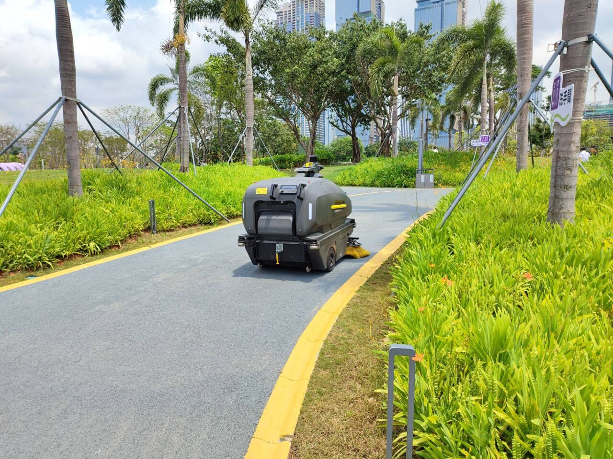

# 公园扫地机器车-第八十五期

现在公园或者路边都配置有这样的扫地机器车，但是效果如何呢？显然没有人打扫的干净，而且遇到的车机器车要反应很久才会让开，这也影响了交通，感觉还是需要再智能点，才会让生活更加美好。

## 技术类分享

### 泊松分布的推导和直觉理解

[https://antaripasaha.notion.site/Derivation-and-Intuition-behind-Poisson-distribution-1255314a56398062bf9dd9049fb1c396](https://antaripasaha.notion.site/Derivation-and-Intuition-behind-Poisson-distribution-1255314a56398062bf9dd9049fb1c396)

泊松分布回答的问题是：在固定时间/空间内，某个随机事件平均发生 λ 次，那么它恰好发生 k 次的概率是多少？

三个关键假设（泊松过程的前提）  
独立性：每个时间片段内事件是否发生互相独立  
稀疏性：在极小时间片段内，最多发生一次事件（同时发生两次的概率可忽略）  
平稳性：事件发生的平均速率 λ 在整个时间段内保持不变

很久没看到概率题了，还是挺有意思的

### Javascript的四种循环

[https://waspdev.com/articles/2026-01-01/javascript-for-of-loops-are-actually-fast#javascript_s_for_of_loops_are_actually_fast](https://waspdev.com/articles/2026-01-01/javascript-for-of-loops-are-actually-fast#javascript_s_for_of_loops_are_actually_fast)

✅ 作者结论 & 实用建议| 场景 | 推荐 |  
| 性能极度敏感 + 大数组 | for (let i = 0; i < length; i++) 缓存 length，最稳定 |  
| 性能敏感但有充分预热 | for...of 也可以，实测可达同等水平 |  
| 日常业务代码 | for...of ，可读性更好，现代 JS 更惯用 |  
| 遍历数组 | ❌ 别用 for...in ，语义错误且性能差 |

💡 看法  
这篇文章的价值在于用数据推翻了一个流传很久的经验法则。"别用 for...of，太慢了"这种说法可能在早期 JS 引擎上成立，但在 2025+ 的 V8 上已经是过时的认知。对于 99% 的业务代码来说，直接用 for...of 就好，可读性高，性能够用；只有真正的热路径才需要精细化优化。

### 测试是新的护城河

[Next.js](https://nextjs.org/) 是目前排名第一的 JS 框架。平时遇到的 JS 全栈应用，我估计，一半用它开发。

两周前，这个框架被一则新闻颠覆了。

一个 Cloudflare 工程师[宣布](https://blog.cloudflare.com/vinext/)，他只用一个星期就用 AI 重新实现了 Next.js，起名为 [vinext](https://vinext.io/)。

事实上，一天就生成产品原型了，后面几天只是在完善。

这个新的实现，比原版 Next.js 性能更好。

这个 vinext 的[代码](https://github.com/cloudflare/vinext)已经放出来了。

我觉得，这件事对 Next.js 的打击非常大。

Next.js 是 Vercel 公司的产品，背后有一个大型开发团队，每年都是巨额投入，已经整整做了10年。虽然是开源软件，但是企业版、云服务、插件、皮肤都要收费，去年的年收入达到2亿美元。

这种看似难以逾越的护城河，在 AI 面前不堪一击。一个工程师用了一个星期，就复刻了大团队十年的工作成果，现有的网页应用不改一行代码，放上去就能跑，原版的每个功能都支持。

你知道花了多少钱？Token 费用仅仅为 1100 美元！

这叫 Vercel 怎么再向 Next.js 的开发投钱，客户又怎么愿意再为某个功能付出高昂的使用费。

推而广之，所有的商业软件都受到了重创。代码的护城河不存在了，只要投入一小笔金钱，AI 就能复刻出大型软件。

那么，为了保护自己，软件公司下一步肯定要防止 AI 复刻。

怎么防呢？关键就是测试用例。

Cloudflare 工程师这一次能够复刻成功，主要原因是 Next.js 有完备的文档、庞大的社区文章、以及完整的测试用例。AI 模拟的每一个 API，只要能够通过原有的接口测试，就能确认百分百兼容。

如果拿不到测试用例，谁知道代码行为是否一致，谁敢放到生产环境运行。

可以想象，为了防止复刻，大型软件项目一定会保护自己的测试用例。测试才是新的护城河。

世界最流行的数据库 [SQLite](https://sqlite.org/)，本身代码15.6万行，但是测试用例[9205万行](https://sqlite.org/testing.html)，足足大了590倍！

其中，最核心的测试套件 [TH3](https://sqlite.org/th3.html) 是闭源的，不公开，主要测试航空、医疗等关键行业的极端情况和边缘案例，属于核心技术资产。正是这些保密用例，才让 SQLite 难以复刻。

无独有偶，就在前两天，另一个开源项目 [tldraw](https://github.com/tldraw/tldraw/issues/8082) 也准备将测试用例闭源。

说实话，保密的测试用例肯定不利于开源项目的发展，但是开发者需要保护自己的利益。在日益强大的 AI 面前，越来越多的软件可能会选择这样做。

## 非技术类分享

### 迪拜如何走向繁荣

[https://unchartedterritories.tomaspueyo.com/p/dubai](https://unchartedterritories.tomaspueyo.com/p/dubai)

迪拜在红海一个突出的岬角上，并不靠近主要航线，周围还有其他港口，那些地方也产珍珠，谁会特意来迪拜呢？

幸运的是，1966年，迪拜发现了石油，获取了巨额财富。但是，单单有石油，并不会变成繁荣的大城市。

这时，迪拜的酋长做出了几个重要决定：（1）免税，不对其他国家的商人征税；（2）发展贸易，给予商人各种便利，方便他们做生意；（3）加强基础设施，石油赚到的钱都投在道路、机场、电力、通信、港口；（4）信仰自由，任何信仰的人都可以来迪拜，不会强迫你遵守伊斯兰教。

正是这些措施，使得迪拜高速发展。

后来，迪拜的石油枯竭了，但是贸易已经稳固确立了，城市开始多元化发展：金融、旅游、房地产......

迪拜的故事告诉我们，自然资源不会带来繁荣，但是一个低税收、宽容、安全、低管制的环境会带来繁荣。

### O(n)与O(n^2)创业公司比较

[https://rohan.ga/blog/startup_types/](https://rohan.ga/blog/startup_types/)

O(n) 公司主动保持低调（不需要融资、不需要营销），导致外界看不见它们——形成了一种信息不对称的护城河  
如果创始人的目标是赚钱（而不是改变世界或上市），从第一天起就应该瞄准 O(n) 路径。

### Google Nano Banana 2（即 Gemini 3.1 Flash Image） 与 字节跳动 Seedream 5 Lite 两款最新 AI 图像生成模型的深度横评

[https://decrypt.co/359700/image-ai-leap-google-bytedances-latest-models](https://decrypt.co/359700/image-ai-leap-google-bytedances-latest-models)

两款模型在 2026 年 2 月底相继发布：  
Nano Banana 2（Google）：高调发布，媒体声量巨大  
Seedream 5 Lite（字节跳动）：低调上线，几乎没有宣传  
但测评结论是：覆盖差距巨大，能力差距很小。

### 老板在度假时用 WhatsApp 解雇了我

[https://ginoz.bearblog.dev/my-boss-fired-me-over-whatsapp-while-he-was-on-vacation-in-honolulu/](https://ginoz.bearblog.dev/my-boss-fired-me-over-whatsapp-while-he-was-on-vacation-in-honolulu/)

我在一家私营公司工作，老板就是创始人。

前一段时间，我把待办事项清单都清空了，无事可做。我就去问项目经理还有什么项目。整整两个星期，他都没有给我派活。

这是很奇怪的状况，我从没遇见过，突然就无事可干，而且已经持续了半个月。肯定哪里出问题了。

于是，我直接在 Slack 上给老板发消息，询问我这个月的任务。

几个小时过去了，没有回复。两天过去了，依然没有回复。

今天早上，我就改在 WhatsApp 上给他的私人账号发了条同样的消息。

他回复了，说他正在夏威夷度假，没看到 Slack。

然后，他写了一条长长的回复，告诉我被解雇了。

他说，我的部门是全公司成本最高的，而且上个月，公司第一次出现亏损，他现在不得不借钱来偿还房贷，削减成本是公司生存下去的唯一途径。

我震惊了，他一边在夏威夷度假，一边说这些话。

我本来很同情他，他努力挣扎着偿还房贷，还要拼尽全力维持公司运营，真的活得非常辛苦。要不是想到他还在度假，我简直要为自己向他索要工资而感到愧疚，我甚至乐意免费为他工作，以避免公司的亏损。

读到他的这些解雇我的理由后，我觉得很可笑，我居然给他写信，要他给我委派任务。

我后来才意识到，自己是在 WhatsApp 上被解雇的，而且只通过一条文字消息。我为他工作了四年，他解雇我的时候甚至连安排一次视频通话、面对面告诉我的勇气都没有。

我看清了，我的工作就是让他能还清房贷，为他的幸福和财富做贡献。而他不需要有同情心，也不需要有直视我眼睛来解雇我的勇气。

这个故事有点可笑，一般人正常摸鱼就行了，还主动去问老板要做什么工作的，还真是少见，不过资本家都是这样利益大于一切
