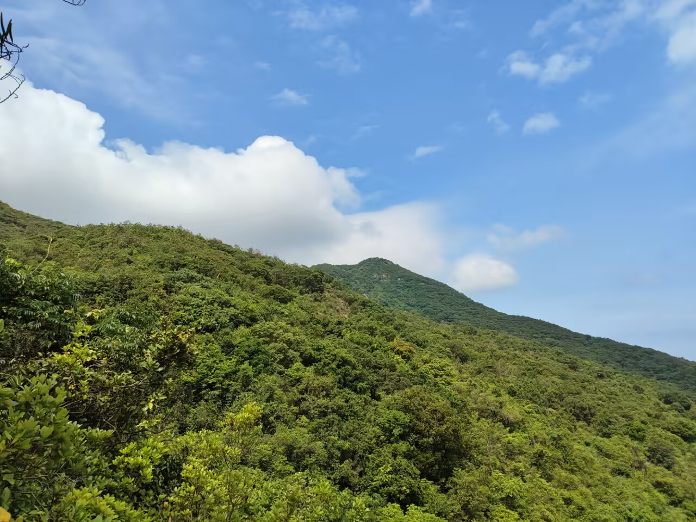

# 五一爬山-第八十九期

五一长假想去爬山，结果约的伙伴半路身体不舒服，只能走到一半就下山了，这是我第二次爬山出状况了，果然爬的次数多了，就会遇到各种突发情况。

## 技术类分享

### 一致性哈希

[https://eli.thegreenplace.net/2025/consistent-hashing](https://eli.thegreenplace.net/2025/consistent-hashing)

一旦节点数 N 变化（扩容/缩容/故障），几乎所有 key 的映射都会改变，导致缓存雪崩

一致性哈希的核心思想  
把节点和数据都映射到一个「哈希环」（单位圆）上：  
每个 key 顺时针找到最近的节点，就归属于它  
节点增删时，只影响相邻区间的 key，其他 key 不受影响  
理论优势：N 个节点、M 个 key，增删一个节点只需迁移约 M/N 个 key（而不是全部）。 现代分布式系统（Redis Cluster、Cassandra、Riak）普遍采用  
这篇文章代码清晰、数学推导完整，非常适合作为分布式系统学习材料

### MDN新前端的底层结构

[https://developer.mozilla.org/en-US/blog/mdn-front-end-deep-dive/](https://developer.mozilla.org/en-US/blog/mdn-front-end-deep-dive/)

MDN 是互联网最大的文档网站，本文介绍这个网站的前端架构，没想到这么复杂。

### 关于索引，你不知道的事

[https://jon.chrt.dev/2026/04/15/things-you-didnt-know-about-indexes.html](https://jon.chrt.dev/2026/04/15/things-you-didnt-know-about-indexes.html)

索引是把双刃剑，建对了飞速查询，建错了白搭甚至变慢。用 EXPLAIN 验证，别靠猜。 高级索引有表达式索引、部分索引、覆盖索引，这种平常很少使用。

## 非技术类分享

### 越使用AI，我越不担忧

[https://simonwillison.net/2025/Jul/4/identify-solve-verify/](https://simonwillison.net/2025/Jul/4/identify-solve-verify/)

我花在 AI 编程的时间越多，对自己的职业生涯的担忧就越少，即使 AI 的编程能力越来越强。

因为，我发现 AI 编程只是流程的一部分，我的工作不仅仅是编写代码。

我的真正工作是，找出可以用代码解决的问题，然后解决它们，并验证解决方案是否有效。

AI 最终或许能够完全承担中间的编码部分，并帮助解决第一部分和最后一部分，但无论如何，仍然需要有人去发现问题、定义问题并确认问题已经得到解决。

这就是我的工作的80%内容。

### 摩尔定律的不可持续性

[https://bzolang.blog/p/the-unsustainability-of-moores-law](https://bzolang.blog/p/the-unsustainability-of-moores-law)

摩尔定律指的是，大约每两年，芯片上的晶体管数量就会翻一番。

但是，它还有一个伴生效应，很少人提到。那就是，大约每五年，芯片工厂的建造成本就会翻一番，而能承担这种成本的芯片公司数量则会减半。

二十五年前，大约有40家公司，可以建造芯片工厂，每个工厂的建造成本约为20亿至40亿美元。如今，只剩下两家或三家芯片公司（数量取决于你对英特尔的乐观程度），可以建造最先进的芯片工厂，建造成本飙升到几百亿美元。

如果按照这种趋势再过10年，芯片工厂的建设成本继续翻倍飙升，也许只有一家公司或根本没有公司，能够负担这样的成本。

目前，芯片的制造工艺已经逼近1纳米，再往下发展，技术壁垒和资金壁垒将同时接近极限。

我预计，摩尔定律很快就会失效，未来增长主要在于算力，而不是单块芯片的计算能力。

未来的芯片将会像二手车，行驶速度都差不多，只是新旧差异。我甚至觉得，2035年生产的芯片和2065年生产的芯片之间，将几乎没有什么实质性区别。

### 为什么沙子有粘性

[https://www.mentalfloss.com/posts/why-is-sand-sticky](https://www.mentalfloss.com/posts/why-is-sand-sticky)

沙子的主要成分是二氧化硅，跟岩石一样。岩石没有粘性，为什么沙子会有粘性呢？

原来，沙子本身没有粘性，但具有亲水性，它会吸水。人体也是亲水的，在烈日下汗流浃背。当沙子接触到湿润的东西时，水分子之间就会产生粘性。

皮肤上往往还有油脂或者防晒霜，它们也会让沙子粘在皮肤上。

另外，皮肤还有一些微小褶皱，也会卡住沙子。

总之，想要去除沙子，就是等到皮肤变干，或者用水冲洗。

### 脑腐

它就是字面意思。有些人看上去是正常的，但是大脑已经变异了，有些部分腐烂了。

根据[介绍文章](https://jshamsul.com/essays/2026-04-12-brainrot-industrial-complex)，"脑腐"的症状就是思考能力下降，难以长时间集中注意力，进行深入的推理和反思。

一遇到比较难、需要反复思考的问题，你就会烦躁，不仅是心理烦躁，还会生理烦躁，全身不安，不愿意多想，就希望赶快了结。

你有没有这个症状？如果有，就有"脑腐"的危险了。我感觉，我的大脑就有一点。遇到复杂的软件概念和算法，以前会仔细研究，直到搞懂为止，现在更可能看一眼就跳过去，不懂就不懂了，知道名字就可以了。

"脑腐"的主要原因是，网络平台上面那些夸张的"标题党"文章和短视频。它们的目标是吸引流量，在最短时间内引发阅读者/观看者的兴趣，感到满足。当你长期观看这些内容以后，大脑就被密集刺激，思维兴奋状态的维持时间越来越短，丧失了长时间深入思考的能力。

这就是为什么一个人看惯短视频以后，就离不开内容压缩了。一篇几千字的文章，他也会要求大模型生成总结；一部90分钟的电影，他也宁愿看几分钟的电影解说。

一旦"脑腐"了，难以长时间集中注意力进行思考，也就难以学习和处理高难度问题了。现在看上去，没有好的解决办法，因为现代人的时间越来越琐碎，内容碎片化是大趋势。

应对之策也许就是反过来，将学习和思考拆解成一系列短问题。比如，以后的学习不再是一厚本教材，而是几十个的系列短视频，每个用两三分钟解释一个知识点。只有这个时间长度，学生的思维才能保持专注。
