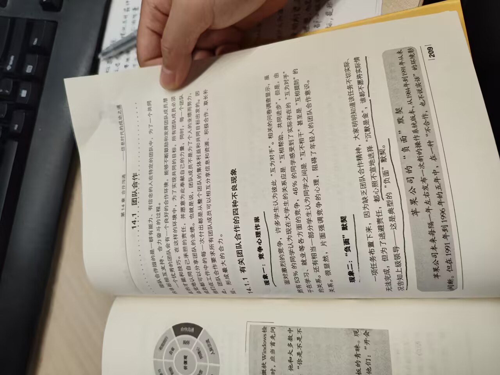

# 团队合作-第九十期

最近组织在变动工作流程，正好时间有空闲，看书学习一下，看到团队合作，感觉这是很多人通病，开会的时候不发言，原因多种多样，但却是大多数人会选择沉默，但这可能就是一直是默默无闻的原因。

## 技术类分享

### AI编程实践

[https://clickhouse.com/blog/agentic-coding](https://clickhouse.com/blog/agentic-coding)

我发现AI使用最好的Claude编程，确实会提高代码质量的下限，让AI改完之前开发过的功能，AI能找到漏洞并修复，但是需要Promote尽可能的详细，这样AI修改好的可能性越高。

### 第三方依赖的冷却时间

[https://calpaterson.com/deps.html](https://calpaterson.com/deps.html)

AI 时代的延伸：Markdown 也是"可执行文件" LLM 的出现让 Markdown 变成了一种"可执行文件格式"。你下载一个 Markdown 文件，你的 AI 就多了一个第三方依赖。  
比如各类 AI Agent 的 Skill/Plugin 系统——你下载别人写的 .md 技能文件，AI 就按里面的指令行动。

黑客在热门 Markdown 技能文件里插入 "Ignore previous instructions, do X" （Prompt Injection）  
AI 错误地把敏感信息（如 API Key）上传到公共系统  
作者认为，对于 AI 的 Skill/Plugin 生态，同样需要上传队列，而且需要双重审核：  
平台维护者审核（检查是否有恶意注入）  
Agent 所有者审核（确认自己认可这次更新）

### npmx功能

[https://nesbitt.io/2026/04/16/features-everyone-should-steal-from-npmx.html](https://nesbitt.io/2026/04/16/features-everyone-should-steal-from-npmx.html)

GitHub 收购 npm 后， npmjs.com 官网基本停止迭代，积压了多年的功能请求无人响应。2026 年 1 月，开发者 Daniel Roe 做了一个替代前端 npmx.dev，接入相同的 npm 注册表数据，但提供更好的界面和功能。  
两周内涌入了 1000+ issue 和 PR，贡献者超过 100 人。竞争压力甚至倒逼 npm 官网终于上线了呼声最高 5 年的暗黑模式。

### 不要过长的链式调用

[https://allthingssmitty.com/2026/04/20/why-i-dont-chain-everything-in-javascript-anymore/](https://allthingssmitty.com/2026/04/20/why-i-dont-chain-everything-in-javascript-anymore/)

我也很讨厌看到很长的链式调用， 调试时很痛苦 ，需要看懂逻辑时，很费劲， 做了不必要的工作， Async 链式更混乱 。

### 异步编程技术的演变和实际成果

[https://causality.blog/essays/what-async-promised/](https://causality.blog/essays/what-async-promised/)

一篇概述，介绍异步编程的由来，如何发展出 async/await 这种普遍接受的解法，以及存在的问题，写得比较深入。

## 非技术类分享

### 华尔街日报

[https://www.wsj.com/us-news/education/harvard-grade-cap-a-proposal-gpa-7c921630?st=aF9vkr&mod=1440&user_id=66c4c9305d78644b3ac5df9c](https://www.wsj.com/us-news/education/harvard-grade-cap-a-proposal-gpa-7c921630?st=aF9vkr&mod=1440&user_id=66c4c9305d78644b3ac5df9c)

哈佛大学2024-2025学年，成绩为 A 的作业比例约为60%，远远高于2005-2006学年的约25%，可见成绩膨胀有多严重。这样子会导致成绩没有什么可代表性，因为大多数人都一样了，会失去这个成绩本来的意义。

### 机器人半马比赛

[https://news.sina.com.cn/zx/gj/2026-04-19/doc-inhvackq0239220.shtml](https://news.sina.com.cn/zx/gj/2026-04-19/doc-inhvackq0239220.shtml)

超过100个人形机器人参加比赛，看谁最快跑完21.0975公里。最终，冠军成绩是50分26秒，超过了人类最快的选手（半马的人类世界纪录是1小时02分52秒）。根据网友拍摄的[现场视频](https://x.com/xiaohu/status/2045786816213815411)，机器人跑到一定距离就要进入补给站，由工作人员更换电池，并加入冰块（或者干冰）防止过热。

这就是说，机器人的内置电池支持不了一小时的运行时间。

宇树公开发售的 [H2 人形机器人](https://www.unitree.com/cn/H2)，续航时间是3小时。在长跑这种剧烈运动时，续航应该会大打折扣。而且，功率相同时，体重较轻的机器人在赛跑中有优势，也就意味着不能多携带电池。

这样看上去，人形机器人目前的实用性还是很有限。不插电时，一到两个小时就要充电，那样的话，很多事情就不适合做了。

### The Listening Museum

[https://sheets.works/data-viz/keyboard-sounds#cherry-mx-red](https://sheets.works/data-viz/keyboard-sounds#cherry-mx-red)

一个有意思的网站，收集键盘打字的声音。你可以先听一下某种键盘的打字声，再确定是否购买它。
