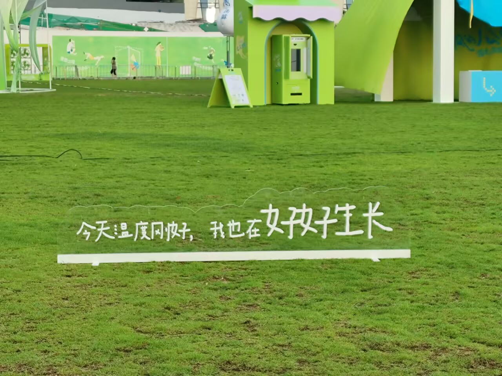

# 今天温度刚好，我在好好生长-第九十二期

暴雨之后的草坪，看到这周末是要搞活动，看着是半程马拉松比赛，似乎很喜欢在草坪上搞活动，一切都这么绿意盎然。

## 技术类分享

### AI越强，你的优势在哪里

[https://mp.weixin.qq.com/s/TD4QN-14GGTWdUHK5E9Dxw](https://mp.weixin.qq.com/s/TD4QN-14GGTWdUHK5E9Dxw)

AI 能解决你定义好的问题，但定义问题本身就是最难的部分。

AI 很强，但它需要精确的问题定义。我的优势在于能把模糊的需求拆解成清晰的技术规格——边界条件、异常处理、业务规则，这些 AI 不会主动问你，但不说清楚代码一定写不对

AI 的输出质量，直接取决于你给的上下文质量。

同样用 Claude Code，不同人产出质量差很多。差别在于上下文构建——我给 AI 的 Prompt 包含完整的业务规则、相关代码片段和边界条件，而不是一句话就让它写。AI 的上限是由你的输入质量决定的

结果验证能力，代码跑起来了 ≠ 代码对了。

AI 生成的代码我会重点验证业务语义，不是看能不能跑通，而是看行为是否符合业务意图。比如退款接口我会验证退款金额、退款对象、幂等性，这些是测试覆盖不到的，必须人工理解

技术决策能力

AI 能列出方案 A 和方案 B 的 pros/cons，但拍板选哪个是你决定的。

AI 能帮我分析方案，但最终的选型决策是我做的。因为决策要考虑的不仅是技术因素，还有团队现状、业务阶段、历史教训——这些 AI 不知道，也不应该由 AI 决定。

成本控制能力

知道什么时候用大模型，什么时候用小模型

知道怎么组织上下文才能省 Token

知道怎么写 Prompt 才能减少来回次数

知道哪些任务让 AI 做更贵，自己做更便宜

### 打造有效的Agents

[https://www.anthropic.com/engineering/building-effective-agents](https://www.anthropic.com/engineering/building-effective-agents)

这是Cluade分享的介绍Agents的文章，有些是workflow，有些是agent，这两者有什么区别，什么时候该使用什么工具.

### AI会让你的流程变快吗

[https://frederickvanbrabant.com/blog/2026-05-15-i-dont-think-ai-will-make-your-processes-go-faster/](https://frederickvanbrabant.com/blog/2026-05-15-i-dont-think-ai-will-make-your-processes-go-faster/)

AI 不会让你的流程变快，因为流程的瓶颈从来不在"打字慢"，而在上游——需求模糊、输入残缺。把 AI 塞进开发环节，只是把瓶颈往前推了一格，并没有消除它。

## 非技术类分享

### 我们把世界弄得态复杂了

[https://user8.bearblog.dev/the-world-is-too-complicated/](https://user8.bearblog.dev/the-world-is-too-complicated/)

世界确实复杂，无时无刻不在变化，人心也很复杂，充满着各种各样的想法，有些东西，无需理解，我觉得思考太大，就是给自己的大脑负重，就比如你一个研究地理的人，无需理解生物，但是如果你好奇，这是可以的，毕竟好奇是一个人学习的本能。

### 李开复写给中国学生的七封信

[https://ggw.tongji.edu.cn/index.php?classid=1470&newsid=2702&t=show](https://ggw.tongji.edu.cn/index.php?classid=1470&newsid=2702&t=show)

最近看完了李开复的《最好的自己》，感觉可以写一篇读后感出来，这七封信也在书中有，我觉得这特别适合给就要步入的大学生看，我准备给我弟弟好好拜读一下。

### 姚顺宇采访

[https://mp.weixin.qq.com/s/Vy4IINteDQFrdr9cffKMhA](https://mp.weixin.qq.com/s/Vy4IINteDQFrdr9cffKMhA)

朴实无华的采访，很多都是关于AI相关的，学会了一个新的词，叫老登，好吧，虽然不是什么好词，用于调侃和骂人。

### 布洛芬和泰迪的区别

[https://asteriskmag.com/issues/14/the-mystery-in-the-medicine-cabinet](https://asteriskmag.com/issues/14/the-mystery-in-the-medicine-cabinet)

原来布洛芬对全身都有影响，但是很多人痛经都会吃布洛芬止痛，是非常不明智的选择，果然是药三分毒，用药需谨慎。

### 小Lin对多邻国CEO的采访

[https://www.youtube.com/watch?v=TxWErg5JBpk](https://www.youtube.com/watch?v=TxWErg5JBpk)

对教育行业有了不一样的看法，特别是他们的理念，你可以不擅长，但是只要是你喜欢，就大胆去做，就是因为CEO不擅长语言，所以就选择了如何尽力去挽留不擅长语言的人去学习语言。
