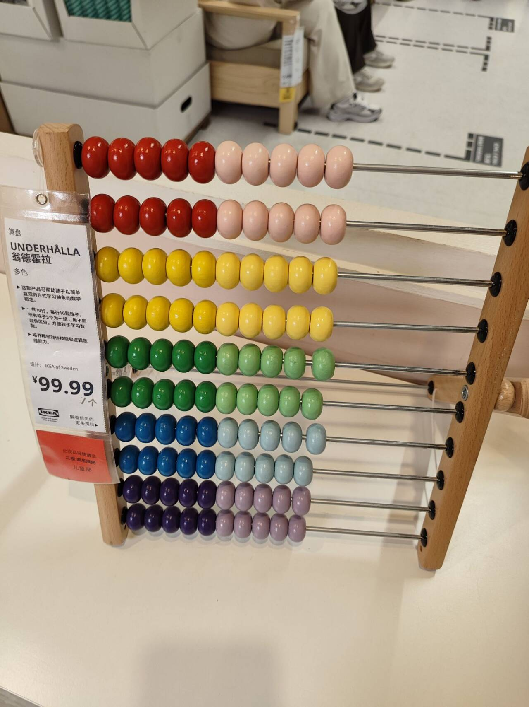

# 算盘-第九十三期

周末打算去公园里逛一逛，结果竟然看到宜家离公园很近，就只是隔了一条街，由于上次跟朋友逛过宜家，还是可以去看一下宜家的设计感的，所以就顺道过去了，但是宜家依旧很大，我发现了一个算盘，这年头这东西可不常见了，自从有了计算机，就代替了算盘的功能，但是作为小孩子的玩具，还是挺好的。

## 技术类分享

### Passkey可以取代密码吗？

[https://kerkour.com/passkeys](https://kerkour.com/passkeys)

关于 passkey 立场最鲜明、技术最扎实的科普长文之一。它解决了"为什么密码必须死 + passkey 怎么救 + 8 个常见质疑怎么回应 + 该用什么算法"四件事，立场强势到罕见。美中不足是回避了同步通道集权、企业场景、账户恢复三大痛点。 微软将淘汰短信验证码的方式，采用Passkey.

### Github pages有域名盗用问题

[https://meertens.dev/blog/github-enables-domain-abuse/](https://meertens.dev/blog/github-enables-domain-abuse/)

这个还是很震惊的，二级域名竟然有被盗用的情况，看到过不少人将自己的博客部署在Github pages上。

### 在Vibe Coding时代，Vue & React

[https://oliver-foster.medium.com/the-vibe-coding-era-has-vue-vanished-or-is-react-simply-dominating-16a02634d1d9](https://oliver-foster.medium.com/the-vibe-coding-era-has-vue-vanished-or-is-react-simply-dominating-16a02634d1d9)

原来只在中国和亚洲区域，Vue更流行，但是在美国，React语言竟然更加受欢迎，所以就导致AI的训练量多少的问题，所以AI天然会选择React框架为主流的项目。

## 非技术类分享

### 我的办公桌布置

[https://arslan.io/2025/11/18/my-two-part-desk-setup/](https://arslan.io/2025/11/18/my-two-part-desk-setup/)

看完之后，我觉得别人都很有设计感，而自己的办公桌则普普通通，自己似乎需要打扫一下了，不至于布置的很好看，但是可以干净利落一些，这周末开始布置吧。

### 赚钱的艺术讨论

[https://news.ycombinator.com/item?id=48247208](https://news.ycombinator.com/item?id=48247208)

从讨论中可以看出，大多数人都是觉得诚信和正直很重要，诚信的人更加容易获取他人信任，同时也不会夸大事实。

### 日本企业的运作模式

[https://davidoks.blog/p/why-japanese-companies-do-so-many](https://davidoks.blog/p/why-japanese-companies-do-so-many)

原来日本企业的运作模式竟然是终身制，一个人必须长期在这家公司工作，岗位变动是随机的，旨在于你了解整个公司的运作，作者成为J型模式，而美国则是H型模式，H 型模式下的生产组织是垂直的 ，而 J 型模式下的生产组织是水平的。美国企业存在的目的是赚钱，或者更加确切的说是给股东带来回报，而日本企业则是有员工运营，对股东的利益漠不关心，其存在的目的是为了生存，这就导致日本企业擅长变化，并乐于改变自身业务的原因。但是弊端也很明显，捆绑难以制作，也难以解开，当经济危机出现时，这样的公司面临破产的风险极高。
