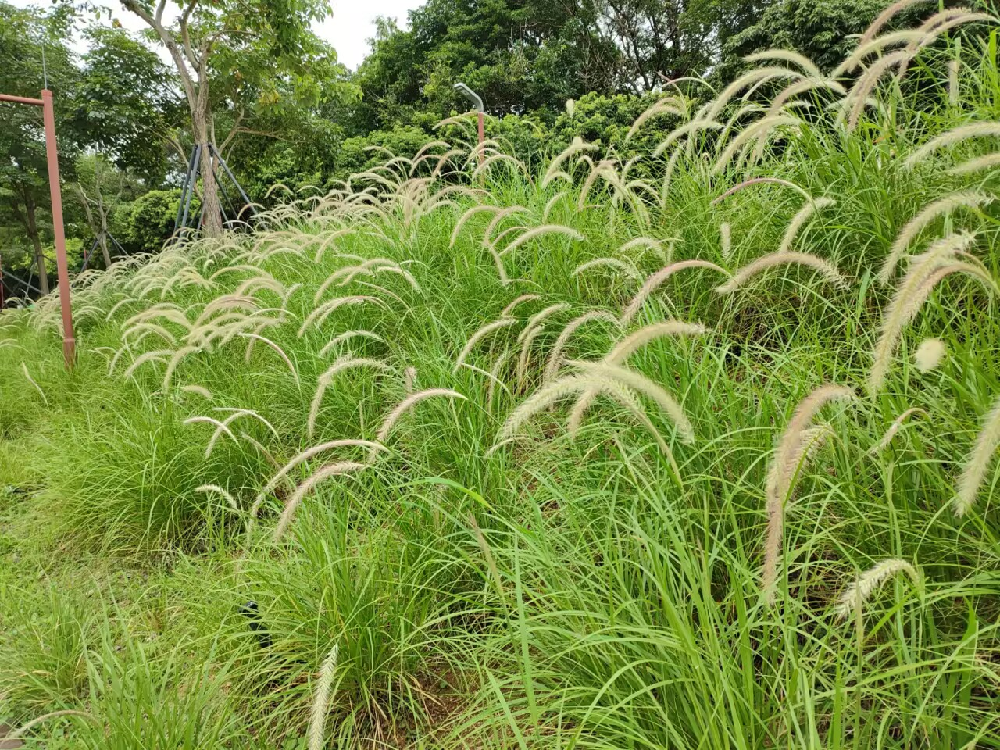

# 狗尾巴草-第九十五期

周末趁着没下雨出去玩，看到一大片狗尾巴草，这要是小时候可要高兴坏了，小时候看到这样的草，就会折下来，然后编成小狗，可以跟姐姐两个人玩很久，现在人越长大，反而对这些微小事物没这么关心了，而且现在城市的小孩子估计都不会编了，毕竟这也需要手艺，哈哈哈哈

## 技术类分享

### 网站规范

[https://specification.website/](https://specification.website/)

一个好的网站应该具备哪些功能？这是一份与平台无关的技术规范，涵盖了每个像样的网站都应该具备的所有技术特性。

### AI是否正在重蹈前端技术失去的十年覆辙

[https://mastrojs.github.io/blog/2026-05-23-is-AI-causing-a-repeat-of-frontends-lost-decade/](https://mastrojs.github.io/blog/2026-05-23-is-AI-causing-a-repeat-of-frontends-lost-decade/)

AI 编程正在重演前端“失落十年”的路径：通过更高层抽象降低门槛，让更多人能快速产出“能用”的软件，但也削弱了对底层原理、性能、可访问性与工程质量的重视。作者把这一过程定义为“去技能化”——原本需要熟练开发者完成的工作，被工具改造成更低技能者也能操作。前端框架如此，LLM 也如此。文章同时承认，AI 和框架确实提升了效率，适合原型、MVP 和常规任务；问题在于抽象一定会泄漏，一旦遇到复杂场景、边界条件或质量要求，仍需要真正理解系统的人。作者还指出，商业成功常常并不严格奖励高质量软件，因此企业会天然偏好更便宜、更快的生产方式。最后借包豪斯作比：不必拒绝 AI，但应在接受工业化工具的同时，重新重视材料、工艺、用户体验与设计质量。

### server workers

[https://mastrojs.github.io/blog/2026-03-09-whatever-happened-to-js-service-workers/](https://mastrojs.github.io/blog/2026-03-09-whatever-happened-to-js-service-workers/)

网络请求代理、可离线使用的应用，但为什么使用不多呢？这一切的代价是需要制定安装、更新和内容缓存策略。这或许是 Service Worker 未能像最初设想的那样广泛应用的主要原因。因为缓存失效机制实在难以捉摸。

### 在AI工程面试中抓到开发人员作弊

[https://medium.com/@brianjenney/i-caught-developers-cheating-in-an-ai-engineering-interview-heres-exactly-what-it-looked-like-6a115d08eae6](https://medium.com/@brianjenney/i-caught-developers-cheating-in-an-ai-engineering-interview-heres-exactly-what-it-looked-like-6a115d08eae6)

如何区分面试者是否作弊呢？现场突发反应以及平常的经验就显得很重要了，其实人与人之间的信任很重要，不知道就是不知道，没必要伪造完美人设。

## 非技术类分享

### 气温与体重

[https://news.yale.edu/2026/05/20/warmer-temps-heavier-owl-monkeys-climate-linked-weight-gain-primates](https://news.yale.edu/2026/05/20/warmer-temps-heavier-owl-monkeys-climate-linked-weight-gain-primates)

一支耶鲁大学的考察队，发现阿根廷的猫头鹰猴比25年前更重。2023年的猴子平均体重比1999年重了50克，相当于增加了4%。

科学家认为，这与气温上升有关。1999年阿根廷的日平均气温为22.2摄氏度，2023年上升到了23.8摄氏度。

气温上升使得猴子减少用于体温调节的能量消耗，从而有额外的卡路里来增重。

该理论看上去也适用于人类，也就是说，全球变暖可能让胖子变多。

所以温度太高的时候，少吃东西就能减重？

### 艺术抗议

[https://p26.bg/news/dupkite-po-ul-chiprovci-v-sofiya-se-prevarnaha-v-ulichna-galeriya-snimki-4310news.html](https://p26.bg/news/dupkite-po-ul-chiprovci-v-sofiya-se-prevarnaha-v-ulichna-galeriya-snimki-4310news.html)

保加利亚首都索非亚，马路上有一个小坑，市政府长期不修补。

两个艺术家感到不满，就在这个小坑上涂鸦，画了一个生气的鬼脸。

鲜艳的图案让司机和行人更容易注意到，减少了事故。同时，也引起了大众的兴趣，新闻媒体纷纷报道，小坑很快就修补了。

这件事告诉我们，不满还是要表达出来，可以推动解决，并且采用艺术形式表达，效果会比较好，容易让人接受。

人也一样，激烈的言语表达不满，就会让人情绪激动无法接受，但是善意的表达别人的问题，反而更加让人能接受。

### 行为经济学诱饵

[https://www.sina.cn/news/detail/5279286413232198.html](https://www.sina.cn/news/detail/5279286413232198.html)

行为经济学家丹·艾瑞里，有一天闲逛《经济学人》官网。

他在订阅页面上，看到了三个选项：

A. 电子版----59美元。 B. 纸质版----125美元。 C. 纸质版＋电子版----125美元。

他愣住了。

B 和 C，价格一模一样。一个只给纸质版，一个纸质版加电子版全送。谁会选 B？

傻子都不会啊。但艾瑞里没有笑，马上意识到这是一个绝妙的设计。

他拿着这三个选项，走进了麻省理工学院（MIT）的课堂，做了一个实验，让100个学生对这三个选项进行选择。

结果：16%的学生选了 A，0%选了B，84%选了C。订阅费总收入：11,444美元。

跟预想的一样，没有一个人选 B。

然后艾瑞里做了一件小事：他把 B 删了，只留 A 和 C。

逻辑上，一个从来没人选的东西，删掉它不应该影响任何结果，对吧？

结果出来了：68%选了 A，32%选了 C。订阅费总收入暴跌到8,012美元。

这就是选项 B 的作用。它从来没人选，自己一份都没卖出去，却在暗中帮旁边的最贵的 C 套餐，多卖了52%。

仅仅因为它的"存在"，就让杂志社多赚了3,432美元。这就是行为经济学中著名的"诱饵效应"。

原理很简单：人类不擅长判断一个东西的"绝对价值"，但极其擅长做"相对比较"。

当只有59美元和125美元两个选项时，你的大脑在比较"便宜 vs 贵"，大多数人选便宜的。

但当"125美元只买纸质版"这个诱饵一出现，你的大脑就不比较 A 和 C 了，它开始比较 B 和 C。

同样的价格，C 多了一个电子版。天哪，这不是白捡的吗！于是你心满意足地选了 C。

浑然不知自己刚刚多花了66美元----买了一本可能一辈子都不会翻开的纸质杂志。

这个套路如今无处不在。咖啡店的中杯定价，只是为了让你觉得大杯"更划算"。视频网站的月卡，贵到让你觉得年卡"不买就亏"。

手机发布会上，永远有一款"高价低配"机型，它唯一的使命，就是让旁边那款旗舰机型看起来"性价比极高"。

当你觉得自己占了便宜的时候，多半是有人精心摆放了一个诱饵，让你心甘情愿走进了更贵的那扇门。

那个没人选的选项，才是全场真正的主角。
