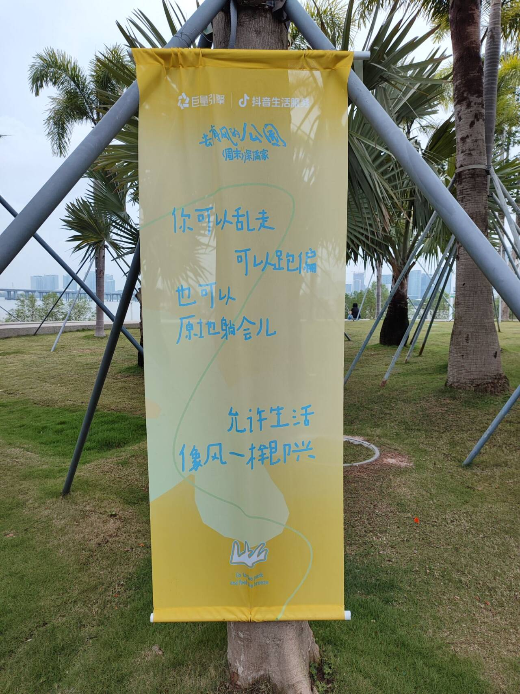

# 去有风的公园-第九十七期

你可以乱走，可以跑偏，也可以原地躺会，允许生活像风一样即兴。

看到公园举行活动，各种各样的横幅，看着还有比赛，最喜欢这一句，与君共勉。

## 技术类分享

### 负载均衡节点健康检查

[https://singh-sanjay.com/2026/01/12/health-checks-client-vs-server-side-lb.html](https://singh-sanjay.com/2026/01/12/health-checks-client-vs-server-side-lb.html)

本文介绍了负载均衡可以做在服务器，也可以做在客户端，这两种情况下如何检查有故障的节点。

### 反向代理如何处理大规模并发连接

[https://singh-sanjay.com/2026/03/09/concurrent-requests-reverse-proxy.html](https://singh-sanjay.com/2026/03/09/concurrent-requests-reverse-proxy.html)

反向代理的性能瓶颈不是吞吐量，而是并发连接管理——如何在不阻塞、不内存膨胀、不丢请求的前提下管理数万个同时连接。

### 我用AI寻找Bug的经历

[https://newsletter.semianalysis.com/p/finding-miscompiles-for-fun-not-profit](https://newsletter.semianalysis.com/p/finding-miscompiles-for-fun-not-profit)

其实我也尝试过这样的操作，你会发现，AI能找到各种各样的问题，比如cr的时候，但是即便是AI写的代码，它再次也会找到问题，但是这也导致了需要很多费用，现在AI使用限额，说明即便是大厂也支撑不起来无底线的使用AI。

### HTML代替JS的四种场景

[https://www.htmhell.dev/adventcalendar/2025/27/](https://www.htmhell.dev/adventcalendar/2025/27/)

现代浏览器 V8/SpiderMonkey 执行 JS 非常快，一个手风琴组件的 JS 不会拖慢页面。但 JS 的成本不仅是执行时间：  
下载 → 解压 → 解析 → 编译 → 执行 → GC → 持续监听  
每一步都有移动端电池消耗和内存占用。单个组件无所谓，但累积效应是真实的——一个页面 50 个"不贵"的 JS 交互叠在一起，就变成了 200KB+ 的 JS bundle。

不是因为"JS 慢"才替代，而是因为"能不写的代码就是最好的代码"。 原生 HTML 方案更健壮、更易维护、更可访问，且天然兼容渐进增强。浏览器性能再好，也不是浪费资源的理由——而是把 JS 留给真正需要它的地方。

## 非技术类分享

### 中国AI大厂访问记

今年5月上旬，一个美国访问团来到中国，访问了14家 AI 和机器人公司。

访问对象包括 DeepSeek、月之暗面、MiniMax、智谱、字节跳动、阿里、蚂蚁、小米、零一万物、宇树、魔搭社区等。

所有成员都是科技分析师，回到美国后，每个人都写了访问观感：[Kevin Xu](https://interconnect.substack.com/p/chinai-mood-april-26-may-4-2026)、[afra Wang](https://afraw.substack.com/p/mandate-of-ai)、[Florian Brand](https://florianbrand.com/posts/china-trip)、[Nathan Lambert](https://www.interconnects.ai/p/notes-from-inside-chinas-ai-labs)、[Azeem Azhar](https://www.exponentialview.co/p/inside-chinese-ai-labs-efficiency-moat)、[Lily Ottinger and Kai Williams](https://archive.md/myA7R)、[Jasmine Sun](https://jasmi.news/p/party-in-the-permanent-underclass)、[Lingua Sinica](https://linguasinica.substack.com/p/notes-from-a-trip-to-chinas-ai-labs)、[Caithrin](https://www.caithrin.com/p/searching-for-amanda-askell-with)。

这些文章有很多有意思的内容，我做了一些摘录。为了保证阅读体验，就不单独注明每一段的出处了。

### 1、算力的差距

我们在每一家公司都听到一个共同的抱怨：算力不足。这使得实验次数减少，模型规模缩小。

中国的算力不足，主要是美国的芯片出口管制政策造成的。我们感兴趣的是亲眼目睹本土公司如何应对。

虽然供应并非完全短缺，中国公司仍然能够拿到英伟达的 H100、B200 和 B300 显卡，但是数量至少比美国竞争对手少一个数量级。

英伟达最新款的 GB300 NVL72 系统（72颗英伟达最新 GPU 组成一个系统）的实时推理速度比三年前的 H100 集群快30倍，每颗芯片的内存容量高出3.6倍，每次推理的能耗降低了25倍。美国公司正在大量订购这些系统，而中国公司却无法做到。

中国科技公司，尤其是华为，在研发 AI 芯片方面取得了长足进步。但即使是华为今年3月发布的最新芯片 Ascend 950PR，其性能也仅与2022年发布的 H100 大致相当。而且，这些芯片的出货量远低于 H100。据估计，英伟达仅在2025年10月之前就已出货了700万颗 Hopper 和 Blackwell GPU，而且出货速度还在不断增长。华为计划今年出货75万颗 Ascend 950PR 芯片，这仍然只有英伟达去年出货量的十分之一左右。

结果就是，美国在算力方面拥有巨大的领先优势。我们估计，2025年底美国 AI 行业的算力大约是中国的8倍。中国 AI 公司目前总的算力，大致相当于美国2023年的规模。

我们向中国研究人员分享了 OpenAI 内部每位研究人员拥有的 GPU 数量。他们听到这个数字时，简直惊呆了。然而，我们都知道，OpenAI 的研究人员，或者说西方所有 AI 公司的研究人员，仍然会抱怨他们的算力太少。

### 2、算力的分配

美国的大部分算力都用于模型训练，而非服务客户。但是，中国的情况不同，算力既要用来训练模型，又要服务于数亿消费者和快速增长的企业用户。

如果拿出一半的算力用于服务客户，那么可用于模型训练的算力就会减少。

还有另一个需要考虑的因素。美国的算力主要由五家公司主导：OpenAI、Anthropic、Google、Meta 和 xAI。而在中国，各大科技公司都在积极研发自己的前沿模型，算力池被进一步分割。

### 3、计算效率

如果按照这种逻辑，既然中国的算力规模比美国落少两年，那么中国模型也应该至少比美国落后两年。但是，情况并非如此。

许多分析都认为，中国模型只比美国模型落后几个月。事实上，在某些方面，两国模型似乎是并驾齐驱的。

原因是芯片管制反而促使中国公司提高计算效率。我们发现，中国公司的单位算力支持的 AI 智能是简单扩展下的 4-7 倍，这弥补了算力的不足。

### 4、开源的分歧

目前，最好的 AI 开源模型是中国公司发布的。但是，对于是否开源自己的模型，中国公司内部有分歧。

公司的财务状况和收入压力，会影响到开源意愿。目前，对于是否开源，有一条界限正变得越来越清晰：模型参数规模达到一万亿。

一些公司认为，开源一万亿或以上参数的模型是一种资源浪费，因为没人能在本地机器上运行如此庞大的模型，而开源模型的典型应用场景正是本地机器。发布一万亿参数模型的更好方式是将其托管在公司自身的云基础设施上，只发布它的 API，方便用户使用。

但是对于另一些公司，开源模型近乎一种信仰，而构建万亿参数级别的模型则是开源事业的入场券。

### 5、西方化还是中国化

有些中国 AI 公司呈现出典型的"西方"风格，处处洋溢着硅谷式的酷炫氛围，甚至连赠送的周边产品都体现了这一点。

另一些公司变得越来越"中国化"，把打造一个光鲜亮丽的展厅视为头等大事。这些展厅用来接待参观者，通常是国有企业 CEO 和地方干部。参观之后，还会举行晚宴招待。

我认为，这既是一种选择，也是一种无奈之举，源于创始人的背景以及公司选择的业务类型。

### 6、对其他公司的看法

我们发现，所有中国 AI 公司都敬畏字节跳动的 Seed 部门。那是中国唯一的闭源 AI 前沿团队。它就像房间里的大象，却在翩翩起舞。它的豆包几乎垄断了 AI 的用户流量，他们的模型都可以快速推广到海量用户，其他公司无法匹敌这一点。

DeepSeek 则是业内最受尊敬的公司，越来越多地承担基础层的工作：架构、效率、推理优化，以及华为协议栈适配。

### 7、实习生

中国 AI 公司的员工，很多是才华横溢的"实习生"，平均年龄二十五六岁，大多数仍然是博士生，能够用英语轻松交流技术话题。他们大多毕业于中国高校，没有海外留学经历。

他们实习期一年到两年，享有全职员工的待遇和完整权限，可以自由地提出想法和开展工作实验。这跟西方顶尖 AI 公司形成鲜明对比，OpenAI、Anthropic、Cursor 等公司根本不提供实习，其他公司（比如谷歌）名义上提供 Gemini 的实习，但不会提供重要的任务。

中国公司更看重"新鲜人"，他们能够带来新想法和充足的脑力。为了改进最终模型，实习生更愿意做一些不那么引人注目的工作。而且，刚接触 AI 开发的人可以免受以前模式的影响。

从中国大学的角度来看，学校的计算资源根本不足以让优秀学生的才华得到充分发挥，不如把他们派往计算资源更丰富的业界公司，双方合作发表论文，实现双赢。

### 8、对待 AI 安全问题的态度

我问了一些年轻的中国研究人员，如何看待 AGI（通用人工智能），他们竟然给出了完全相同的答案："AGI 就是人工智能可以取代我！"

我发现，他们没有流露出任何担忧，非但不害怕被取代，反而对机器是否真的能够超越其制造者充满好奇。如果真的实现了这一点，他们会欣然去做其他事情。

这跟西方同行形成了鲜明对比，他们许多人非常关注 AI 的安全问题及其社会影响。中国研究人员也重视安全，每个人都认为 AI 不应该做坏事。但如何确保这一点，大家都觉得这应该交给政府来决定，政府应该能够解决。

### 9、中国企业的 AI 需求

中国企业是否愿意付费购买本国 AI 服务？

一种广为流传的看法是，中国 AI 市场规模较小，因为中国企业通常不愿为软件付费，因此无法支撑本国的 AI 公司。

这种看法仅适用于 SaaS 模式的软件支出，这种模式在中国历来规模很小。但是，中国显然拥有庞大的云计算市场。

中国 AI 公司正在争论，中国企业把 AI 服务，到底看成是 SaaS 产品（规模较小）还是云计算（规模较大）？目前，AI 的发展趋势似乎更倾向于云计算。

### 10、数据产业不如美国

我们听说，像 Anthropic 或 OpenAI 这样的美国 AI 公司，每年购买训练数据（或者强化学习环境）就会投入超过1000万美元，累计投入更是高达数亿美元。我们很想知道，中国 AI 公司是否也是如此。

得到的答案是中国几乎没有数据产业，因为很多 AI 公司觉得，中国的数据产品质量较差，因此自行准备数据往往更为理想。

研究人员会花费大量时间来构建强化学习训练环境，而像字节跳动和阿里巴巴这样的大公司则拥有内部数据标注团队来支持这项工作。

### 11、政府的作用

谁才是中国 AI 领域真正的幕后推动者？相当于硅谷的红杉资本和 a16。

我的一个朋友的答案是：上海、北京和杭州的市政府。这些勤奋却又精疲力竭的政府官员，完全被"害怕错过"和竞争焦虑所驱使，正在拼命推动本地 AI 产业。
